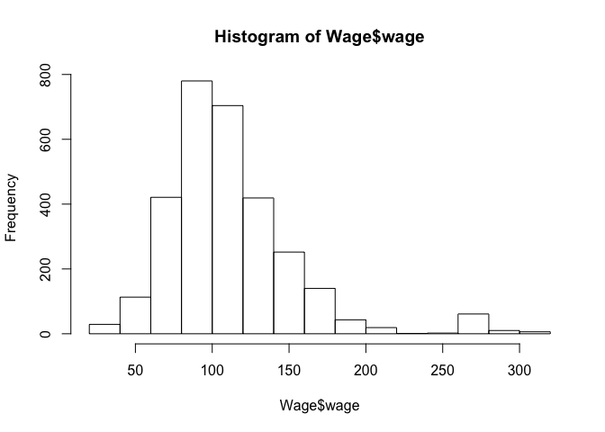
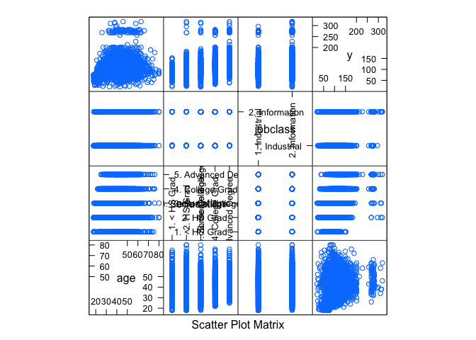
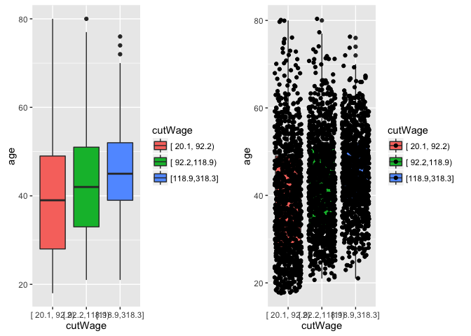

# Caret Package
Pier Lorenzo Paracchini  
February 9, 2016  

The `caret` package is a set of functions that attemt to streamline the process of creating predictive models. It includes functions to:

* preprocess the data
* split the data
* train models (fit) and test nodels
* comparison of models

`caret` acts as a **wrapper** around other packages used for predictive models.

##Packages, Installations (with Dependencies)


```r
#The caret package
install.packages("caret", dependencies = c("Depends", "Suggests"))

#Binning Support
install.packages("Hmisc")

#Multiple plots in same grid
install.packages("gridExtra")

#Data
install.packages("ISLR")
install.packages("AppliedPredictiveModeling")
```


##The datasets  
The `ISLR::Wage` dataset:  

```
## 'data.frame':	3000 obs. of  12 variables:
##  $ year      : int  2006 2004 2003 2003 2005 2008 2009 2008 2006 2004 ...
##  $ age       : int  18 24 45 43 50 54 44 30 41 52 ...
##  $ sex       : Factor w/ 2 levels "1. Male","2. Female": 1 1 1 1 1 1 1 1 1 1 ...
##  $ maritl    : Factor w/ 5 levels "1. Never Married",..: 1 1 2 2 4 2 2 1 1 2 ...
##  $ race      : Factor w/ 4 levels "1. White","2. Black",..: 1 1 1 3 1 1 4 3 2 1 ...
##  $ education : Factor w/ 5 levels "1. < HS Grad",..: 1 4 3 4 2 4 3 3 3 2 ...
##  $ region    : Factor w/ 9 levels "1. New England",..: 2 2 2 2 2 2 2 2 2 2 ...
##  $ jobclass  : Factor w/ 2 levels "1. Industrial",..: 1 2 1 2 2 2 1 2 2 2 ...
##  $ health    : Factor w/ 2 levels "1. <=Good","2. >=Very Good": 1 2 1 2 1 2 2 1 2 2 ...
##  $ health_ins: Factor w/ 2 levels "1. Yes","2. No": 2 2 1 1 1 1 1 1 1 1 ...
##  $ logwage   : num  4.32 4.26 4.88 5.04 4.32 ...
##  $ wage      : num  75 70.5 131 154.7 75 ...
```

```
##       year           age               sex                    maritl    
##  Min.   :2003   Min.   :18.00   1. Male  :3000   1. Never Married: 648  
##  1st Qu.:2004   1st Qu.:33.75   2. Female:   0   2. Married      :2074  
##  Median :2006   Median :42.00                    3. Widowed      :  19  
##  Mean   :2006   Mean   :42.41                    4. Divorced     : 204  
##  3rd Qu.:2008   3rd Qu.:51.00                    5. Separated    :  55  
##  Max.   :2009   Max.   :80.00                                           
##                                                                         
##        race                   education                     region    
##  1. White:2480   1. < HS Grad      :268   2. Middle Atlantic   :3000  
##  2. Black: 293   2. HS Grad        :971   1. New England       :   0  
##  3. Asian: 190   3. Some College   :650   3. East North Central:   0  
##  4. Other:  37   4. College Grad   :685   4. West North Central:   0  
##                  5. Advanced Degree:426   5. South Atlantic    :   0  
##                                           6. East South Central:   0  
##                                           (Other)              :   0  
##            jobclass               health      health_ins      logwage     
##  1. Industrial :1544   1. <=Good     : 858   1. Yes:2083   Min.   :3.000  
##  2. Information:1456   2. >=Very Good:2142   2. No : 917   1st Qu.:4.447  
##                                                            Median :4.653  
##                                                            Mean   :4.654  
##                                                            3rd Qu.:4.857  
##                                                            Max.   :5.763  
##                                                                           
##       wage       
##  Min.   : 20.09  
##  1st Qu.: 85.38  
##  Median :104.92  
##  Mean   :111.70  
##  3rd Qu.:128.68  
##  Max.   :318.34  
## 
```

The `iris` dataset:  

```
## 'data.frame':	150 obs. of  5 variables:
##  $ Sepal.Length: num  5.1 4.9 4.7 4.6 5 5.4 4.6 5 4.4 4.9 ...
##  $ Sepal.Width : num  3.5 3 3.2 3.1 3.6 3.9 3.4 3.4 2.9 3.1 ...
##  $ Petal.Length: num  1.4 1.4 1.3 1.5 1.4 1.7 1.4 1.5 1.4 1.5 ...
##  $ Petal.Width : num  0.2 0.2 0.2 0.2 0.2 0.4 0.3 0.2 0.2 0.1 ...
##  $ Species     : Factor w/ 3 levels "setosa","versicolor",..: 1 1 1 1 1 1 1 1 1 1 ...
```

```
##   Sepal.Length    Sepal.Width     Petal.Length    Petal.Width   
##  Min.   :4.300   Min.   :2.000   Min.   :1.000   Min.   :0.100  
##  1st Qu.:5.100   1st Qu.:2.800   1st Qu.:1.600   1st Qu.:0.300  
##  Median :5.800   Median :3.000   Median :4.350   Median :1.300  
##  Mean   :5.843   Mean   :3.057   Mean   :3.758   Mean   :1.199  
##  3rd Qu.:6.400   3rd Qu.:3.300   3rd Qu.:5.100   3rd Qu.:1.800  
##  Max.   :7.900   Max.   :4.400   Max.   :6.900   Max.   :2.500  
##        Species  
##  setosa    :50  
##  versicolor:50  
##  virginica :50  
##                 
##                 
## 
```

#Setting the seed 
Useful to seed the seed in order to be able to replicate the running experiments.

* Often useful to set an overall seed
* Possible to set a seed for each resample (for parallel fits)


```r
#Need to be done before a random operation
set.seed(123)
seeds <- vector(mode = "list", length = 2)
for(i in 1:2) seeds[[i]] <- sample.int(1000, 10)
seeds
```

```
## [[1]]
##  [1] 288 788 409 881 937  46 525 887 548 453
## 
## [[2]]
##  [1] 957 453 677 571 103 896 245  42 326 946
```

```r
set.seed(123)
seeds <- vector(mode = "list", length = 2)
for(i in 1:2) seeds[[i]] <- sample.int(1000, 10)
seeds
```

```
## [[1]]
##  [1] 288 788 409 881 937  46 525 887 548 453
## 
## [[2]]
##  [1] 957 453 677 571 103 896 245  42 326 946
```


#The Caret Vocabulary & Process  
##Data Splitting
Techniques that can be used to create a **training** and **testing** dataset from the vailable data.  
###Simple Splitting Based On Outcome
Create a balanced split of the data based on the outcome, keeping the overall distribution of the data (if outcome is a classifier)....  


```r
prop.table(table(iris$Species))
## 
##     setosa versicolor  virginica 
##  0.3333333  0.3333333  0.3333333

#split 75%/25% - training/ test
inTraining <- createDataPartition(iris$Species, times = 1, p = 0.75, list = FALSE)
#If list = TRUE - a listy is returned

iris.train <- iris[inTraining,]
dim(iris.train)[1]/dim(iris)[1] * 100
## [1] 76
prop.table(table(iris.train$Species))
## 
##     setosa versicolor  virginica 
##  0.3333333  0.3333333  0.3333333

iris.test <- iris[-inTraining,]
dim(iris.test)[1]/dim(iris)[1] * 100
## [1] 24
prop.table(table(iris.test$Species))
## 
##     setosa versicolor  virginica 
##  0.3333333  0.3333333  0.3333333
```

###Splitting Based On Predictors
The data can be splitted on the basis of teh predictor values using the _maximum dissimilarity sampling_. Note!! Dissimilarity between two sample can be  measured in a number of ways. Simplest approach is to use the distance between predictor values - if the distance is small then the 2 values are in near proximity. Larger distances are indication for dissimilarities. See `caret::maxDissim` function.

###Cross-Validation and Resampling Techniques
Cross-Validation is a model validation technique for assessing how teh results of a statistical analysis will generalize to an independent dataset - using the same dataset e.g. **training** dataset to create different sets of test/training datasets (different cross-validation rounds).

####k-fold
Creating **training** folds...  

```r
set.seed(32323)
folds.training <- createFolds(y = iris$Species, k = 10, list = TRUE, returnTrain = TRUE)
#return a list objects, each list element contains info on the training dataset for each specific fold
sapply(folds.training, length)
```

```
## Fold01 Fold02 Fold03 Fold04 Fold05 Fold06 Fold07 Fold08 Fold09 Fold10 
##    135    135    135    135    135    135    135    135    135    135
```

Creating **testing** folds...  

```r
set.seed(32323)
folds.testing <- createFolds(y = iris$Species, k = 10, list = TRUE, returnTrain = FALSE)
#return a list objects, each list element contains info on the testing dataset for each specific fold
sapply(folds.testing, length)
```

```
## Fold01 Fold02 Fold03 Fold04 Fold05 Fold06 Fold07 Fold08 Fold09 Fold10 
##     15     15     15     15     15     15     15     15     15     15
```

If `list=FALSE` then `returnTrain` is not used - the **testing** dataset is returned (which fold each observation should be, based on teh k folder).


```r
set.seed(32323)
folds.testing <- createFolds(y = iris$Species, k = 5, list = FALSE)
head(folds.testing)
```

```
## [1] 4 3 4 5 1 5
```

```r
fold1.testing.idx <- which(folds.testing == 1)
fold1.testing <- iris[fold1.testing.idx,]
head(fold1.testing)
```

```
##    Sepal.Length Sepal.Width Petal.Length Petal.Width Species
## 5           5.0         3.6          1.4         0.2  setosa
## 7           4.6         3.4          1.4         0.3  setosa
## 10          4.9         3.1          1.5         0.1  setosa
## 24          5.1         3.3          1.7         0.5  setosa
## 30          4.7         3.2          1.6         0.2  setosa
## 31          4.8         3.1          1.6         0.2  setosa
```

###Data Splitting Applied to Time Series: TimeSlices


```r
set.seed(32323)
tme_index <- 1:1000 # index for the time slice
time_folds <-  createTimeSlices(y = tme_index,initialWindow = 30, horizon = 10)
names(time_folds) #List of 2 elements train and test
## [1] "train" "test"

#Time Slice connected with the 1st fold 30 points for TRAINING/ 10 points for TESTING
time_folds$train$Training001
##  [1]  1  2  3  4  5  6  7  8  9 10 11 12 13 14 15 16 17 18 19 20 21 22 23
## [24] 24 25 26 27 28 29 30
time_folds$test$Testing001
##  [1] 31 32 33 34 35 36 37 38 39 40

#Time Slice connected with the 2nd fold 30 points for TRAINING/ 10 points for TESTING
time_folds$train$Training002
##  [1]  2  3  4  5  6  7  8  9 10 11 12 13 14 15 16 17 18 19 20 21 22 23 24
## [24] 25 26 27 28 29 30 31
time_folds$test$Testing002
##  [1] 32 33 34 35 36 37 38 39 40 41
```

####Playing with `fixedWindow`  

```r
createTimeSlices(y = 1:9, initialWindow = 5, horizon = 1, fixedWindow = FALSE)
## $train
## $train$Training1
## [1] 1 2 3 4 5
## 
## $train$Training2
## [1] 1 2 3 4 5 6
## 
## $train$Training3
## [1] 1 2 3 4 5 6 7
## 
## $train$Training4
## [1] 1 2 3 4 5 6 7 8
## 
## 
## $test
## $test$Testing1
## [1] 6
## 
## $test$Testing2
## [1] 7
## 
## $test$Testing3
## [1] 8
## 
## $test$Testing4
## [1] 9
createTimeSlices(y = 1:9, initialWindow = 5, horizon = 1, fixedWindow = TRUE)
## $train
## $train$Training1
## [1] 1 2 3 4 5
## 
## $train$Training2
## [1] 2 3 4 5 6
## 
## $train$Training3
## [1] 3 4 5 6 7
## 
## $train$Training4
## [1] 4 5 6 7 8
## 
## 
## $test
## $test$Testing1
## [1] 6
## 
## $test$Testing2
## [1] 7
## 
## $test$Testing3
## [1] 8
## 
## $test$Testing4
## [1] 9

createTimeSlices(y = 1:9, initialWindow = 5, horizon = 3, fixedWindow = TRUE)
## $train
## $train$Training1
## [1] 1 2 3 4 5
## 
## $train$Training2
## [1] 2 3 4 5 6
## 
## 
## $test
## $test$Testing1
## [1] 6 7 8
## 
## $test$Testing2
## [1] 7 8 9
createTimeSlices(y = 1:9, initialWindow = 5, horizon = 3, fixedWindow = FALSE)
## $train
## $train$Training1
## [1] 1 2 3 4 5
## 
## $train$Training2
## [1] 1 2 3 4 5 6
## 
## 
## $test
## $test$Testing1
## [1] 6 7 8
## 
## $test$Testing2
## [1] 7 8 9
```

####Playing with `skip`

```r
createTimeSlices(y = 1:15, initialWindow = 5, horizon = 3)
## $train
## $train$Training1
## [1] 1 2 3 4 5
## 
## $train$Training2
## [1] 2 3 4 5 6
## 
## $train$Training3
## [1] 3 4 5 6 7
## 
## $train$Training4
## [1] 4 5 6 7 8
## 
## $train$Training5
## [1] 5 6 7 8 9
## 
## $train$Training6
## [1]  6  7  8  9 10
## 
## $train$Training7
## [1]  7  8  9 10 11
## 
## $train$Training8
## [1]  8  9 10 11 12
## 
## 
## $test
## $test$Testing1
## [1] 6 7 8
## 
## $test$Testing2
## [1] 7 8 9
## 
## $test$Testing3
## [1]  8  9 10
## 
## $test$Testing4
## [1]  9 10 11
## 
## $test$Testing5
## [1] 10 11 12
## 
## $test$Testing6
## [1] 11 12 13
## 
## $test$Testing7
## [1] 12 13 14
## 
## $test$Testing8
## [1] 13 14 15
createTimeSlices(y = 1:15, initialWindow = 5, horizon = 3, skip = 2)
## $train
## $train$Training1
## [1] 1 2 3 4 5
## 
## $train$Training4
## [1] 4 5 6 7 8
## 
## $train$Training7
## [1]  7  8  9 10 11
## 
## 
## $test
## $test$Testing1
## [1] 6 7 8
## 
## $test$Testing4
## [1]  9 10 11
## 
## $test$Testing7
## [1] 12 13 14
createTimeSlices(y = 1:15, initialWindow = 5, horizon = 3, skip = 3)
## $train
## $train$Training1
## [1] 1 2 3 4 5
## 
## $train$Training5
## [1] 5 6 7 8 9
## 
## 
## $test
## $test$Testing1
## [1] 6 7 8
## 
## $test$Testing5
## [1] 10 11 12
```
##Visualizations
**Important!** When performing exploratory analysis on the available dataset is a **good practice** to **split the available data set in a training dataset and a testing dataset** and perform the relevant exploration/ visualization on the **training** dataset.

Visual inspection/ exploration is important for building up an "initial" understanding of the available predictors, "possible" patterns and relationships. E.g. looking for skewness, outliers, ...

Things to look for  

* Imbalance in outcomes/ predictors
* Outliers
* Group of points not explained by a predictor
* Skewed predictors

###Plots
####Histograms 
Using `graphics` ...  

```r
hist(Wage$wage)
```

 

####Scatterplot Matrix (caret)
The `pairs` plot option is available for **regression** and **classification** problems.


```r
featurePlot(x=Wage[, c("age", "education", "jobclass")], y=Wage$wage, plot="pairs")
```

 


```r
featurePlot(x=iris[, 1:4], y=iris$Species, plot="pairs", auto.key = list(colums= 3))
```

 

####Scatterplot Matrix with Ellipses (caret)
The `ellipse` plot option is available for **classification** problems.


```r
featurePlot(x=iris[, 1:4], y=iris$Species, plot="ellipse", auto.key = list(colums= 3))
```

 

####Scatterplot (ggplot2)
Simple Scatterplot:  

```r
qplot(x=age, y=wage, data=Wage)
```

 

Adding the `jobclass` dimension:  

```r
qplot(x=age, y=wage, colour=jobclass, data=Wage)
```

 

Using `education` dimension and adding regression smoothers:  

```r
qq <- qplot(x=age, y=wage, colour=education, data=Wage)
qq + geom_smooth(method="lm", formula = y~x)
```

 

####Boxplot (Hmisc + ggplot2 + gridExtra)
A boxplot example using `qplot` ...  

```r
cutWage <- cut2(Wage$wage, g=3) #g: number of quantiles group
p1 <- qplot(x = cutWage, y = age , data=Wage, fill=cutWage, geom=c("boxplot"))
p1
```

 

Adding the points overlayed...  

```r
p2 <- qplot(x = cutWage, y = age , data=Wage, fill=cutWage, geom=c("boxplot", "jitter"))
grid.arrange(p1, p2, ncol=2)
```

 

####Boxplot (caret)
A boxplot example using `featurePlot` ...  

```r
featurePlot(x = iris[, 1:4],
            y = iris$Species,
            plot = "box",
            ##pass in options to bwplot
            scales = list(y = list(relation="free"), x = list(rot = 90)),
            layout= c(4,1), auto.key = list(columns = 2))
```

 

####Density Plots  
Using `ggplot2` ...  

```r
qplot(x = wage, colour = education, data = Wage, geom = "density")
```

 

Using `caret` ...  

```r
featurePlot(Wage$wage, y = Wage$education, plot = "density", scales = list(x = list(relation="free"), y = list(releation="free")), adjust = 1.5, pch = "|", auto.key = list(columns = 3))
```

```
## Warning in complete_names(y, y.scales): Invalid or ambiguous component
## names: releation
```

 

####Tables

```r
t1 <- table(cut2(Wage$wage, g=3), Wage$jobclass)
##Show table content
t1
```

```
##                
##                 1. Industrial 2. Information
##   [ 20.1, 92.2)           629            371
##   [ 92.2,118.9)           533            507
##   [118.9,318.3]           382            578
```

```r
##Show Proportion by row
prop.table(t1, 1)
```

```
##                
##                 1. Industrial 2. Information
##   [ 20.1, 92.2)     0.6290000      0.3710000
##   [ 92.2,118.9)     0.5125000      0.4875000
##   [118.9,318.3]     0.3979167      0.6020833
```

```r
##Show Proportion by col
prop.table(t1, 2)
```

```
##                
##                 1. Industrial 2. Information
##   [ 20.1, 92.2)     0.4073834      0.2548077
##   [ 92.2,118.9)     0.3452073      0.3482143
##   [118.9,318.3]     0.2474093      0.3969780
```

##Pre-processing
The addition, deletion or transformation of **training** dataset.  
###Binning: making factors out of quantitative predictors (Hmisc)
An example on how to break a quantitative variables into different categories.


```r
cutWage <- cut2(Wage$wage, g=3) #g: number of quantiles group
table(cutWage)
```

```
## cutWage
## [ 20.1, 92.2) [ 92.2,118.9) [118.9,318.3] 
##          1000          1040           960
```

##Model Training & Parameter Tuning
The caret package has several functions that attempt to streamline the model building and evaluation process.

The `train` function can be used to

* evaluate, using resampling, the effect of model tuning parameters on performance
* choose the "optimal" model across these parameters
* estimate model performance from a training set

[Model List & Parameters](http://topepo.github.io/caret/modelList.html)


`train` arguments/ options

```r
args(train.default)
```

```
## function (x, y, method = "rf", preProcess = NULL, ..., weights = NULL, 
##     metric = ifelse(is.factor(y), "Accuracy", "RMSE"), maximize = ifelse(metric %in% 
##         c("RMSE", "logLoss"), FALSE, TRUE), trControl = trainControl(), 
##     tuneGrid = NULL, tuneLength = 3) 
## NULL
```

Using the train arguments is possible to perform some basic parameter tuning e.g.

`metric` option
* Continuous outcomes
    * RMSE Root Mean Squared Error
    * Rsquared
* Categorical outcomes
    * Accuracy
    * Kappa (a measure of concordance)


Basic parameter tuning can be done using the `trainControl` function. 

`fitControl` arguments/ options

```r
args(trainControl)
```

```
## function (method = "boot", number = ifelse(grepl("cv", method), 
##     10, 25), repeats = ifelse(grepl("cv", method), 1, number), 
##     p = 0.75, search = "grid", initialWindow = NULL, horizon = 1, 
##     fixedWindow = TRUE, verboseIter = FALSE, returnData = TRUE, 
##     returnResamp = "final", savePredictions = FALSE, classProbs = FALSE, 
##     summaryFunction = defaultSummary, selectionFunction = "best", 
##     preProcOptions = list(thresh = 0.95, ICAcomp = 3, k = 5), 
##     sampling = NULL, index = NULL, indexOut = NULL, timingSamps = 0, 
##     predictionBounds = rep(FALSE, 2), seeds = NA, adaptive = list(min = 5, 
##         alpha = 0.05, method = "gls", complete = TRUE), trim = FALSE, 
##     allowParallel = TRUE) 
## NULL
```

For example by default simple bootstrap resampling is used for `each resampling iteration`. `trainControl` can be used to specify the type of resampling. So if a repeated k-fold resampling is to be used instead 


```r
fitControl <- trainControl(## 10-fold CV
                           method = "repeatedcv",
                           number = 10,
                           ## repeated ten times
                           repeats = 10)
#This function will be used in the train function through the trControl argument
```

__`trainControl` resampling options (see documentation for more info)

* method
    * boot = bootstrapping
    * boot632 = bootstrapping with adjustment
    * cv = cross validation
    * repeatedcv = repeated cross validation
    * LOOCV = leave-one-out cross validation
* number
    * for boot/ cross validation
    * no of samples to take
* repeats
    * Number of times to repeat subsampling
    * If big - it can slow things down
