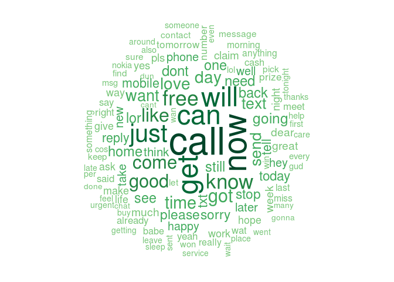
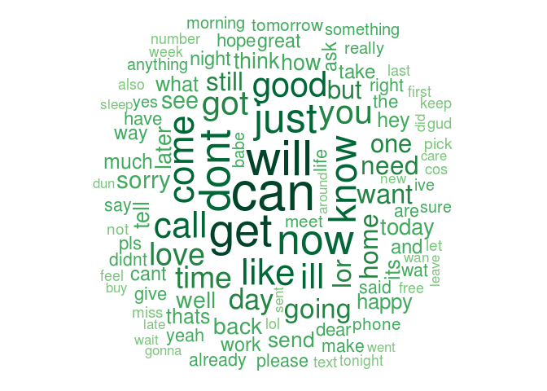

# Naive Bayes Applied - SMS messages: spam or ham?
ppar  
05. nov. 2015  

#SMS messages: spam or ham?
Filtering mobile phone spam with the __naive Bayes__ algorithm. 
Advertisers utilize Short Message Service (SMS) text messages to target potential consumers with unwanted advertising known as SMS spam. This type of spam is particularly troublesome because, unlike email spam, many cellular phone users pay a fee per SMS received. Developing a classification algorithm that could filter SMS spam would provide a useful tool for cellular phone providers.

#Data Processing
##Loading the data and some basic changes
The data and relevant information can be found (here)[http://www.dt.fee.unicamp.br/~tiago/smsspamcollection/]. For simplicity the data is available locally as part of the repository.

Load the raw data into R ...

```r
rawData <-  read.csv("./datasets/Chapter 04/sms_spam.csv", header = TRUE, stringsAsFactors = FALSE)
```


```r
#Show the structure of the raw dataset
str(rawData)
## 'data.frame':	5559 obs. of  2 variables:
##  $ type: chr  "ham" "ham" "ham" "spam" ...
##  $ text: chr  "Hope you are having a good week. Just checking in" "K..give back my thanks." "Am also doing in cbe only. But have to pay." "complimentary 4 STAR Ibiza Holiday or £10,000 cash needs your URGENT collection. 09066364349 NOW from Landline not to lose out!"| __truncated__ ...

#Summary of the raw dataset
summary(rawData)
##      type               text          
##  Length:5559        Length:5559       
##  Class :character   Class :character  
##  Mode  :character   Mode  :character
```

Possible improvements in the raw dataset are

* to __encode__ the `text` feature to `utf-8` 
* to __transform__ the `type` feature from a `character` type to a `factor` type...


```r
#Converting the text to utf-8 format
rawData$text <- iconv(rawData$text, to = "utf-8")
#Type as factor
rawData$type <- factor(rawData$type)

summary(rawData)
##    type          text          
##  ham :4812   Length:5559       
##  spam: 747   Class :character  
##              Mode  :character
```


```r
#Show the structure of the raw dataset
table(rawData$type)
## 
##  ham spam 
## 4812  747
```

As we can see from the raw dataset - there are 5559 messages - 4812 (0.8656233) classified as __ham__, 747 (0.1343767) classified as __spam__.

##Exploring and preparing the data for analysis
Some of these messages are important (__ham__) whime some of messages are irrelevant (__spam__). Let's see the content of some messages ...


```r
head(rawData$text, 5)
## [1] "Hope you are having a good week. Just checking in"                                                                                                                
## [2] "K..give back my thanks."                                                                                                                                          
## [3] "Am also doing in cbe only. But have to pay."                                                                                                                      
## [4] "complimentary 4 STAR Ibiza Holiday or £10,000 cash needs your URGENT collection. 09066364349 NOW from Landline not to lose out! Box434SK38WP150PPM18+"            
## [5] "okmail: Dear Dave this is your final notice to collect your 4* Tenerife Holiday or #5000 CASH award! Call 09061743806 from landline. TCs SAE Box326 CW25WX 150ppm"

tail(rawData$text, 5)
## [1] "You are a great role model. You are giving so much and i really wish each day for a miracle but God as a reason for everything and i must say i wish i knew why but i dont. I've looked up to you since i was young and i still do. Have a great day."
## [2] "Awesome, I remember the last time we got somebody high for the first time with diesel :V"                                                                                                                                                             
## [3] "If you don't, your prize will go to another customer. T&C at www.t-c.biz 18+ 150p/min Polo Ltd Suite 373 London W1J 6HL Please call back if busy "                                                                                                    
## [4] "SMS. ac JSco: Energy is high, but u may not know where 2channel it. 2day ur leadership skills r strong. Psychic? Reply ANS w/question. End? Reply END JSCO"                                                                                           
## [5] "Shall call now dear having food"
```

###Creating and cleaning the corpus
SMS messages are strings of text composed of words, spaces, numbers, and punctuation. We needs to consider how to remove numbers, punctuation, handle uninteresting words such as and, but, and or, and how to break apart sentences into individual words.

__Note!__ `tm` package - Text Mining package in R - can be used for such purpose. For installing the package run `install.packages("tm")`.

__First step__ is creating the **corpus**, a R object representing a collection of text documents. In this specific case a text document refers to a single SMS message.


```r
library(tm) #loading tm library for usage
## Loading required package: NLP
corpus <- Corpus(VectorSource(rawData$text))

#basic info about the corpus
print(corpus)
## <<VCorpus>>
## Metadata:  corpus specific: 0, document level (indexed): 0
## Content:  documents: 5559
```
Please note that the corpus contains 5559 text documents (aka sms text).


```r
#Inspect the first 4 documents
corpus[[1]]$content
## [1] "Hope you are having a good week. Just checking in"
corpus[[2]]$content
## [1] "K..give back my thanks."
corpus[[3]]$content
## [1] "Am also doing in cbe only. But have to pay."
corpus[[4]]$content
## [1] "complimentary 4 STAR Ibiza Holiday or £10,000 cash needs your URGENT collection. 09066364349 NOW from Landline not to lose out! Box434SK38WP150PPM18+"
```

Before splitting the text into words some __cleaning steps__ need to be performed in order to remove punctuation and other characters that may create problems.

__Note!!__ Standard transformations supported by the `tm` package. 

```
## [1] "removeNumbers"     "removePunctuation" "removeWords"      
## [4] "stemDocument"      "stripWhitespace"
```


```r
#1. normalize to lowercase
corpus <- tm_map(corpus, tolower)

#2. remove numbers
corpus <- tm_map(corpus, removeNumbers)

#3. remove stopwords e.g. to, and, but, or (using predefined set of word in tm package)
corpus <- tm_map(corpus, removeWords, stopwords())

#4. remove punctuation
corpus <- tm_map(corpus, removePunctuation)

#5. normalize whitespaces
#Now that we have removed numbers, stop words, and punctuation, the text messages are left with #blank spaces where these characters used to be. The last step then is to remove additional #whitespace, leaving only a single space between words.
corpus <- tm_map(corpus, stripWhitespace)

#Be sure to use the following script once you have completed preprocessing.
#This tells R to treat your preprocessed documents as text documents because of the non standard transformations (tolower)
corpus <- tm_map(corpus, PlainTextDocument)
```


```r
#Inspect the first 4 documents
corpus[[1]]$content
## [1] "hope good week just checking "
corpus[[2]]$content
## [1] "kgive back thanks"
corpus[[3]]$content
## [1] " also cbe pay"
corpus[[4]]$content
## [1] "complimentary star ibiza holiday cash needs urgent collection now landline lose boxskwpppm"
```

###Tokenization
Now that the data are processed to our __liking__, the final step is to split the messages into individual elements through a process called __tokenization__. A __token__ is a single element of a text string; in this case, the tokens are words.

From the __corpus__ a data structured called __sparse matrix__ is created. In the __sparse matrix__, each row (observation) represents a document (SMS text message) and each column is a token/ word. The number in a cell represents the number of time the token (col) is present in the document represented by that row.


```r
sms_dtm <- DocumentTermMatrix(corpus)

#basic information about the sparse matrix
print(sms_dtm)
## <<DocumentTermMatrix (documents: 5559, terms: 7868)>>
## Non-/sparse entries: 42595/43695617
## Sparsity           : 100%
## Maximal term length: 40
## Weighting          : term frequency (tf)
```

__Note!!__ The sparse matrix has the following dimensions

* nrows = 5559 -> the number of documents
* ncols = 7868 -> the number of features/ terms found in the corpus.

###Creation of the __Training__ and __Test__ datasets
Using the `caTools` package, specifically `sample.split` function to create a test and training sets for rawData, clean corpus and sparse matrix. Advantage of using such a function is _preserving relative ratios of different labels in X_.


```r
library(caTools)
set.seed(19711004)

spl_data <- sample.split(rawData$type, SplitRatio = 0.7)

rawData_train <- subset(rawData, spl_data) #Get only where TRUE
sms_dtm_train <- sms_dtm[spl_data,] #Get only where TRUE
corpus_train <- corpus[spl_data] #Get only where TRUE

rawData_test <- subset(rawData, !spl_data) #Get only where FALSE
sms_dtm_test <- sms_dtm[!spl_data,] #Get only where FALSE
corpus_test <- corpus[!spl_data] #Get only where FALSE
```


```r
#Training dataset info
prop.table(table(rawData_train$type))
## 
##       ham      spam 
## 0.8655873 0.1344127

#Test dataset info
prop.table(table(rawData_test$type))
## 
##       ham      spam 
## 0.8657074 0.1342926
```

###(Optional) Visual Analysis
Using the `wordclod` package to visualize frequency of words in prepared text data.


```r
library(wordcloud)
## Loading required package: RColorBrewer
pal <- brewer.pal(9,"YlGn")
pal <- pal[-(1:4)]
```

__Wordcloud for training dataset__ ....

```r
#min.freq initial settings -> around 10% of the number of docs in the corpus (40 times)
wordcloud(corpus_train, min.freq = 40, random.order = FALSE, colors = pal)
```

 

Another interesting visualization involves comparing the clouds of SMS __spam__ and __ham__ using the raw text messages that are going to be used to train the algorith... 

```r
rawData_train_spam <- subset(rawData_train, type == "spam")
rawData_train_ham <- subset(rawData_train, type == "ham")
```

__Spam__ overview...

```r
wordcloud(rawData_train_spam$text, min.freq = 40, random.order = FALSE, colors = pal)
```

 

__Ham__ overview...

```r
wordcloud(rawData_train_ham$text, min.freq = 40, random.order = FALSE, colors = pal)
```

 

Spam SMS messages include words such as urgent, free, mobile, call, claim, and stop; these terms do not appear in the ham cloud at all. Instead, ham messages use words such as can, sorry, need, and time. These stark differences suggest that our naive Bayes model will have some strong key words to differentiate between the classes.

###Creating indicator features for frequent words
The next step is to transform the sparse matrix into a data structure that can be used to train a __naive Bayes classifier__.


```r
print(sms_dtm_train)
```

```
## <<DocumentTermMatrix (documents: 3891, terms: 7868)>>
## Non-/sparse entries: 29589/30584799
## Sparsity           : 100%
## Maximal term length: 40
## Weighting          : term frequency (tf)
```
 The sparse matrix used for training include 3891 documents and 7868 features (terms). __Not all of these terms will be useful for classification__. In order to reduce thenumber of features we can proceed to consider the words that appears at least a certain number of times (__frequent words__)...


```r
sms_dict <- findFreqTerms(sms_dtm_train, 5) #find words that appears at least 5 times
summary(sms_dict)
##    Length     Class      Mode 
##      1152 character character
```

There are 1152 terms/ features idendified as frequent terms. __To limit our training and test matrix to only the words in the dictionary of frequent terms__ we can use the following commands ...


```r
sms_train <- DocumentTermMatrix(corpus_train, list(dictionary = sms_dict))
print(sms_train)
## <<DocumentTermMatrix (documents: 3891, terms: 1152)>>
## Non-/sparse entries: 21837/4460595
## Sparsity           : 100%
## Maximal term length: 15
## Weighting          : term frequency (tf)

sms_test <- DocumentTermMatrix(corpus_test, list(dictionary = sms_dict))
print(sms_test)
## <<DocumentTermMatrix (documents: 1668, terms: 1152)>>
## Non-/sparse entries: 9118/1912418
## Sparsity           : 100%
## Maximal term length: 15
## Weighting          : term frequency (tf)
```

The naive Bayes classifier is typically trained on data with categorical features. This poses a problem since the cells in the sparse matrix indicate a count of the times a word appears in a message. We should change this to a factor variable that simply indicates yes or no depending on whether the word appears at all in a document.

Let's create a function for that ...

```r
convert_counts <- function(x){
  x <- ifelse(x > 0, 1, 0)
  x <- factor(x, levels = c(0,1), labels = c("No", "Yes"))
  return (x)
}
```

Let's apply the function to each column in the sparse matrices ...

```r
sms_train <- apply(sms_train, MARGIN = 2, convert_counts)
sms_test <- apply(sms_test, MARGIN = 2, convert_counts)
```

Now we have two matrixes each with a "Yes" or "No" indicating if a specific word (feature) appears in the messages (rows).

```r
head(sms_train[,1:5])
```

```
##               Terms
## Docs           abiola able abt  accept access
##   character(0) "No"   "No" "No" "No"   "No"  
##   character(0) "No"   "No" "No" "No"   "No"  
##   character(0) "No"   "No" "No" "No"   "No"  
##   character(0) "No"   "No" "No" "No"   "No"  
##   character(0) "No"   "No" "No" "No"   "No"  
##   character(0) "No"   "No" "No" "No"   "No"
```

```r
head(sms_test[,1:5])
```

```
##               Terms
## Docs           abiola able abt  accept access
##   character(0) "No"   "No" "No" "No"   "No"  
##   character(0) "No"   "No" "No" "No"   "No"  
##   character(0) "No"   "No" "No" "No"   "No"  
##   character(0) "No"   "No" "No" "No"   "No"  
##   character(0) "No"   "No" "No" "No"   "No"  
##   character(0) "No"   "No" "No" "No"   "No"
```

##Train the model using the training dataset

```r
#Library implementing the naive Bayes algorithm
library(e1071)
```


```r
sms_classifier <- naiveBayes(sms_train, rawData_train$type)
```
##Test the model against the test dataset and evaluate model performance


```r
sms_test_pred <- predict(sms_classifier, sms_test)
```

```r
#table actual (row) vs. predicted (col)
table(rawData_test$type, sms_test_pred)
##       sms_test_pred
##         ham spam
##   ham  1438    6
##   spam   29  195
```
Looking at the table we can see that 29 messages out of 1467 ham messages (0.0197682) have been incorrcetly classified as spam, while 6 messages out of 201 spam messages (0.0298507) have been incorrectly classified as ham.
