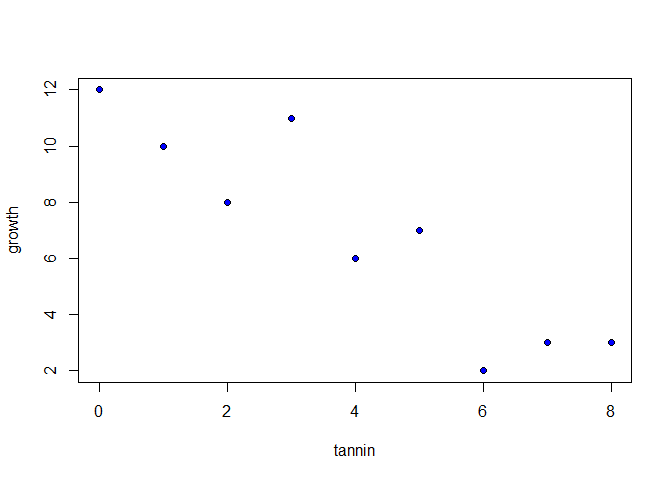
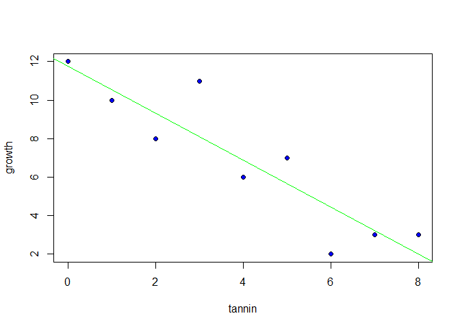

# Regression Analysis
Pier Lorenzo Paracchini  
January 4, 2016  


Regression analysis is the preferred method when both the response variable and the predictors (explanatory variables) are __continuous variables__.

The essence of the Regression Analysis is to use sample data to estimate parameter values and their standard errors having selected a model which describes the relationship between the response and the predictors (explanatory variables). __Note!__ _The model choice is a really big deal._

The __simplest model__ is the __linear model__

$y = a + b * x$

where

* y: response variable
* x: explanatory variable
* a: the __intercept__, the value of y when x = 0
* b: the __slope__, the change of y for a change of x

##Example

```r
reg.data <- read.csv("./datasets/tannin.csv")
attach(reg.data)
```


```r
str(reg.data)
```

```
## 'data.frame':	9 obs. of  2 variables:
##  $ growth: int  12 10 8 11 6 7 2 3 3
##  $ tannin: int  0 1 2 3 4 5 6 7 8
```

```r
summary(reg.data)
```

```
##      growth           tannin 
##  Min.   : 2.000   Min.   :0  
##  1st Qu.: 3.000   1st Qu.:2  
##  Median : 7.000   Median :4  
##  Mean   : 6.889   Mean   :4  
##  3rd Qu.:10.000   3rd Qu.:6  
##  Max.   :12.000   Max.   :8
```

```r
#Regression by eye: 
#What has happened to the y value?
#How has the x value changed?
plot(tannin, growth, pch=21, bg="blue")
```

 

###Linear Regression

```r
#growth = a + b * tannin
reg.model.fit <- lm(growth ~ tannin)
#Calculate the predicted y based on the model (for the provided x)
reg.model.prediction <- predict(reg.model.fit)

summary(reg.model.fit)
```

```
## 
## Call:
## lm(formula = growth ~ tannin)
## 
## Residuals:
##     Min      1Q  Median      3Q     Max 
## -2.4556 -0.8889 -0.2389  0.9778  2.8944 
## 
## Coefficients:
##             Estimate Std. Error t value Pr(>|t|)    
## (Intercept)  11.7556     1.0408  11.295 9.54e-06 ***
## tannin       -1.2167     0.2186  -5.565 0.000846 ***
## ---
## Signif. codes:  0 '***' 0.001 '**' 0.01 '*' 0.05 '.' 0.1 ' ' 1
## 
## Residual standard error: 1.693 on 7 degrees of freedom
## Multiple R-squared:  0.8157,	Adjusted R-squared:  0.7893 
## F-statistic: 30.97 on 1 and 7 DF,  p-value: 0.0008461
```

The two parameters __a__ and __b__ are called __coefficients__ in R and their estimates are calculated using the __maximum likelihood estimates__ of the parameters. Alias _"we want to find the values of the slope and intercept that make the data most likely."_ - implemented using SSE (Sum of Squared Errors) and minimizing it.


```r
plot(tannin, growth, pch=21, bg="blue")
abline(reg = reg.model.fit, col="green")
```

 

The fit is reasonably good but it is not perfect. The observations do not lie on the fitted line. The difference between an observation and the predicted value (using the model) for a specific x (explanatory variable) is called __residual__.

The fit pass through the point in the centre of the cloud of data. The best-fit line will be pivoted about the mean values of x and y and our job is to find the best value for this slope <U+2013> the one that minimizes the sum of squares of the red lines in the graph above.


```r
#Observations: growth (y)
growth
## [1] 12 10  8 11  6  7  2  3  3

#Predictions
reg.model.prediction
##         1         2         3         4         5         6         7 
## 11.755556 10.538889  9.322222  8.105556  6.888889  5.672222  4.455556 
##         8         9 
##  3.238889  2.022222

#Residual (Observation - Prediction)
growth - reg.model.prediction
##          1          2          3          4          5          6 
##  0.2444444 -0.5388889 -1.3222222  2.8944444 -0.8888889  1.3277778 
##          7          8          9 
## -2.4555556 -0.2388889  0.9777778
```

Let's visualize the __residuals__ ...


```r
plot(tannin, growth, pch=21, bg="blue")
abline(reg = reg.model.fit, col="green")
for(i in 1:length(tannin)){
  lines(c(tannin[i], tannin[i]), c(growth[i], reg.model.prediction[i]), col="red")
}
```

 

Residuals:

$d_i = y_i - \hat y_i$  
$d_i = y_i - \hat a - \hat b * x_i$ 

__Property#1__: The sum of the residuals in a linear regression is __zero__ $\sum d_i = \sum (y_i - \hat a - \hat b * x_i) = 0$   


Residuals are very important to estimate and evalute the goodness of the model. Our __maximum likelihood__ model is defined as _the model that minimize the sum of the squares of these residuals_.

Visualizing the SSE changing the slope coefficient. We can see that the minimum SSE is at the estimated slope coeffiecient (using the linear regression model).


```r
b <- seq(-3, 1, 0.01)
sse <- numeric(length = length(b))

for (i in 1:length(b)){
  #Based on the fact that the regression line pass through the sample mean of x and y
  a <- mean(growth) - b[i] * mean(tannin)
  evaluated.residuals <- growth - (a + (b[i] * tannin))
  sse[i] <- sum(evaluated.residuals ^ 2)
}

#estimated b for the minimum SSE
b[which(sse == min(sse))]
## [1] -1.22

plot(b, sse, type="l", ylim=c(19,25))
abline(h=20.07225,col="green",lty=2)
arrows(-1.216,20.07225,-1.216,19,col="red")
```

 

###Calculation Involved in Linear Regression

Basic elements: the __corrected sums__ calculations.l

Corrected Sum of Squares of y: $SSY = \sum y_i^2 - (\sum y_i)^2 / n$  
Corrected Sum of Squares of x: $SSX = \sum x_i^2 - (\sum x_i)^2 / n$  
Corrected Sum of Squares of products xy: $SSXY = \sum x_i * y_i - (\sum x_i * \sum y_i)  / n$  

These corrected sum are absolutely central to everything that follows about regression and analysis of variance. Specifically ...

__Total Variability__: $SSY = SSR + SSE = \sum (y_i - \overline{y})^2 =  \sum y_i^2 - (\sum y_i)^2 / n$

__Regression Variability__ (Regression Sum of Squares): $SSR = \sum (\hat y_i - \overline{y})^2 = SSXY^2/SSX$
The variability that is explained by the model.


__Residual Variability__ (Error Sum of Squares): $SSE = \sum (y_i - \hat y_i)^2 = SSY - SSR = \sum (y_i - \hat a - \hat b * x_i)^2$
The variability that is not explained by the model/ leftover around the regression line.

Correlation Coefficient __R__: $R^2 = SSR/ SSY = (SSXY / (\sqrt{SSX * SSY}))^2$  


```r
n <- length(growth)

SSX <- sum(tannin ^ 2) - sum(tannin) ^ 2 / n
SSXY <- sum(growth * tannin) - (sum(growth) * sum(tannin))/n

SSY <- sum(growth ^ 2) - sum(growth) ^ 2 / n
SSY.1 <- sum((growth - mean(growth))^2)

SSR <- (SSXY^2) / SSX
SSR.1 <- sum((reg.model.prediction - mean(growth))^2)

SSE <- SSY - SSR
SSE.1 <- sum((growth - reg.model.prediction)^2)

SSY.2 <- SSR + SSE

Rs <- SSR/ SSY
Rs.1 <- (SSXY / (sqrt(SSX * SSY)))^2


variabilitiesTbl <- rbind(c(SSY, SSR, SSE, Rs), c(SSY.1, SSR.1, SSE.1, Rs.1), c(SSY.2, NA, NA, NA))
colnames(variabilitiesTbl) <- c("SSY", "SSR", "SSE", "R^2")

variabilitiesTbl
##           SSY      SSR      SSE       R^2
## [1,] 108.8889 88.81667 20.07222 0.8156633
## [2,] 108.8889 88.81667 20.07222 0.8156633
## [3,] 108.8889       NA       NA        NA
```

The maximum likelihood estimate for the slope b and the intercept a can be calculated using the folowing formulas:

$b = SSXY/SSX$  
$a = \overline{y} - b * \overline{x}$, where $\overline{y} = \sum y_i / n$ and $\overline{x} = \sum x_i / n$  


Estimation of the coefficients done using the previous formulas are identical to estimation done using the `lm` function.


```r
n <- length(growth)
SSY <- sum(growth ^ 2) - sum(growth) ^ 2 / n
SSX <- sum(tannin ^ 2) - sum(tannin) ^ 2 / n
SSXY <- sum(growth * tannin) - (sum(growth) * sum(tannin))/n

b_coeff <- SSXY/SSX
a_coeff <- mean(growth) - b_coeff * mean(tannin)
#Intercept
a_coeff
## [1] 11.75556
#Slope
b_coeff
## [1] -1.216667
```

In addition to the estimates of the parameters we need to measure the __unreliability associated with each one of them__. In other words we need to calculate the __standard error of the intercept__ and the __standard error of the slope__.

The __ANOVA__ table

* Variability (SSR, SSR, SSY)
* Degrees of Freedom (for each variability source)
    * SSY, only one parameter is estimated from the data $\overline{y}$ so `n-1` degrees of freedom
    * SSE, two parameters are estimated from the data $\hat a$ and $\hat b$ so `n-2` degrees of freedom
    * SSR, `1` degree of freedom, _"how many extra parameters, over and above the mean value of y, did you estimate when fitting the regression model to the data?"_
* __Mean squares__ is the variance calculated as $Sum of Squares / Degrees of Freedom$
*F ratio = Variance(SSR) / Variance(SSE) 
  
|Variability Source|Variability (Sum of Squares)|Degrees of Freedom|Mean squares|F ratio|
|-|-|-|-|-|
|Regression|88.8166667|1|88.8166667|30.9739828|
|Residual/ Error|20.0722222|7|2.8674603||
|Total|108.8888889|8|||


"The null hypothesis under test in a linear regression is that the slope of the regression line is zero (i.e. no dependence of y on x). The two-tailed alternative hypothesis is that the slope is significantly different from zero (either positive or negative). In many applications it is not particularly interesting to reject the null hypothesis, because we are interested in the effect sizes (estimates of the slope and intercept) and their standard errors. We often know from the outset that the null hypothesis is false. Nevertheless, to test whether the F ratio is sufficiently large to reject the null hypothesis, we compare our test statistic (the calculated value of F in the final column of the ANOVA table) with the critical value of F. Recall that the test statistic is the value of F that is expected by chance alone when the null hypothesis is true. We find the critical value of F from quantiles of the F distribution qf, with 1 d.f. in the numerator and n <U+2212> 2 d.f. in the denominator (as described below)."


```r
criticalF.95 <- qf(0.95, 1, (n-2))
criticalF.95
```

```
## [1] 5.591448
```
Calculated F value is 30.9739828 and the critical F value (95%) is 5.5914479. Being the calculated much bigger than the critical value we can __reject the null hypothesis__.


```r
pp <- 1 - pf((SSR / 1) / (SSE / (n-2)), 1, (n-2))
```

The probability of getting a value for F as large as the calculated on if the null hypothesis is true is 8.4607384\times 10^{-4} - quite small so very unlikely to get such statistic under the null hypothesis.


#Reference

* Chapter 7 of ["Statistics: An Introduction Using R"](http://eu.wiley.com/WileyCDA/WileyTitle/productCd-1118941098.html)
