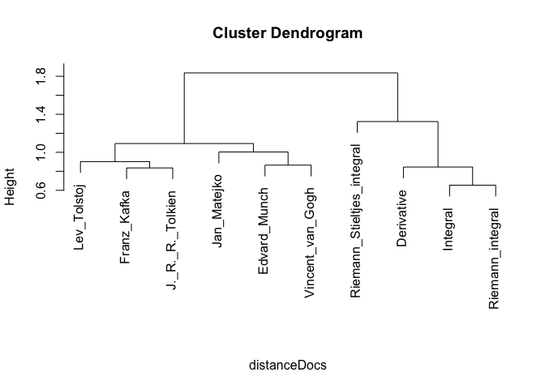

# Automatica Categorization of Wikipedia articles
ppar  
13 Nov 2015  

The following exercise is based on the blog ["Text Mining in R - Automatic categorization of Wikipedia articles"](http://www.r-bloggers.com/text-mining-in-r-automatic-categorization-of-wikipedia-articles/) by Norbert Ryciak appeared on R-bloggers on June 16, 2014.

An example of __hierarchical__ categorization of Wikipedia articles taking adavantage of the text mining and analysis capability of R and specifically the `RCurl` and `tm` packages.


```r
Sys.setlocale("LC_ALL", "C")
## [1] "C/C/C/C/C/no_NO.UTF-8"
require(RCurl)
## Loading required package: RCurl
## Warning: package 'RCurl' was built under R version 3.1.3
## Loading required package: bitops
require(tm)
## Loading required package: tm
## Warning: package 'tm' was built under R version 3.1.3
## Loading required package: NLP
## Warning: package 'NLP' was built under R version 3.1.3
require(proxy)
## Loading required package: proxy
## Warning: package 'proxy' was built under R version 3.1.3
## 
## Attaching package: 'proxy'
## 
## The following objects are masked from 'package:stats':
## 
##     as.dist, dist
## 
## The following object is masked from 'package:base':
## 
##     as.matrix
```

##Loading the data
Let??s prepare a list of Wikipedia articles by _title_ that are going to be used for this exercise.

* Articles
    * 4 mathematical articles
    * 3 articles about painters
    * 3 articles about writers


```r
wiki <- "https://en.wikipedia.org/wiki/"
titles <- c(
    "Integral", "Riemann_integral", "Riemann_Stieltjes_integral", "Derivative",
    "Edvard_Munch", "Vincent_van_Gogh", "Jan_Matejko",
    "Lev_Tolstoj", "Franz_Kafka", "J._R._R._Tolkien"
)

articleUris <- paste(wiki, titles, sep = "")

#data stucture to contain each article
articles <- character(length(titles))

for(i in 1 : length(titles)){
    articles[i] <- getURL(articleUris[i])
}
```

##Creating the Corpus
First step is to create the corpus from our set of documents (articles) ...

```r
theCorpus <- Corpus(VectorSource(articles))
print(theCorpus)
## <<VCorpus>>
## Metadata:  corpus specific: 0, document level (indexed): 0
## Content:  documents: 10
#The corpus contains the 10 documents

#Structure of a document in the corpus
str(theCorpus[1])
## List of 1
##  $ 1:List of 2
##   ..$ content: chr "<!DOCTYPE html>\n<html lang=\"en\" dir=\"ltr\" class=\"client-nojs\">\n<head>\n<meta charset=\"UTF-8\" />\n<title>Integral - Wi"| __truncated__
##   ..$ meta   :List of 7
##   .. ..$ author       : chr(0) 
##   .. ..$ datetimestamp: POSIXlt[1:1], format: "2015-11-13 19:44:28"
##   .. ..$ description  : chr(0) 
##   .. ..$ heading      : chr(0) 
##   .. ..$ id           : chr "1"
##   .. ..$ language     : chr "en"
##   .. ..$ origin       : chr(0) 
##   .. ..- attr(*, "class")= chr "TextDocumentMeta"
##   ..- attr(*, "class")= chr [1:2] "PlainTextDocument" "TextDocument"
##  - attr(*, "class")= chr [1:2] "VCorpus" "Corpus"
```

##Processing the Corpus
This is the first step of text analysis. It???s important because preparing the data strongly affects the results. 

* Replace all ???html??? elements with a space. We do it because there are not a part of text document but in general a html code.
* Replace all ???/t??? with a space.
* Transform characters to lower case.
* Remove punctuation marks and numbers
* Remove from the documents words which we find redundant for text mining (e.g. pronouns, conjunctions). We set this words as stopwords(???english???) which is a built-in list for English language (this argument is passed to the function removeWords.
* Remove extra whitespaces from the documents.


```r
#Removing <..> elements
#Note when doing the transformation - content_transformer must be used cause
#this transformation is not a std transformation defined into the tm package
theCorpus <- tm_map(theCorpus, content_transformer(function(a){ gsub("<.+?>", " ", a)}))

#Removing "\t"" tab elements
#Note when doing the transformation - content_transformer must be used cause
#this transformation is not a std transformation defined into the tm package
theCorpus <- tm_map(theCorpus, content_transformer(function(b) {gsub("\t", " ", b)}))

#To lowercase
#Note when doing the transformation - content_transformer must be used cause
#this transformation is not a std transformation defined into the tm package
theCorpus <- tm_map(theCorpus, content_transformer(tolower))

#Remove numbers
theCorpus <- tm_map(theCorpus, removeNumbers)

#Remove punctuations
theCorpus <- tm_map(theCorpus, removePunctuation)

#Remove stopwords
theCorpus <- tm_map(theCorpus, removeWords, stopwords("english"))

#Normalize whitespaces
theCorpus <- tm_map(theCorpus, stripWhitespace)
```

Lets visualize the outcome of the text processing ...

```r
substr(articles[1], 1, 500)
```

```
## [1] "<!DOCTYPE html>\n<html lang=\"en\" dir=\"ltr\" class=\"client-nojs\">\n<head>\n<meta charset=\"UTF-8\" />\n<title>Integral - Wikipedia, the free encyclopedia</title>\n<script>document.documentElement.className = document.documentElement.className.replace( /(^|\\s)client-nojs(\\s|$)/, \"$1client-js$2\" );</script>\n<script>window.RLQ = window.RLQ || []; window.RLQ.push( function () {\nmw.config.set({\"wgCanonicalNamespace\":\"\",\"wgCanonicalSpecialPageName\":false,\"wgNamespaceNumber\":0,\"wgPageName\":\"Integral\",\"wgTitle\":"
```

```r
substr(theCorpus[[1]]$content, 1, 500)
```

```
## [1] " integral wikipedia free encyclopedia documentdocumentelementclassname documentdocumentelementclassnamereplace sclientnojss clientjs windowrlq windowrlq windowrlqpush function mwconfigsetwgcanonicalnamespacewgcanonicalspecialpagenamefalsewgnamespacenumberwgpagenameintegralwgtitleintegralwgcurrevisionidwgrevisionidwgarticleidwgisarticletruewgisredirectfalsewgactionviewwgusernamenullwgusergroupswgcategoriesarticles needing additional references april articles needing additional referencesintegrals"
```
##Analysis of the Corpus
The starting point is creating `DocumentTermMatrix` - define the frequency of each term in each document in the corpus. This is a fundamental object in the text analysis. 


```r
theCorpusDTM <- DocumentTermMatrix(theCorpus)
theCorpusDTM
## <<DocumentTermMatrix (documents: 10, terms: 12256)>>
## Non-/sparse entries: 21583/100977
## Sparsity           : 82%
## Maximal term length: 1189
## Weighting          : term frequency (tf)

#Visualize the content of the matrix
theCorpusDTM_m <- as.matrix(theCorpusDTM)
print(as.matrix(theCorpusDTM_m[,9:10]))
##     Terms
## Docs   <U+00C9>douard   <U+00C9>lie
##   1               0           1
##   2               0           0
##   3               0           0
##   4               0           0
##   5               0           0
##   6               1           0
##   7               0           0
##   8               0           0
##   9               2           0
##   10              0           0
```

The current corpus of 10 documents has 12256 terms. A possible approach is to reduce the number of relevant terms, removing all of the terms that are under a certain frequency.

Lets find the frequent terms, starting with a lower frequency set to 11, and lets use these terms to create a dictionary that will be use to recreate the `DocumentTermMatrix`.


```r
#find words that appears at least 10 times
theCorpus_dict <- findFreqTerms(theCorpusDTM, lowfreq = 11) 
summary(theCorpus_dict)
##    Length     Class      Mode 
##       908 character character
theCorpus_dict[1:10]
##  [1] "<U+00D7>cm"                                                  
##  [2] "<U+0411><U+0435><U+043B><U+0430><U+0440><U+0443><U+0441><U+043A><U+0430><U+044F>"
##  [3] "able"                                                        
##  [4] "absolute"                                                    
##  [5] "academic"                                                    
##  [6] "academy"                                                     
##  [7] "according"                                                   
##  [8] "account"                                                     
##  [9] "accuracy"                                                    
## [10] "addition"

theCorpusDTM_s <- DocumentTermMatrix(theCorpus, list(dictionary = theCorpus_dict))
theCorpusDTM_s
## <<DocumentTermMatrix (documents: 10, terms: 908)>>
## Non-/sparse entries: 4609/4471
## Sparsity           : 49%
## Maximal term length: 20
## Weighting          : term frequency (tf)

#Visualize the content of the matrix
theCorpusDTM_s_m <- as.matrix(theCorpusDTM_s)
print(as.matrix(theCorpusDTM_m[,9:10]))
##     Terms
## Docs   <U+00C9>douard   <U+00C9>lie
##   1               0           1
##   2               0           0
##   3               0           0
##   4               0           0
##   5               0           0
##   6               1           0
##   7               0           0
##   8               0           0
##   9               2           0
##   10              0           0
```

Based on it we create a matrix of dissimilarities ??? it measures dissimilarity between documents (the function dissimilarity returns an object of class dist ??? it is a convenience because clustering functions require this type of argument).

```r
distanceDocs <- dist(theCorpusDTM_s_m, method = "Hellinger")
distanceDocs_m <- as.matrix(distanceDocs)
distanceDocs_m[, 1:5]
##            1         2        3         4         5
## 1  0.0000000 0.6536879 1.164898 0.7451819 1.1598033
## 2  0.6536879 0.0000000 1.129624 0.8541140 1.1987613
## 3  1.1648981 1.1296242 0.000000 1.2003915 1.2242494
## 4  0.7451819 0.8541140 1.200392 0.0000000 1.1774214
## 5  1.1598033 1.1987613 1.224249 1.1774214 0.0000000
## 6  1.1636005 1.2149497 1.259500 1.1863261 0.8647776
## 7  1.2050047 1.2385327 1.184569 1.2288196 0.9501897
## 8  1.1712484 1.2081354 1.212476 1.1922494 0.9873273
## 9  1.1544617 1.2118413 1.256723 1.1764792 0.9434447
## 10 1.1364590 1.1852378 1.243741 1.1494221 0.9471039
rownames(distanceDocs_m) <- titles
colnames(distanceDocs_m) <- titles
```

At last we apply the function hclust (but it can be any clusterig function) and we see result on the plot.

```r
h <- hclust(distanceDocs, method = "ward.D2")
plot(h, labels = titles, sub = "")
```

 
