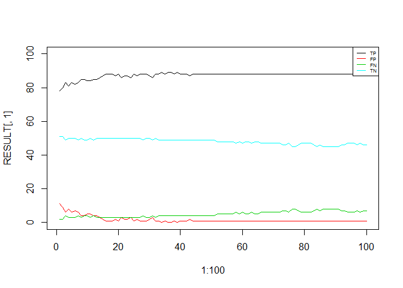

# Classification Using KNN


__Core Concept__  
"_... things that are alike are likely to have properties that are alike._"

Nearest-Neighbors (NN) classifiers are defined by their characteristic of classifying __unlabeled__ examples by assigning them the class of similar labeled examples. NN methods are quite owerful.

# The k-NN algorithm

| Strengths | Weakness |
| --------- | -------- |
| Simple and effective | Does not produce a model, limited interpretability |
| Makes no assumption ablout the underlying data distribution | Requires the selection of an appropiate K |
| Fast training phase | Slow classification phase |
| | Nominal features and missing data require additional processing |


The k-NN algorith uses k nearest-neighbors to classify unlabeled obseravtions. After choosing k, the algorithm requires a trining dataset made up of labeled observations. Then for each unlabeled observation, k-NN identifies the k records in the training dataset that are nearest/ similar to the observation undr analysis. The unlabeled observation is assigned the same class representing the majority of the k neighbors.

The KNN algorith is considered __lazy learning/ instance-based learning/ rote learning__ cause no abstraction/ generalization occurs. A __lazy learner__ is not learning anything, it just stores the training data. For this reason the training phase - which is not actually training anything - is very fast. On the other side the making prediction tends to be very slow having to go through the training data than using an abstraction/ generalization.

Although KNN classifiers are considered lazy, they are still quite powerful under certain circumstances.

## How to Quantify Similarity 

Similarity is measured with __distance__. A __distance function__ is a function or formula that measures the similarity between two different observations/ instances.

There are many ways to calculate the __distance__ traditionally the K-NN algorithm uses the __euclidean distance__ which is the distance that would be measured if it were possible to use a ruler between the two observations/ points. Note! the euclidean distance is measured "as the crow flies" or in other words "the shortest direct route".

{p, q} are two observations to be compared, each observation has n (quantitative) features then the euclidean distance is calculated as 

\[dist(p,q) = \sqrt{(p1-q1)^2 + (p2-q2)^2 + .. + (pn -qn)^2}\]

## Choosing the appropiate k

The decion of how many neighbors (K) to use in the algorithm influences how well the classification performs on unlabeled data (__bias-variance tradeoff__). Choosing a large k reduces the variance but increases the bias (__bias the learner__), on the other side choosing a small k (e.g. k = 1) increases the variance but reduces the bias (the learner is able to identify small and important patterns).

In practice choosing k depends on the difficulty of the concept to be learned and the number of observations in the training dataset - "_One common practice is to begin with k equal to the square root of the number of training examples_" and then test several k values on a variety of test dataset and choose the one that deliver the best classification performance.

## Preparing the data for KNN

The distance formula is highly dependent on how the features are measured (e.g scale) - the features with the dominat scales will influence the distance two observations. For this reason features are transformed to a __standard range__ before applying the algorithm.

One solution is to __rescale__ the features by shrinking or expanding their range in order to have each feature contributing the distance calculation, e.g the __min-max normalization__, the __z-score standardization__.

__min-max normalization__ for a feature x

\[x_{new} = \frac{x - min(x)}{max(x) - min(x)}\]


__z-score standardization__ for a feature x

\[x_{new} = \frac{x - \mu}{\sigma} = \frac{x - mean(x)}{stdDev(x)}\]


## The case of nominal/ qualitative data

The distance formula is not defined for nominal/ qualitative data, e.g. what is the distance between "male" and "female"? A typical solution for nominal/ qualitative features is to introduce __dummy variables__ and if necessary apply normalization.


# Example - Using k-NN to diagnose breast cancer


```r
require(caret)
require(class)
require(gmodels)
```

## Information about the data
The data and its relevant information are available in the [UCI Machine Learning Repository](http://archive.ics.uci.edu/ml/datasets/Breast+Cancer+Wisconsin+%28Diagnostic%29).

"_The breast cancer data includes 569 examples of cancer biopsies, each with 32 features. One feature is an identification number, another is the cancer diagnosis, and 30 are numeric-valued laboratory measurements. The diagnosis is coded as "M" to indicate malignant or "B" to indicate benign._"


```r
data.ori <- read.csv("./datasets/wisc_bc_data.csv", stringsAsFactors = F, header = T)

#Split the data for exploration analysis
set.seed(19711004)
idx.train <- createDataPartition(data.ori$diagnosis, p = 0.75, list = F, times = 1)

data.train <- data.ori[idx.train,]
data.test <- data.ori[-idx.train,]
```

## Exploring the data


```r
str(data.train)
## 'data.frame':	427 obs. of  32 variables:
##  $ id               : int  87139402 868871 925291 87880 89827 8711003 857810 9111805 925277 89511502 ...
##  $ diagnosis        : chr  "B" "B" "B" "M" ...
##  $ radius_mean      : num  12.3 11.3 11.5 13.8 11.1 ...
##  $ texture_mean     : num  12.4 13.4 23.9 23.8 15 ...
##  $ perimeter_mean   : num  78.8 73 74.5 91.6 71.5 ...
##  $ area_mean        : num  464 385 404 598 374 ...
##  $ smoothness_mean  : num  0.1028 0.1164 0.0926 0.1323 0.1033 ...
##  $ compactness_mean : num  0.0698 0.1136 0.1021 0.1768 0.091 ...
##  $ concavity_mean   : num  0.0399 0.0464 0.1112 0.1558 0.054 ...
##  $ points_mean      : num  0.037 0.048 0.0411 0.0918 0.0334 ...
##  $ symmetry_mean    : num  0.196 0.177 0.139 0.225 0.178 ...
##  $ dimension_mean   : num  0.0595 0.0607 0.0657 0.0742 0.0691 ...
##  $ radius_se        : num  0.236 0.338 0.239 0.565 0.16 ...
##  $ texture_se       : num  0.666 1.343 2.904 1.93 0.823 ...
##  $ perimeter_se     : num  1.67 1.85 1.94 3.91 1.35 ...
##  $ area_se          : num  17.4 26.3 17 52.7 10.8 ...
##  $ smoothness_se    : num  0.00805 0.01127 0.0082 0.00882 0.00742 ...
##  $ compactness_se   : num  0.0118 0.035 0.0298 0.0311 0.0188 ...
##  $ concavity_se     : num  0.0168 0.0219 0.0574 0.0311 0.0276 ...
##  $ points_se        : num  0.0124 0.0197 0.0127 0.0129 0.0101 ...
##  $ symmetry_se      : num  0.0192 0.0158 0.0149 0.02 0.0235 ...
##  $ dimension_se     : num  0.00225 0.00344 0.00474 0.00451 0.00292 ...
##  $ radius_worst     : num  13.5 11.9 12.5 19.2 11.9 ...
##  $ texture_worst    : num  15.6 15.8 37.2 41.9 19.9 ...
##  $ perimeter_worst  : num  87 76.5 82.3 128.5 79.8 ...
##  $ area_worst       : num  549 434 474 1153 440 ...
##  $ smoothness_worst : num  0.139 0.137 0.13 0.223 0.142 ...
##  $ compactness_worst: num  0.127 0.182 0.252 0.521 0.221 ...
##  $ concavity_worst  : num  0.1242 0.0867 0.363 0.4646 0.2299 ...
##  $ points_worst     : num  0.0939 0.0861 0.0965 0.2013 0.1075 ...
##  $ symmetry_worst   : num  0.283 0.21 0.211 0.443 0.33 ...
##  $ dimension_worst  : num  0.0677 0.0678 0.0873 0.1086 0.0908 ...
```

`diagnosis` is a qualitative feature, the __outcome/ lable__, all of the others features are quantitative. 


`id` feature is a unique identifier for each patient and it does not provide useful information - so it will be excluded from the model. Note!! __ID variables__ should alwys be excluded regardless of the machine learning method used.


```r
data.train <- data.train[,-1]

#Same need to be done on testing dataset
data.test <- data.test[,-1]
```


```r
table(data.train$diagnosis)
## 
##   B   M 
## 268 159
round(prop.table(table(data.train$diagnosis)) * 100, digits = 2)
## 
##     B     M 
## 62.76 37.24

#Summary of the data
summary(data.train)
##   diagnosis          radius_mean      texture_mean   perimeter_mean  
##  Length:427         Min.   : 7.729   Min.   : 9.71   Min.   : 47.92  
##  Class :character   1st Qu.:11.750   1st Qu.:16.20   1st Qu.: 75.53  
##  Mode  :character   Median :13.400   Median :18.70   Median : 86.49  
##                     Mean   :14.149   Mean   :19.32   Mean   : 92.09  
##                     3rd Qu.:15.940   3rd Qu.:21.71   3rd Qu.:104.90  
##                     Max.   :28.110   Max.   :39.28   Max.   :188.50  
##    area_mean      smoothness_mean   compactness_mean  concavity_mean   
##  Min.   : 178.8   Min.   :0.05263   Min.   :0.01938   Min.   :0.00000  
##  1st Qu.: 426.4   1st Qu.:0.08586   1st Qu.:0.06352   1st Qu.:0.02796  
##  Median : 552.4   Median :0.09587   Median :0.09242   Median :0.06155  
##  Mean   : 656.9   Mean   :0.09609   Mean   :0.10348   Mean   :0.08825  
##  3rd Qu.: 790.9   3rd Qu.:0.10535   3rd Qu.:0.13040   3rd Qu.:0.13200  
##  Max.   :2501.0   Max.   :0.14470   Max.   :0.31140   Max.   :0.42680  
##   points_mean      symmetry_mean    dimension_mean      radius_se     
##  Min.   :0.00000   Min.   :0.1060   Min.   :0.04996   Min.   :0.1115  
##  1st Qu.:0.01965   1st Qu.:0.1633   1st Qu.:0.05775   1st Qu.:0.2316  
##  Median :0.03390   Median :0.1798   Median :0.06148   Median :0.3160  
##  Mean   :0.04867   Mean   :0.1815   Mean   :0.06266   Mean   :0.4089  
##  3rd Qu.:0.07202   3rd Qu.:0.1961   3rd Qu.:0.06610   3rd Qu.:0.5006  
##  Max.   :0.20120   Max.   :0.3040   Max.   :0.09575   Max.   :2.8730  
##    texture_se      perimeter_se       area_se        smoothness_se     
##  Min.   :0.3602   Min.   : 0.757   Min.   :  6.802   Min.   :0.001713  
##  1st Qu.:0.8293   1st Qu.: 1.570   1st Qu.: 17.640   1st Qu.:0.005084  
##  Median :1.0790   Median : 2.257   Median : 24.200   Median :0.006307  
##  Mean   :1.2208   Mean   : 2.884   Mean   : 41.142   Mean   :0.007021  
##  3rd Qu.:1.4745   3rd Qu.: 3.412   3rd Qu.: 46.475   3rd Qu.:0.008091  
##  Max.   :4.8850   Max.   :21.980   Max.   :542.200   Max.   :0.031130  
##  compactness_se      concavity_se       points_se       
##  Min.   :0.002252   Min.   :0.00000   Min.   :0.000000  
##  1st Qu.:0.012805   1st Qu.:0.01463   1st Qu.:0.007364  
##  Median :0.020160   Median :0.02575   Median :0.010900  
##  Mean   :0.025255   Mean   :0.03177   Mean   :0.011737  
##  3rd Qu.:0.032535   3rd Qu.:0.04011   3rd Qu.:0.014990  
##  Max.   :0.135400   Max.   :0.39600   Max.   :0.052790  
##   symmetry_se        dimension_se        radius_worst    texture_worst  
##  Min.   :0.007882   Min.   :0.0008948   Min.   : 8.952   Min.   :12.02  
##  1st Qu.:0.015170   1st Qu.:0.0022250   1st Qu.:13.060   1st Qu.:21.05  
##  Median :0.018780   Median :0.0031360   Median :14.910   Median :25.27  
##  Mean   :0.020622   Mean   :0.0038084   Mean   :16.287   Mean   :25.69  
##  3rd Qu.:0.023510   3rd Qu.:0.0045600   3rd Qu.:18.895   3rd Qu.:29.42  
##  Max.   :0.061460   Max.   :0.0298400   Max.   :36.040   Max.   :49.54  
##  perimeter_worst    area_worst     smoothness_worst  compactness_worst
##  Min.   : 56.65   Min.   : 240.1   Min.   :0.07117   Min.   :0.02729  
##  1st Qu.: 84.39   1st Qu.: 517.1   1st Qu.:0.11530   1st Qu.:0.13925  
##  Median : 97.17   Median : 684.5   Median :0.13120   Median :0.21560  
##  Mean   :107.33   Mean   : 882.6   Mean   :0.13191   Mean   :0.25200  
##  3rd Qu.:126.80   3rd Qu.:1091.5   3rd Qu.:0.14555   3rd Qu.:0.34225  
##  Max.   :251.20   Max.   :4254.0   Max.   :0.22260   Max.   :0.93790  
##  concavity_worst   points_worst    symmetry_worst   dimension_worst  
##  Min.   :0.0000   Min.   :0.0000   Min.   :0.1565   Min.   :0.05504  
##  1st Qu.:0.1075   1st Qu.:0.0632   1st Qu.:0.2505   1st Qu.:0.07125  
##  Median :0.2267   Median :0.1012   Median :0.2823   Median :0.07987  
##  Mean   :0.2696   Mean   :0.1138   Mean   :0.2906   Mean   :0.08371  
##  3rd Qu.:0.3831   3rd Qu.:0.1620   3rd Qu.:0.3187   3rd Qu.:0.09210  
##  Max.   :1.2520   Max.   :0.2903   Max.   :0.5774   Max.   :0.14860
```

Looking at the summary for all of the quantitative features the __scale__ of features are different and this could create problems in teh distance calculation.

## Transforming and Normalizing the numeric data


```r
data.train$diagnosis <- factor(data.train$diagnosis, levels = c("B", "M"), labels = c("Benign", "Malignant"))

#Same transformation applied to test dataset
data.test$diagnosis <- factor(data.test$diagnosis, levels = c("B", "M"), labels = c("Benign", "Malignant"))
```

The __min-max noirmalization__ is used to transofrming and normalizing the data.


```r
normalize <- function(x){
    return ((x - min(x))/(max(x)-min(x)))
}

data.train.norm <- as.data.frame(lapply(data.train[, 2:31], normalize))
#Same transformation done on test dataset
data.test.norm <- as.data.frame(lapply(data.test[, 2:31], normalize))

summary(data.train.norm)
```

```
##   radius_mean      texture_mean    perimeter_mean     area_mean     
##  Min.   :0.0000   Min.   :0.0000   Min.   :0.0000   Min.   :0.0000  
##  1st Qu.:0.1973   1st Qu.:0.2193   1st Qu.:0.1964   1st Qu.:0.1066  
##  Median :0.2782   Median :0.3040   Median :0.2744   Median :0.1609  
##  Mean   :0.3150   Mean   :0.3250   Mean   :0.3142   Mean   :0.2059  
##  3rd Qu.:0.4029   3rd Qu.:0.4058   3rd Qu.:0.4053   3rd Qu.:0.2636  
##  Max.   :1.0000   Max.   :1.0000   Max.   :1.0000   Max.   :1.0000  
##  smoothness_mean  compactness_mean concavity_mean    points_mean     
##  Min.   :0.0000   Min.   :0.0000   Min.   :0.0000   Min.   :0.00000  
##  1st Qu.:0.3609   1st Qu.:0.1511   1st Qu.:0.0655   1st Qu.:0.09769  
##  Median :0.4696   Median :0.2501   Median :0.1442   Median :0.16849  
##  Mean   :0.4720   Mean   :0.2880   Mean   :0.2068   Mean   :0.24191  
##  3rd Qu.:0.5726   3rd Qu.:0.3802   3rd Qu.:0.3093   3rd Qu.:0.35795  
##  Max.   :1.0000   Max.   :1.0000   Max.   :1.0000   Max.   :1.00000  
##  symmetry_mean    dimension_mean     radius_se         texture_se    
##  Min.   :0.0000   Min.   :0.0000   Min.   :0.00000   Min.   :0.0000  
##  1st Qu.:0.2894   1st Qu.:0.1701   1st Qu.:0.04351   1st Qu.:0.1037  
##  Median :0.3727   Median :0.2516   Median :0.07405   Median :0.1589  
##  Mean   :0.3813   Mean   :0.2773   Mean   :0.10770   Mean   :0.1902  
##  3rd Qu.:0.4548   3rd Qu.:0.3525   3rd Qu.:0.14088   3rd Qu.:0.2463  
##  Max.   :1.0000   Max.   :1.0000   Max.   :1.00000   Max.   :1.0000  
##   perimeter_se        area_se        smoothness_se    compactness_se   
##  Min.   :0.00000   Min.   :0.00000   Min.   :0.0000   Min.   :0.00000  
##  1st Qu.:0.03831   1st Qu.:0.02024   1st Qu.:0.1146   1st Qu.:0.07926  
##  Median :0.07068   Median :0.03250   Median :0.1562   Median :0.13450  
##  Mean   :0.10022   Mean   :0.06414   Mean   :0.1804   Mean   :0.17276  
##  3rd Qu.:0.12508   3rd Qu.:0.07410   3rd Qu.:0.2168   3rd Qu.:0.22744  
##  Max.   :1.00000   Max.   :1.00000   Max.   :1.0000   Max.   :1.00000  
##   concavity_se       points_se       symmetry_se      dimension_se    
##  Min.   :0.00000   Min.   :0.0000   Min.   :0.0000   Min.   :0.00000  
##  1st Qu.:0.03694   1st Qu.:0.1395   1st Qu.:0.1360   1st Qu.:0.04596  
##  Median :0.06503   Median :0.2065   Median :0.2034   Median :0.07743  
##  Mean   :0.08023   Mean   :0.2223   Mean   :0.2378   Mean   :0.10066  
##  3rd Qu.:0.10129   3rd Qu.:0.2840   3rd Qu.:0.2917   3rd Qu.:0.12663  
##  Max.   :1.00000   Max.   :1.0000   Max.   :1.0000   Max.   :1.00000  
##   radius_worst    texture_worst    perimeter_worst    area_worst     
##  Min.   :0.0000   Min.   :0.0000   Min.   :0.0000   Min.   :0.00000  
##  1st Qu.:0.1517   1st Qu.:0.2408   1st Qu.:0.1426   1st Qu.:0.06901  
##  Median :0.2199   Median :0.3531   Median :0.2083   Median :0.11072  
##  Mean   :0.2708   Mean   :0.3643   Mean   :0.2605   Mean   :0.16008  
##  3rd Qu.:0.3671   3rd Qu.:0.4638   3rd Qu.:0.3606   3rd Qu.:0.21211  
##  Max.   :1.0000   Max.   :1.0000   Max.   :1.0000   Max.   :1.00000  
##  smoothness_worst compactness_worst concavity_worst    points_worst   
##  Min.   :0.0000   Min.   :0.0000    Min.   :0.00000   Min.   :0.0000  
##  1st Qu.:0.2914   1st Qu.:0.1230    1st Qu.:0.08582   1st Qu.:0.2177  
##  Median :0.3964   Median :0.2068    Median :0.18107   Median :0.3486  
##  Mean   :0.4011   Mean   :0.2468    Mean   :0.21530   Mean   :0.3920  
##  3rd Qu.:0.4912   3rd Qu.:0.3459    3rd Qu.:0.30599   3rd Qu.:0.5579  
##  Max.   :1.0000   Max.   :1.0000    Max.   :1.00000   Max.   :1.0000  
##  symmetry_worst   dimension_worst 
##  Min.   :0.0000   Min.   :0.0000  
##  1st Qu.:0.2232   1st Qu.:0.1733  
##  Median :0.2989   Median :0.2654  
##  Mean   :0.3185   Mean   :0.3064  
##  3rd Qu.:0.3854   3rd Qu.:0.3961  
##  Max.   :1.0000   Max.   :1.0000
```

## Training a model

Using the `knn` function in the `class` package.


```r
mod.prediction <- knn(train = data.train.norm, test = data.test.norm, cl = data.train[,1], k = 20)
```

## Evaluating the model performance


```r
CrossTable(x = data.test[,1], y = mod.prediction, prop.chisq = F)
```

```
## 
##  
##    Cell Contents
## |-------------------------|
## |                       N |
## |           N / Row Total |
## |           N / Col Total |
## |         N / Table Total |
## |-------------------------|
## 
##  
## Total Observations in Table:  142 
## 
##  
##                | mod.prediction 
## data.test[, 1] |    Benign | Malignant | Row Total | 
## ---------------|-----------|-----------|-----------|
##         Benign |        86 |         3 |        89 | 
##                |     0.966 |     0.034 |     0.627 | 
##                |     0.966 |     0.057 |           | 
##                |     0.606 |     0.021 |           | 
## ---------------|-----------|-----------|-----------|
##      Malignant |         3 |        50 |        53 | 
##                |     0.057 |     0.943 |     0.373 | 
##                |     0.034 |     0.943 |           | 
##                |     0.021 |     0.352 |           | 
## ---------------|-----------|-----------|-----------|
##   Column Total |        89 |        53 |       142 | 
##                |     0.627 |     0.373 |           | 
## ---------------|-----------|-----------|-----------|
## 
## 
```

A total of 5 observations out of 142 were wrongly classified by the k-NN approach.


## Testing alternative values of k


```r
applyKnn <- function(x.data, y.data, x.label, y.label, k){
    mod.prediction <- knn(train = x.data, test = y.data, cl = x.label, k = k)
    res <- table(mod.prediction, y.label)
    return (c(res[1], res[2], res[3], res[4]))
}

RESULT <- NULL

for(k in 1:100){
    tmp <- applyKnn(x.data = data.train.norm, y.data = data.test.norm, x.label = data.train[,1], y.label = data.test[,1], k)
    RESULT <- rbind(RESULT, data.frame(TP = tmp[1], FP = tmp[2], FN = tmp[3], TN = tmp[4]))
}


plot(1:100, RESULT[,1], type = "l", ylim = c(0,100))
lines(RESULT[,2], type = "l", col = 2)
lines(RESULT[,3], type = "l",col = 3)
lines(RESULT[,4], type = "l",col = 5)

legend("topright", legend = c("TP", "FP", "FN", "TN"), col = c(1,2,3,5), lwd = 1, cex = 0.5)
```



# Reference

* Chapter 3 & 4 of ["Machine Learning with R" 2nd edition](https://www.safaribooksonline.com/library/view/machine-learning-with/9781784393908/ch03.html)
