# Data Exploration with RMS Titanic
Pier Lorenzo Paracchini  
25 January 2016  


Based on/ inspired from Chapter 2 of _"Machine Learning with R Cookbook"_, Yu-Wei, Chiu (David Chiu) [see here](https://www.packtpub.com/big-data-and-business-intelligence/machine-learning-r-cookbook).

Data available on [Kaggle Titanic Competition](https://www.kaggle.com/c/titanic)  

##Some more information  
_'The sinking of the RMS Titanic is one of the most infamous shipwrecks in history.  On April 15, 1912, during her maiden voyage, the Titanic sank after colliding with an iceberg, killing 1502 out of 2224 passengers and crew. This sensational tragedy shocked the international community and led to better safety regulations for ships. One of the reasons that the shipwreck led to such loss of life was that there were not enough lifeboats for the passengers and crew. Although there was some element of luck involved in surviving the sinking, some groups of people were more likely to survive than others, such as women, children, and the upper-class.In this challenge, we ask you to complete the analysis of what sorts of people were likely to survive. In particular, we ask you to apply the tools of machine learning to predict which passengers survived the tragedy.'_

##Data Exploration

###Data Description
    VARIABLE DESCRIPTIONS:
    survival        Survival
                    (0 = No; 1 = Yes)
    pclass          Passenger Class
                    (1 = 1st; 2 = 2nd; 3 = 3rd)
    name            Name
    sex             Sex
    age             Age
    sibsp           Number of Siblings/Spouses Aboard
    parch           Number of Parents/Children Aboard
    ticket          Ticket Number
    fare            Passenger Fare
    cabin           Cabin
    embarked        Port of Embarkation
                    (C = Cherbourg; Q = Queenstown; S = Southampton)
    
    SPECIAL NOTES:
    Pclass is a proxy for socio-economic status (SES)
     1st ~ Upper; 2nd ~ Middle; 3rd ~ Lower
    
    Age is in Years; Fractional if Age less than One (1)
     If the Age is Estimated, it is in the form xx.5
    
    With respect to the family relation variables (i.e. sibsp and parch)
    some relations were ignored.  The following are the definitions used
    for sibsp and parch.
    
    Sibling:  Brother, Sister, Stepbrother, or Stepsister of Passenger Aboard Titanic
    Spouse:   Husband or Wife of Passenger Aboard Titanic (Mistresses and Fiances Ignored)
    Parent:   Mother or Father of Passenger Aboard Titanic
    Child:    Son, Daughter, Stepson, or Stepdaughter of Passenger Aboard Titanic
    
    Other family relatives excluded from this study include cousins,
    nephews/nieces, aunts/uncles, and in-laws.  Some children travelled
    only with a nanny, therefore parch=0 for them.  As well, some
    travelled with very close friends or neighbors in a village, however,
    the definitions do not support such relations.

###Loading the data
When loading the data 2 consideration avoid to use string as factors (e.g with the `Name` and `Tickect` features) and use the empty field as `NA`.

```r
dataFile <- "./train.csv"
train.data <- read.csv(dataFile, header = TRUE, na.strings = c("NA", ""), stringsAsFactors = FALSE)
rawData <- train.data
```

Dataset structure - we can see that some of the vailable features can be transformed into categorical data.

```r
str(rawData)
```

```
## 'data.frame':	891 obs. of  12 variables:
##  $ PassengerId: int  1 2 3 4 5 6 7 8 9 10 ...
##  $ Survived   : int  0 1 1 1 0 0 0 0 1 1 ...
##  $ Pclass     : int  3 1 3 1 3 3 1 3 3 2 ...
##  $ Name       : chr  "Braund, Mr. Owen Harris" "Cumings, Mrs. John Bradley (Florence Briggs Thayer)" "Heikkinen, Miss. Laina" "Futrelle, Mrs. Jacques Heath (Lily May Peel)" ...
##  $ Sex        : chr  "male" "female" "female" "female" ...
##  $ Age        : num  22 38 26 35 35 NA 54 2 27 14 ...
##  $ SibSp      : int  1 1 0 1 0 0 0 3 0 1 ...
##  $ Parch      : int  0 0 0 0 0 0 0 1 2 0 ...
##  $ Ticket     : chr  "A/5 21171" "PC 17599" "STON/O2. 3101282" "113803" ...
##  $ Fare       : num  7.25 71.28 7.92 53.1 8.05 ...
##  $ Cabin      : chr  NA "C85" NA "C123" ...
##  $ Embarked   : chr  "S" "C" "S" "S" ...
```

###Preparing the data
####Transforming categorical data into `factors`  
__Note!__ When transforming the categorical variable - NAs are preserved  

```r
any(is.na(rawData$Survived))
## [1] FALSE
##factorized function manages NAs
rawData$Survived_f <- factorize(rawData$Survived, c("No", "Yes"))
str(rawData$Survived_f)
##  Factor w/ 2 levels "No","Yes": 1 2 2 2 1 1 1 1 2 2 ...
table(rawData$Survived_f)
## 
##  No Yes 
## 549 342
```


```r
any(is.na(rawData$Pclass))
## [1] FALSE
##factorized function manages NAs
rawData$Pclass_f <- factorize(rawData$Pclass, c("1st", "2nd", "3rd"))
str(rawData$Pclass_f)
##  Factor w/ 3 levels "1st","2nd","3rd": 3 1 3 1 3 3 1 3 3 2 ...
table(rawData$Pclass_f)
## 
## 1st 2nd 3rd 
## 216 184 491
```


```r
any(is.na(rawData$Sex))
## [1] FALSE
##factorized function manages NAs
rawData$Sex_f <- factorize(rawData$Sex, c("F", "M"))
str(rawData$Sex_f)
##  Factor w/ 2 levels "F","M": 2 1 1 1 2 2 2 2 1 1 ...
table(rawData$Sex_f)
## 
##   F   M 
## 314 577
```


```r
any(is.na(rawData$Embarked))
## [1] TRUE
##factorized function manages NAs
rawData$Embarked_f <- factorize(rawData$Embarked, c("C", "Q", "S"))
str(rawData$Embarked_f)
##  Factor w/ 4 levels "C","Q","S","NA": 3 1 3 3 3 2 3 3 3 1 ...
table(rawData$Embarked_f)
## 
##   C   Q   S  NA 
## 168  77 644   2
```

Transformed data

```r
#Note at the new features that have been added to the original dataset
str(rawData)
```

```
## 'data.frame':	891 obs. of  16 variables:
##  $ PassengerId: int  1 2 3 4 5 6 7 8 9 10 ...
##  $ Survived   : int  0 1 1 1 0 0 0 0 1 1 ...
##  $ Pclass     : int  3 1 3 1 3 3 1 3 3 2 ...
##  $ Name       : chr  "Braund, Mr. Owen Harris" "Cumings, Mrs. John Bradley (Florence Briggs Thayer)" "Heikkinen, Miss. Laina" "Futrelle, Mrs. Jacques Heath (Lily May Peel)" ...
##  $ Sex        : chr  "male" "female" "female" "female" ...
##  $ Age        : num  22 38 26 35 35 NA 54 2 27 14 ...
##  $ SibSp      : int  1 1 0 1 0 0 0 3 0 1 ...
##  $ Parch      : int  0 0 0 0 0 0 0 1 2 0 ...
##  $ Ticket     : chr  "A/5 21171" "PC 17599" "STON/O2. 3101282" "113803" ...
##  $ Fare       : num  7.25 71.28 7.92 53.1 8.05 ...
##  $ Cabin      : chr  NA "C85" NA "C123" ...
##  $ Embarked   : chr  "S" "C" "S" "S" ...
##  $ Survived_f : Factor w/ 2 levels "No","Yes": 1 2 2 2 1 1 1 1 2 2 ...
##  $ Pclass_f   : Factor w/ 3 levels "1st","2nd","3rd": 3 1 3 1 3 3 1 3 3 2 ...
##  $ Sex_f      : Factor w/ 2 levels "F","M": 2 1 1 1 2 2 2 2 1 1 ...
##  $ Embarked_f : Factor w/ 4 levels "C","Q","S","NA": 3 1 3 3 3 2 3 3 3 1 ...
```

####Finding Missing Values  
Checking if features containg `NA`s and `NaN`s ..


```r
countNAs <- function(x){
    if(is.factor(x)){
        sum(x == "NA")
    }else{
        sum(is.na(x))    
    }
}

countNaNs <- function(x){
    sum(is.nan(x))
}

NaN_info <- sapply(rawData, countNaNs)
NaN_info
```

```
## PassengerId    Survived      Pclass        Name         Sex         Age 
##           0           0           0           0           0           0 
##       SibSp       Parch      Ticket        Fare       Cabin    Embarked 
##           0           0           0           0           0           0 
##  Survived_f    Pclass_f       Sex_f  Embarked_f 
##           0           0           0           0
```

```r
NA_info <- sapply(rawData, countNAs)
NA_info
```

```
## PassengerId    Survived      Pclass        Name         Sex         Age 
##           0           0           0           0           0         177 
##       SibSp       Parch      Ticket        Fare       Cabin    Embarked 
##           0           0           0           0         687           2 
##  Survived_f    Pclass_f       Sex_f  Embarked_f 
##           0           0           0           2
```

From tha output we can see that there are not `NaN`s in the dataset, but we have some `NA`s  

- `Age` -> 177 (19.87%)
- `Cabin` -> 687 (77.1%)
- `Embarked` -> 2 (0.22%)

Percentage of `NA`s

```r
percNAs <- function(x){
    if(is.factor(x)){
        round(100* sum(x == "NA")/ length(x),3)
    }else{
        round(100 * sum(is.na(x))/ length(x),3)
    }
}
sapply(rawData, percNAs)
```

```
## PassengerId    Survived      Pclass        Name         Sex         Age 
##       0.000       0.000       0.000       0.000       0.000      19.865 
##       SibSp       Parch      Ticket        Fare       Cabin    Embarked 
##       0.000       0.000       0.000       0.000      77.104       0.224 
##  Survived_f    Pclass_f       Sex_f  Embarked_f 
##       0.000       0.000       0.000       0.224
```

####Managing missing values: the strategy
`Cabin` contains a high number of `NA`s (around 70%) so it is quite difficult to find a replecement strategy. Another option could be to remove the obeservations with NAs but we will lose around 70% of the observation.


```r
rawData$Cabin <- NULL
```

`Embarked` contains a very limited number of `NA`s so the strategy that could be used for the missing values is to use the more probable setting for that specific feature. Another possible option could be to remove such observations with the missing value.


```r
table(rawData$Embarked, useNA = "always")
## 
##    C    Q    S <NA> 
##  168   77  644    2
#Note that S is the more probable port so we can set the missing values to S
indexEmbarked_NAs <- which(is.na(rawData$Embarked))
rawData$Embarked[indexEmbarked_NAs] <- "S"
rawData$Embarked_f[indexEmbarked_NAs] <- "S"
table(rawData$Embarked, useNA = "always")
## 
##    C    Q    S <NA> 
##  168   77  646    0
table(rawData$Embarked_f, useNA = "always")
## 
##    C    Q    S   NA <NA> 
##  168   77  646    0    0
```

`Age` contains around 20% of observations with a missing value.
One possible strategy is to identify the connection between the title and age for the observation with `age` value. Use then title to provide the best guess of the age (for observatios with missing age).


```r
head(rawData[, c("Name", "Age")], 20)
```

```
##                                                       Name Age
## 1                                  Braund, Mr. Owen Harris  22
## 2      Cumings, Mrs. John Bradley (Florence Briggs Thayer)  38
## 3                                   Heikkinen, Miss. Laina  26
## 4             Futrelle, Mrs. Jacques Heath (Lily May Peel)  35
## 5                                 Allen, Mr. William Henry  35
## 6                                         Moran, Mr. James  NA
## 7                                  McCarthy, Mr. Timothy J  54
## 8                           Palsson, Master. Gosta Leonard   2
## 9        Johnson, Mrs. Oscar W (Elisabeth Vilhelmina Berg)  27
## 10                     Nasser, Mrs. Nicholas (Adele Achem)  14
## 11                         Sandstrom, Miss. Marguerite Rut   4
## 12                                Bonnell, Miss. Elizabeth  58
## 13                          Saundercock, Mr. William Henry  20
## 14                             Andersson, Mr. Anders Johan  39
## 15                    Vestrom, Miss. Hulda Amanda Adolfina  14
## 16                        Hewlett, Mrs. (Mary D Kingcome)   55
## 17                                    Rice, Master. Eugene   2
## 18                            Williams, Mr. Charles Eugene  NA
## 19 Vander Planke, Mrs. Julius (Emelia Maria Vandemoortele)  31
## 20                                 Masselmani, Mrs. Fatima  NA
```


```r
words_tbl <- table(unlist(strsplit(rawData$Name, "\\s+")))
sort(words_tbl[grep("\\.", names(words_tbl))], decreasing = TRUE)
```

```
## 
##       Mr.     Miss.      Mrs.   Master.       Dr.      Rev.      Col. 
##       517       182       125        40         7         6         2 
##    Major.     Mlle.     Capt. Countess.      Don. Jonkheer.        L. 
##         2         2         1         1         1         1         1 
##     Lady.      Mme.       Ms.      Sir. 
##         1         1         1         1
```

```r
#Knowing the title associated to a missing value age can give some informtion oh how
#to recover the missing age
indexAge_NAs <- which(is.na(rawData$Age))
indexAge_notNAs <- which(!is.na(rawData$Age))

#What is the suvival status for passengers with a missing age
table(rawData$Survived_f[indexAge_NAs])
```

```
## 
##  No Yes 
## 125  52
```

```r
passengersTitle <- rawData[, c("Age", "Name")]
passengersTitle$StartPos <- regexpr("[a-zA-Z]+\\.", passengersTitle$Name)
passengersTitle$EndPos <- regexpr("\\.\\s+[a-zA-Z(]", passengersTitle$Name)
passengersTitle$Title <- substr(passengersTitle$Name, passengersTitle$StartPos, passengersTitle$EndPos)
```


Title in the observations with calculate average age for title (excluding observation having age value set to `NA`).

```r
table(passengersTitle$Title[indexAge_notNAs])
```

```
## 
##     Capt.      Col. Countess.      Don.       Dr. Jonkheer.     Lady. 
##         1         2         1         1         6         1         1 
##    Major.   Master.     Miss.     Mlle.      Mme.       Mr.      Mrs. 
##         2        36       146         2         1       398       108 
##       Ms.      Rev.      Sir. 
##         1         6         1
```

```r
titleMeans <- aggregate(passengersTitle$Age[indexAge_notNAs], by = list(title = passengersTitle$Title[indexAge_notNAs]), mean)
titleMeans
```

```
##        title         x
## 1      Capt. 70.000000
## 2       Col. 58.000000
## 3  Countess. 33.000000
## 4       Don. 40.000000
## 5        Dr. 42.000000
## 6  Jonkheer. 38.000000
## 7      Lady. 48.000000
## 8     Major. 48.500000
## 9    Master.  4.574167
## 10     Miss. 21.773973
## 11     Mlle. 24.000000
## 12      Mme. 24.000000
## 13       Mr. 32.368090
## 14      Mrs. 35.898148
## 15       Ms. 28.000000
## 16      Rev. 43.166667
## 17      Sir. 49.000000
```
Adding ages for the observation with missing values `NA`s ...

```r
gestBestGuessOnAge <- function(title){
    ##titleMeans is a variable defined in the global environment
    titleMeans$x[titleMeans$title == title]
}

guessedAge <- sapply(passengersTitle$Title[indexAge_NAs],FUN = gestBestGuessOnAge)
rawData$Age[indexAge_NAs] <- round(guessedAge)
head(rawData[, c("Name", "Age")], 20)
```

```
##                                                       Name Age
## 1                                  Braund, Mr. Owen Harris  22
## 2      Cumings, Mrs. John Bradley (Florence Briggs Thayer)  38
## 3                                   Heikkinen, Miss. Laina  26
## 4             Futrelle, Mrs. Jacques Heath (Lily May Peel)  35
## 5                                 Allen, Mr. William Henry  35
## 6                                         Moran, Mr. James  32
## 7                                  McCarthy, Mr. Timothy J  54
## 8                           Palsson, Master. Gosta Leonard   2
## 9        Johnson, Mrs. Oscar W (Elisabeth Vilhelmina Berg)  27
## 10                     Nasser, Mrs. Nicholas (Adele Achem)  14
## 11                         Sandstrom, Miss. Marguerite Rut   4
## 12                                Bonnell, Miss. Elizabeth  58
## 13                          Saundercock, Mr. William Henry  20
## 14                             Andersson, Mr. Anders Johan  39
## 15                    Vestrom, Miss. Hulda Amanda Adolfina  14
## 16                        Hewlett, Mrs. (Mary D Kingcome)   55
## 17                                    Rice, Master. Eugene   2
## 18                            Williams, Mr. Charles Eugene  32
## 19 Vander Planke, Mrs. Julius (Emelia Maria Vandemoortele)  31
## 20                                 Masselmani, Mrs. Fatima  36
```
###Visualizing the Data


```r
barplot(table(rawData$Survived), main = "Passenger Survivals", names = c("Died", "Survived"))
```

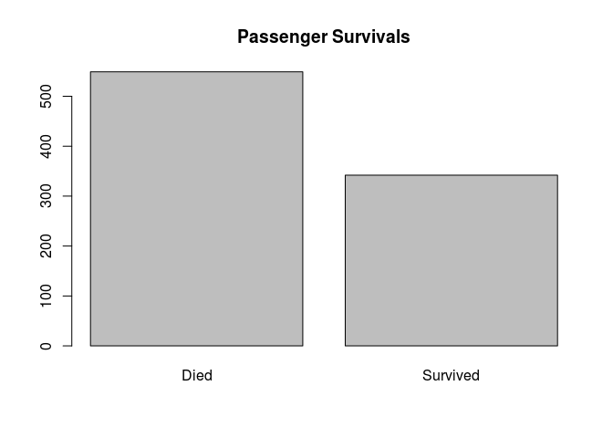 

```r
barplot(table(rawData$Pclass_f), main = "Passenger Class")
```

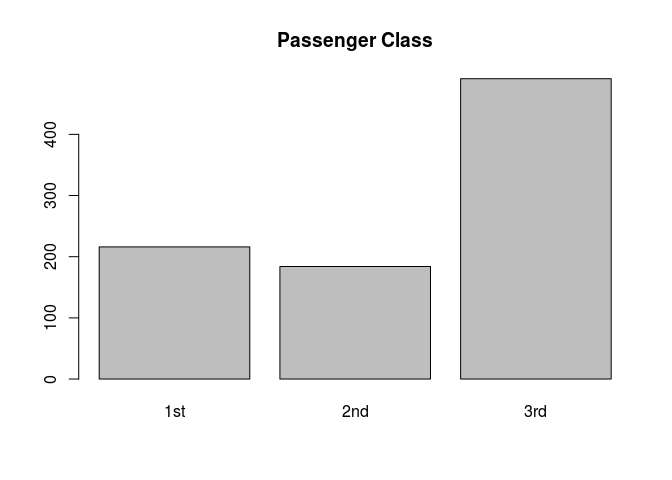 

```r
barplot(table(rawData$Sex), main = "Passenger Gender")
```

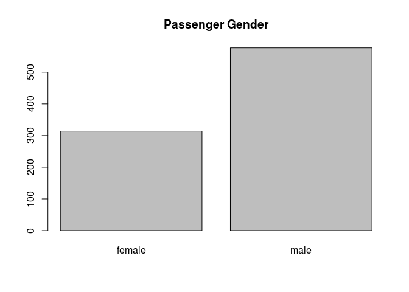 

```r
hist(rawData$Age, main = "Passenger Age Distribution",breaks = 20)
```

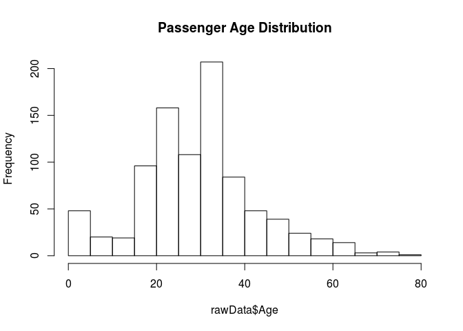 

```r
barplot(table(rawData$SibSp), main = "Number of Siblings OnBoard")
```

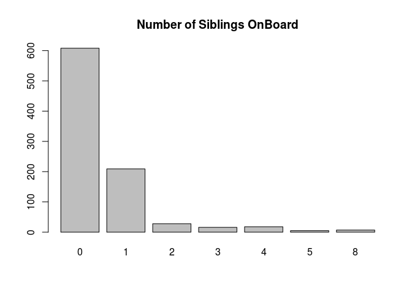 

```r
barplot(table(rawData$Parch), main = "Number of Parents/ Children OnBoard")
```

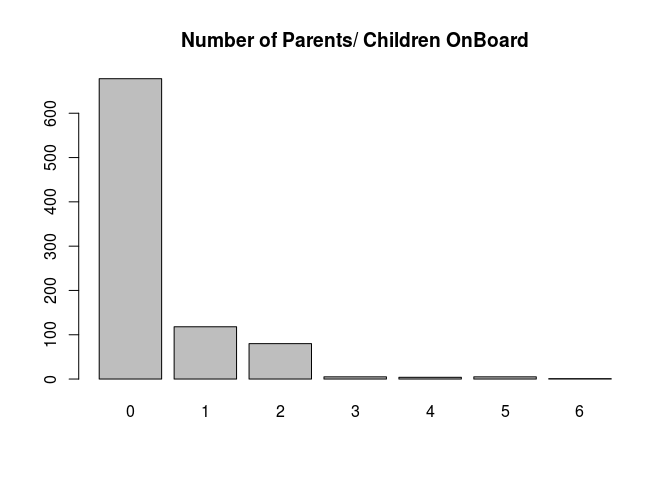 

```r
hist(rawData$Fare, main = "Passenger Fare Distribution")
```

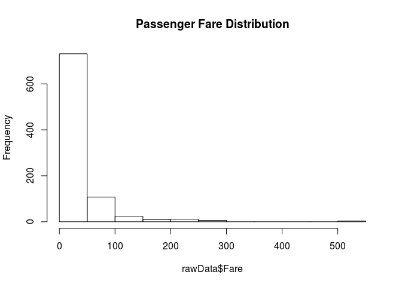 

```r
barplot(table(rawData$Embarked), main = "Port of Origin")
```

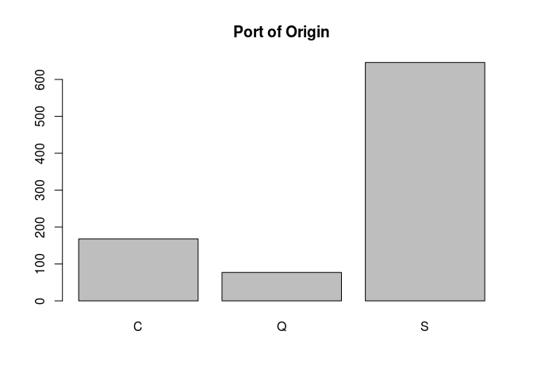 


```r
barplot(table(rawData$Survived, rawData$Sex_f), main = "Passenger Survival by Gender", col = c("red", "green"), legend = c("Died", "Survived"))
```

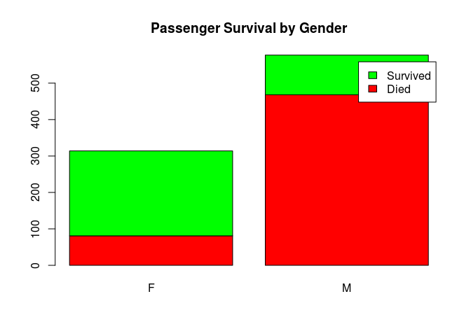 

```r
barplot(table(rawData$Survived, rawData$Pclass_f), main = "Passenger Survival by Class", col = c("red", "green"), legend = c("Died", "Survived"))
```

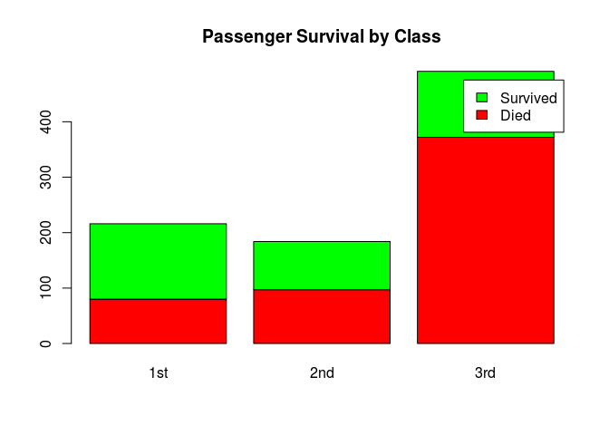 

```r
barplot(table(rawData$Sex_f, rawData$Pclass_f), main = "Passenger Gender by Class", col = c("pink", "blue"), legend = c("Female", "Male"))
```

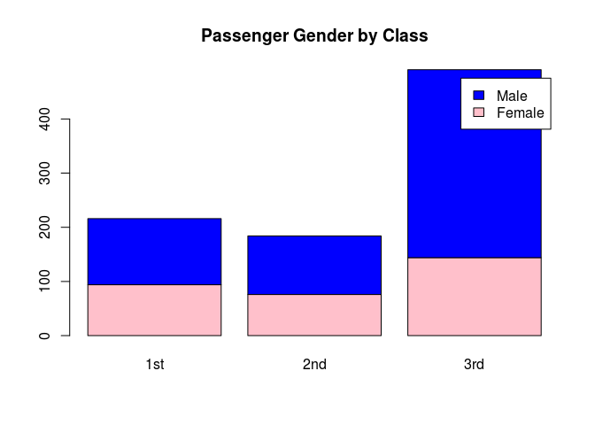 

```r
survivalBySexClass <- as.data.frame(table(rawData$Survived, rawData$Pclass_f, rawData$Sex_f))
survivalBySexClass_f <- subset(survivalBySexClass, survivalBySexClass$Var3 == "F")
survivalBySexClass_m <- subset(survivalBySexClass, survivalBySexClass$Var3 == "M")
sf_matrix <- matrix(survivalBySexClass_f$Freq, nrow = 2, ncol = 3)
rownames(sf_matrix) <- c("0", "1")
colnames(sf_matrix) <- c("1st", "2nd", "3rd")
barplot(sf_matrix, col = c("red", "green"), main = "Survival Female Passenger By Class", legend = c("Died", "Survived"))
```

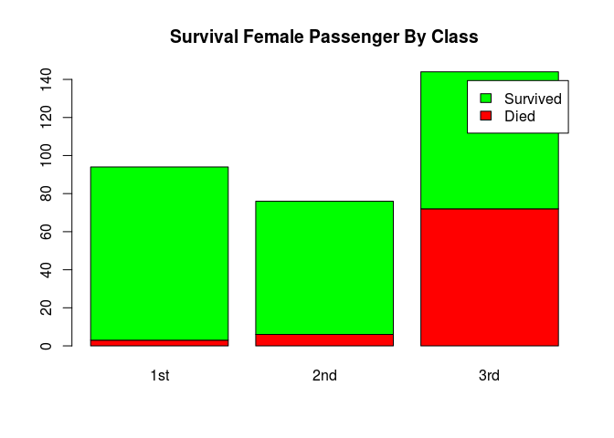 

```r
sf_matrix <- matrix(survivalBySexClass_m$Freq, nrow = 2, ncol = 3)
rownames(sf_matrix) <- c("0", "1")
colnames(sf_matrix) <- c("1st", "2nd", "3rd")
barplot(sf_matrix, col = c("red", "green"), main = "Survival Male Passenger By Class", legend = c("Died", "Survived"))
```

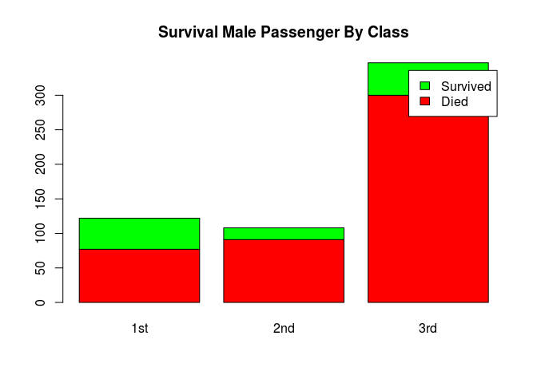 


```r
index_survived <- which(rawData$Survived_f == "Yes")
index_notSurvived <- which(rawData$Survived_f == "No")
hist(rawData$Age[index_notSurvived], main = "Passenger Age Distribution", xlab = "Age", ylab = "No Of Passengers", col = "red", breaks = seq(0,80, by=2))
hist(rawData$Age[index_survived], col = "green", breaks = seq(0,80, by=2), add = TRUE)
legend("topright", c("Died", "Survived"), col=c("red", "green"), lwd=10)
```

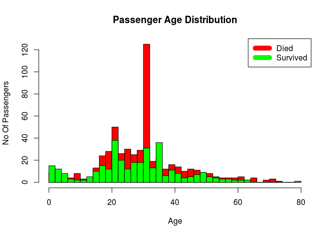 


```r
boxplot(rawData$Age ~ rawData$Survived_f, main = "Passenger by Age", xlab = "Survived", ylab = "Age")
```

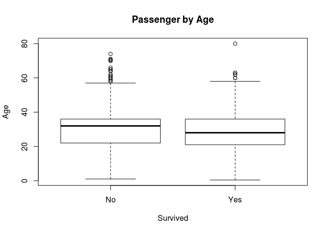 

Some reference [Quantiles & the Boxplot](https://en.wikipedia.org/wiki/Quartile).


```r
rawData$isChild <- rawData$Age < 13
rawData$isAdolescent <- rawData$Age >= 14 & rawData$Age < 20
rawData$isAdult <- rawData$Age >= 20 & rawData$Age < 65
rawData$isSenior <- rawData$Age >= 65
table(rawData$Survived_f, rawData$isChild)
##      
##       FALSE TRUE
##   No    518   31
##   Yes   300   42
sum(rawData$Survived_f == "Yes" & rawData$isChild == TRUE)/ sum(rawData$isChild)
## [1] 0.5753425

table(rawData$Survived_f, rawData$isAdolescent)
##      
##       FALSE TRUE
##   No    493   56
##   Yes   305   37
sum(rawData$Survived_f == "Yes" & rawData$isAdolescent == TRUE)/ sum(rawData$isAdolescent)
## [1] 0.3978495

table(rawData$Survived_f, rawData$isAdult)
##      
##       FALSE TRUE
##   No     97  452
##   Yes    82  260
sum(rawData$Survived_f == "Yes" & rawData$isAdult == TRUE)/ sum(rawData$isAdult)
## [1] 0.3651685

table(rawData$Survived_f, rawData$isSenior)
##      
##       FALSE TRUE
##   No    539   10
##   Yes   341    1
sum(rawData$Survived_f == "Yes" & rawData$isSenior == TRUE)/ sum(rawData$isSenior)
## [1] 0.09090909
```

##Survival Model using Trees 
CART = Classification And Regression Trees
Conditional Inference Tree

###Training and Test dataset
Splitting the training dataset in two different datasets  

- __training__ dataset, used to build the model
- __test__ dataset, used to validate the model


```r
require(caTools)
## Loading required package: caTools
#Contains basic utility functions like sample.split
index_split <- sample.split(rawData$Survived_f, SplitRatio = 0.7)

#Preparing the raw dataset - removing not needed feature
rawData$Pclass <- NULL
rawData$Survived <- NULL
rawData$Sex <- NULL
rawData$Embarked <- NULL

dataset.train <- rawData[index_split,]
dataset.test <- rawData[!index_split,]
#sample.split keeps the same ratio of the provided feature
table(dataset.test$Survived_f)[2]/ nrow(dataset.test)
##       Yes 
## 0.3843284
table(dataset.train$Survived_f)[2]/nrow(dataset.train)
##       Yes 
## 0.3836276
```

##Modelling using `rpart` package
Load the required packages ...

```r
#install.packages("rpart")
#install.packages("rpart.plot")
#install.packages("ROCR")
require(rpart)
```

```
## Loading required package: rpart
```

```r
require(rpart.plot)
```

```
## Loading required package: rpart.plot
```

```r
require(ROCR)
```

```
## Loading required package: ROCR
## Loading required package: gplots
## 
## Attaching package: 'gplots'
## 
## The following object is masked from 'package:stats':
## 
##     lowess
```

Create the CART model ...

```r
survivalModel1 <- rpart(Survived_f ~ Age + Pclass_f + Sex_f + Fare + SibSp + Parch + Embarked_f, data = dataset.train, minbucket = 15)

prp(survivalModel1, main = "Classification & Regression Tree")
```

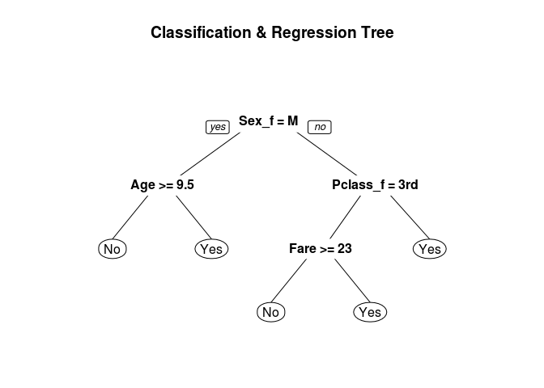 

Validate the model ...

```r
predictionOnModel1_c <- predict(survivalModel1, newdata = dataset.test, type = "class")

#Create the confusion matrix 
table(dataset.test$Survived_f, predictionOnModel1_c)
##      predictionOnModel1_c
##        No Yes
##   No  142  23
##   Yes  29  74

#Accuracy (TP + TN)/ Total
(table(dataset.test$Survived_f, predictionOnModel1_c)[1] + table(dataset.test$Survived_f, predictionOnModel1_c)[4])/nrow(dataset.test)
## [1] 0.8059701
```


```r
predictionOnModel1_p <- predict(survivalModel1, newdata = dataset.test)

pred <- prediction(predictionOnModel1_p[,2], dataset.test$Survived_f)
perf <- performance(pred, "tpr", "fpr")

plot(perf, main = "ROC")
```

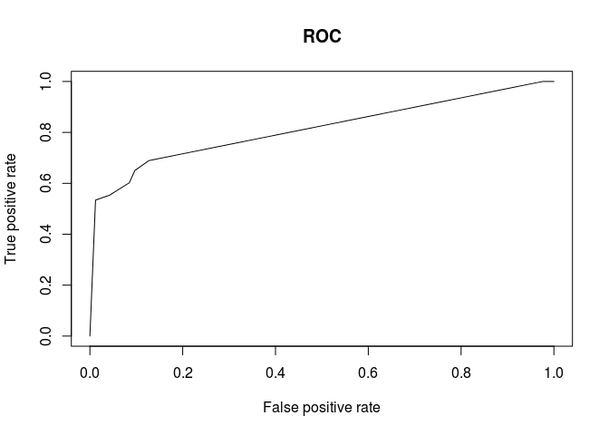 

##Modelling using `party` package
Load the required packages ...

```r
#install.packages("party")
#install.packages("caret")
require(party)
require(caret)
```

Create the CART model ...

```r
survivalModel2 <- ctree(Survived_f ~ Age + Pclass_f + Sex_f + Fare + SibSp + Parch + Embarked_f, data = dataset.train)

survivalModel2
## 
## 	 Conditional inference tree with 7 terminal nodes
## 
## Response:  Survived_f 
## Inputs:  Age, Pclass_f, Sex_f, Fare, SibSp, Parch, Embarked_f 
## Number of observations:  623 
## 
## 1) Sex_f == {F}; criterion = 1, statistic = 175.586
##   2) Pclass_f == {3rd}; criterion = 1, statistic = 42.535
##     3) Fare <= 23.25; criterion = 0.991, statistic = 10.315
##       4)*  weights = 90 
##     3) Fare > 23.25
##       5)*  weights = 14 
##   2) Pclass_f == {1st, 2nd}
##     6)*  weights = 111 
## 1) Sex_f == {M}
##   7) Age <= 9; criterion = 0.996, statistic = 13.811
##     8) SibSp <= 2; criterion = 1, statistic = 20.986
##       9)*  weights = 18 
##     8) SibSp > 2
##       10)*  weights = 7 
##   7) Age > 9
##     11) Pclass_f == {1st}; criterion = 1, statistic = 20.447
##       12)*  weights = 80 
##     11) Pclass_f == {2nd, 3rd}
##       13)*  weights = 303
par(ps = 4, cex = 1, cex.main = 1)
plot(survivalModel2, main = "Conditional Inference Tree")
```

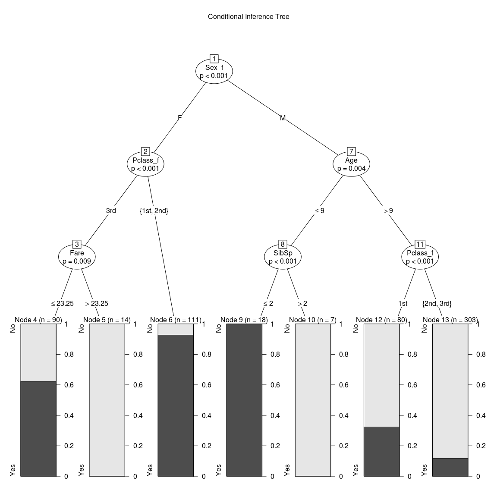 

Validate the model ...

```r
predictionOnModel2_c <- predict(survivalModel2, newdata = dataset.test)

#Create the confusion matrix 
table(dataset.test$Survived_f, predictionOnModel2_c)
##      predictionOnModel2_c
##        No Yes
##   No  150  15
##   Yes  30  73

#Accuracy (TP + TN)/ Total
(table(dataset.test$Survived_f, predictionOnModel2_c)[1] + table(dataset.test$Survived_f, predictionOnModel2_c)[4])/nrow(dataset.test)
## [1] 0.8320896

#Another approach using the caret package
confusionMatrix(predictionOnModel2_c, dataset.test$Survived_f)
## Confusion Matrix and Statistics
## 
##           Reference
## Prediction  No Yes
##        No  150  30
##        Yes  15  73
##                                           
##                Accuracy : 0.8321          
##                  95% CI : (0.7819, 0.8748)
##     No Information Rate : 0.6157          
##     P-Value [Acc > NIR] : 9.763e-15       
##                                           
##                   Kappa : 0.6352          
##  Mcnemar's Test P-Value : 0.03689         
##                                           
##             Sensitivity : 0.9091          
##             Specificity : 0.7087          
##          Pos Pred Value : 0.8333          
##          Neg Pred Value : 0.8295          
##              Prevalence : 0.6157          
##          Detection Rate : 0.5597          
##    Detection Prevalence : 0.6716          
##       Balanced Accuracy : 0.8089          
##                                           
##        'Positive' Class : No              
## 
```

