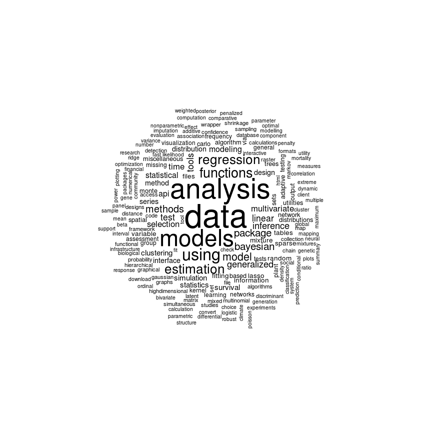
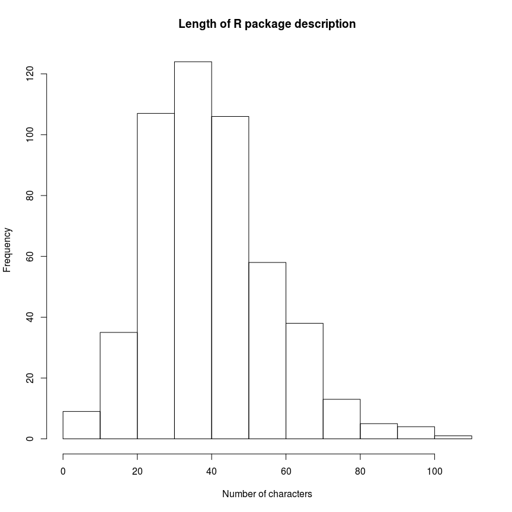

# Managing Unstructured Data with the `tm` package
ppar  
10. nov. 2015  
##Reference
The following material is extracted from `chapter 7` of ["Mastering Data Analysis with R"](https://www.packtpub.com/big-data-and-business-intelligence/mastering-data-analysis-r) by _Gergely Daróczi_.

##Required packages

* `tm` package, used perform text mining operations on unstructured data
* `XML` package, used to perfom some web scraping
* `wordcloud` package, used for visualization purpose
* `SnowballC` package, used for stemming


##Introduction
Text mining is the process of analysing natural language text.A __corpus__ is a collection of text document that we want to include in the analysis.

Available options in `tm` to import a corpus can be seen using `getSources()`

```r
getSources()
## [1] "DataframeSource" "DirSource"       "URISource"       "VectorSource"   
## [5] "XMLSource"       "ZipSource"
```

We can import text documents using a dataframe, a vector, a URI, a directory, etc. The `URISource` stands for a collection of hyperlinks or file paths, although this is somewhat easier to handle with `DirSource`, which imports all the textual documents found in the referenced directory on our hard drive.

Using `getReaders()` we can see teh supported text file formats

```r
getReaders()
##  [1] "readDOC"                 "readPDF"                
##  [3] "readPlain"               "readRCV1"               
##  [5] "readRCV1asPlain"         "readReut21578XML"       
##  [7] "readReut21578XMLasPlain" "readTabular"            
##  [9] "readTagged"              "readXML"
```

##Getting the data and creating the __corpus__
The data representing our __corpus__ is the list of R package names and short description available [here](http://cran.r-project.org/web/packages/available_packages_by_name.html). For dowloading the data we will use the `readHTMTable` function in the `XLM` package.


```r
dataUri <- "http://cran.r-project.org/web/packages/available_packages_by_name.html"
rawData <- XML::readHTMLTable(paste0(dataUri), stringsAsFactors = FALSE, which = 1)
```


```r
class(rawData)
## [1] "data.frame"

str(rawData)
## 'data.frame':	7492 obs. of  2 variables:
##  $ V1: chr  "A3" "abbyyR" "abc" "ABCanalysis" ...
##  $ V2: chr  "Accurate, Adaptable, and Accessible Error Metrics for Predictive\nModels" "Access to Abbyy Optical Character Recognition (OCR) API" "Tools for Approximate Bayesian Computation (ABC)" "Computed ABC Analysis" ...

tail(rawData, 3)
##          V1                                             V2
## 7490    ZRA      Dynamic Plots for Time Series Forecasting
## 7491 ztable Zebra-Striped Tables in LaTeX and HTML Formats
## 7492    zyp               Zhang + Yue-Pilon trends package
```

`rawData` is a dataframe of 7492 entries, where each entry includes the package name and a short description of the package.

The features/ columns do not have proper names (just the standard names assigned by R). Proper names are given to the columns - `packageName` and `description` respectively. 

```r
names(rawData)
## [1] "V1" "V2"

names(rawData) <- c("packageName", "description")
names(rawData)
## [1] "packageName" "description"

rawData$packageName[1:3]
## [1] "A3"     "abbyyR" "abc"
```

__Simplification__: _in order to be able to run the example we will consider just a subset of 500 documents from the `rawData` dataframe. The following code chunk can be commented out in order to work with the complete set of documents._


```r
set.seed(10711004)
tmp <- sample(1:dim(rawData)[1], 500, replace = FALSE)
rawData <- rawData[tmp,]
dim(rawData)
```

```
## [1] 500   2
```
We have a dataframe containing all of the documents that should be part of our corpus. Let's build a corpus using the `vectorSource` and the package decsription.


```r
theCorpus <- Corpus(VectorSource(x = rawData$description))
print(theCorpus)
## <<VCorpus>>
## Metadata:  corpus specific: 0, document level (indexed): 0
## Content:  documents: 500
#created a VCorpus (in-memory) object of 7492 documents - aka a description is a document
```
Here we can see the first 2 documents in the corpus (not very meaningful) and their contents. Note the corpus is a `list`. 


```r
inspect(head(theCorpus,2))
## <<VCorpus>>
## Metadata:  corpus specific: 0, document level (indexed): 0
## Content:  documents: 2
## 
## [[1]]
## <<PlainTextDocument>>
## Metadata:  7
## Content:  chars: 75
## 
## [[2]]
## <<PlainTextDocument>>
## Metadata:  7
## Content:  chars: 54
theCorpus[[1]]$content
## [1] "Marker-Based Estimation of Heritability Using Individual Plant\nor Plot Data"
theCorpus[[2]]$content
## [1] "Frequency Domain Analysis for Multivariate Time Series"
```

##Cleaning the __corpus__
The `tm` package offfers a variety of __predefined transformations__ that can be applied on __corpora__ (__corpuses__).


```r
getTransformations()
## [1] "removeNumbers"     "removePunctuation" "removeWords"      
## [4] "stemDocument"      "stripWhitespace"
```

Usually one of the first steps is to remove the most frequently used words from the  corpus, called __stopwords__.  __Stopwords__ are the most common, short function terms, whit no important meaning. The `tm` package already offers a list of such a word (predefined)


```r
stopwords()
##   [1] "i"          "me"         "my"         "myself"     "we"        
##   [6] "our"        "ours"       "ourselves"  "you"        "your"      
##  [11] "yours"      "yourself"   "yourselves" "he"         "him"       
##  [16] "his"        "himself"    "she"        "her"        "hers"      
##  [21] "herself"    "it"         "its"        "itself"     "they"      
##  [26] "them"       "their"      "theirs"     "themselves" "what"      
##  [31] "which"      "who"        "whom"       "this"       "that"      
##  [36] "these"      "those"      "am"         "is"         "are"       
##  [41] "was"        "were"       "be"         "been"       "being"     
##  [46] "have"       "has"        "had"        "having"     "do"        
##  [51] "does"       "did"        "doing"      "would"      "should"    
##  [56] "could"      "ought"      "i'm"        "you're"     "he's"      
##  [61] "she's"      "it's"       "we're"      "they're"    "i've"      
##  [66] "you've"     "we've"      "they've"    "i'd"        "you'd"     
##  [71] "he'd"       "she'd"      "we'd"       "they'd"     "i'll"      
##  [76] "you'll"     "he'll"      "she'll"     "we'll"      "they'll"   
##  [81] "isn't"      "aren't"     "wasn't"     "weren't"    "hasn't"    
##  [86] "haven't"    "hadn't"     "doesn't"    "don't"      "didn't"    
##  [91] "won't"      "wouldn't"   "shan't"     "shouldn't"  "can't"     
##  [96] "cannot"     "couldn't"   "mustn't"    "let's"      "that's"    
## [101] "who's"      "what's"     "here's"     "there's"    "when's"    
## [106] "where's"    "why's"      "how's"      "a"          "an"        
## [111] "the"        "and"        "but"        "if"         "or"        
## [116] "because"    "as"         "until"      "while"      "of"        
## [121] "at"         "by"         "for"        "with"       "about"     
## [126] "against"    "between"    "into"       "through"    "during"    
## [131] "before"     "after"      "above"      "below"      "to"        
## [136] "from"       "up"         "down"       "in"         "out"       
## [141] "on"         "off"        "over"       "under"      "again"     
## [146] "further"    "then"       "once"       "here"       "there"     
## [151] "when"       "where"      "why"        "how"        "all"       
## [156] "any"        "both"       "each"       "few"        "more"      
## [161] "most"       "other"      "some"       "such"       "no"        
## [166] "nor"        "not"        "only"       "own"        "same"      
## [171] "so"         "than"       "too"        "very"
```

As we can see stopwords are unimportant words that will not actually change the meaning of the documents (each package description). 

Example of a simple transformation on a document, we can see that the "and" word is replaced with an empty space. But "And" is not removed cause of the uppercase letter (case sensitive) and also "punctuation" symbol are not removed.


```r
removeWords("live long and prosper", stopwords())
## [1] "live long  prosper"

removeWords("live long And prosper.", stopwords())
## [1] "live long And prosper."
```

In order to remove the possible challenges connected with uppercases and punctuation symbols, common practices are to simply

* transform the uppercase to lowercase
* remove the stopwords
* remove punctuation symbols
* remove numbers
* normalize the white spaces (a words removed is transofrmed into a white space) 

To iteratively apply transformations to the corpus we use the `tm_map` function. Lets apply the different transformations and see how the content of some documents have changed.

```r
theCorpus <- tm_map(theCorpus, content_transformer(tolower))
#we had to wrap the tolower function in the content_transformer function, so that our transformation really complies with the tm package's object structure.This is usually required when using a transformation function outside of the tm package.
theCorpus <- tm_map(theCorpus, removeWords, stopwords())
theCorpus <- tm_map(theCorpus, removePunctuation)
theCorpus <- tm_map(theCorpus, removeNumbers)
theCorpus <- tm_map(theCorpus, stripWhitespace)

##see the content fo 3 documents
theCorpus[[1]]$content
## [1] "markerbased estimation heritability using individual plant plot data"
theCorpus[[10]]$content
## [1] "coupled dipole approximation light scattering clusters nanoparticles"
theCorpus[[100]]$content
## [1] "diversitydependent diversification"
```
##Visualizing most frequent words in the corpus
The `wordcloud` function in the `wordcloud` package can be used to generate useful wordclouds from the corpus. It is a valuable tool to visualize the some of teh information hidden in the corpus.


```r
wordcloud(theCorpus, random.order = FALSE)
```

 

##More cleanup
Another possible improvement is to remove some frequent domain-specific words not meaningful for our analysis. In order to find the most common words in the corpus we need to create a sparse matrix from the corpus using `TermDocumentMatrix`.

A `TermDocumentMatrix` is sparse matrix is basically a matrix which includes the words in the rows and the documents in the columns. Each cell represents tne number of occurences of that specific word in that specific document.


```r
tdm <- TermDocumentMatrix(theCorpus)
inspect(tdm[1:5, 1:20])
## <<TermDocumentMatrix (terms: 5, documents: 20)>>
## Non-/sparse entries: 0/100
## Sparsity           : 100%
## Maximal term length: 13
## Weighting          : term frequency (tf)
## 
##                Docs
## Terms           1 2 3 4 5 6 7 8 9 10 11 12 13 14 15 16 17 18 19 20
##   abcdefba      0 0 0 0 0 0 0 0 0  0  0  0  0  0  0  0  0  0  0  0
##   abcsmc        0 0 0 0 0 0 0 0 0  0  0  0  0  0  0  0  0  0  0  0
##   abnormalities 0 0 0 0 0 0 0 0 0  0  0  0  0  0  0  0  0  0  0  0
##   absolute      0 0 0 0 0 0 0 0 0  0  0  0  0  0  0  0  0  0  0  0
##   abstraction   0 0 0 0 0 0 0 0 0  0  0  0  0  0  0  0  0  0  0  0
```

Lets' find the most frequent terms using our sparse matrix... actually we are looking at the terms which compares at least 100 times.  

```r
#Note the bigger the number of documents, the bigger the lowfreq numer - use 100 if using all of the documents.
findFreqTerms(tdm, lowfreq = 10)
##  [1] "analysis"     "api"          "bayesian"     "data"        
##  [5] "estimation"   "functions"    "generalized"  "inference"   
##  [9] "linear"       "methods"      "model"        "modeling"    
## [13] "models"       "multivariate" "package"      "regression"  
## [17] "selection"    "statistical"  "test"         "time"        
## [21] "tools"        "using"
```

Inspecting this list fo words we can see that there could be some words that do not add any value (meaningless) e.g. "based", "using", "package". We can actually create a new list of words that need to be removed 


```r
myStopWords <- c("package", "using", "based")
theCorpus <- tm_map(theCorpus, removeWords, myStopWords)
theCorpus <- tm_map(theCorpus, stripWhitespace)
```
###Stemming words
Let's get rid fo the plural form of nouns using some stemming algorithms - specifically we will use the `SnowballC` package. This package has a `wordStem` function that support 16 languages based on the __Porter's stemming algorithm__.


```r
#example for word stemming
wordStem(c("cats", "mastering", "using", "modelling", "models", "model"))
```

```
## [1] "cat"    "master" "us"     "model"  "model"  "model"
```

```r
#Note that the Porter's algorithm does not provide real english words in all cases
#Something to consider later when looking at the results.
wordStem(c("are", "analyst", "analyze", "analysis"))
```

```
## [1] "ar"      "analyst" "analyz"  "analysi"
```


```r
theCorpus_noStem <- theCorpus
theCorpus <- tm_map(theCorpus, stemDocument, language = "english")
#Note that stemDocument is a tm function - using the wordStem in SnowballC
```
'And now, lets call the stemCompletion function on our previously defined `theCorpus_noStem`, and let's formulate each stem to the shortest relevant word found in the database. Unfortunately, it's not as straightforward as the previous examples, as the stemCompletion function takes a character vector of words instead of documents that we have in our corpus. So thus, we have to write our own transformation function with the previously used `content_transformer` helper. The basic idea is to split each documents into words by a space, apply the stemCompletion function, and then concatenate the words into sentences again' _from the book_.


```r
a <- c("mining", "miners", "mining")
b <- stemDocument(a)
d <- stemCompletion(b, dictionary = a)
#Original words
a
## [1] "mining" "miners" "mining"

#Stemmed words
b
## [1] "mine"  "miner" "mine"

#Completion Stemmed Words
d
##     mine    miner     mine 
## "miners" "miners" "miners"

#Do u see anything strange?
```

__Be aware!! This step is time and resource demanding - even for a small subset of documents! Commente it out if necessary.__

```r
theCorpus <- tm_map(theCorpus, content_transformer(function(x, d){
  paste(stemCompletion(
    strsplit(stemDocument(x), " ")[[1]],
    d), collapse = " ")}), theCorpus_noStem)
```

_'While stemming terms, we started to remove characters from the end of words in the hope of finding the stem, which is a heuristic process often resulting in not-existing words, as we have seen previously. We tried to overcome this issue by completing these stems to the shortest meaningful words by using a dictionary, which might result in derivation in the meaning of the term.'_ __lemmatisation__


```r
tdm <- TermDocumentMatrix(theCorpus)
#Show the frequent terms
#Note the bigger the number of documents, the bigger the lowfreq numer - use 100 if using all of the documents.
findFreqTerms(tdm, lowfreq = 10)
##  [1] "abcdefba"     "algorithm"    "analysing"    "api"         
##  [5] "bayesian"     "cluster"      "data"         "design"      
##  [9] "distributed"  "estimability" "file"         "fit"         
## [13] "function"     "general"      "graphical"    "inference"   
## [17] "linear"       "method"       "mixture"      "model"       
## [21] "multivariate" "network"      "regression"   "selection"   
## [25] "set"          "simulate"     "statistical"  "test"        
## [29] "time"         "tool"         "variable"

#Show content of tmd
print(tdm)
## <<TermDocumentMatrix (terms: 1027, documents: 500)>>
## Non-/sparse entries: 2365/511135
## Sparsity           : 100%
## Maximal term length: 26
## Weighting          : term frequency (tf)
```

##Analysing the Associations among terms
The `TermDocumentMatrix` can be used to identify the association between the cleaned terms found in the corpus. For this purpose we can use the `findAssocs` function in the `tm` package.


```r
#Lets find the associations between the data term and others terms that have a correlation higher than 0.2
findAssocs(tdm, "data", 0.15)
```

```
## $data
##        frame          set   multilabel      socrata     download 
##         0.26         0.26         0.23         0.23         0.19 
##   containing   individual relationship 
##         0.15         0.15         0.15
```


```r
#Lets find the associations between the big term and others terms that have a correlation higher than 0.2
findAssocs(tdm, "big", 0.15)
```

```
## $big
## numeric(0)
```

##Some other metrics
Statistics around the number of characters used in the package description


```r
theCorpus_nchar <- sapply(theCorpus, function(x) nchar(x$content))

#Basic statistics
summary(theCorpus_nchar)
##    Min. 1st Qu.  Median    Mean 3rd Qu.    Max. 
##    2.00   29.00   39.00   40.37   49.00  104.00
```

Show the document with the shortest/ longest description

```r
#min
tmp <- theCorpus[[which.min(theCorpus_nchar)]]
tmp$content
## [1] "NA"

#max
tmp <- theCorpus[[which.max(theCorpus_nchar)]]
tmp$content
## [1] "implementation elm extreme learned machine algorithm slfn single hidden layer feedforward neural network"
```

Letsvisualize the ditribution of the document lengths 

```r
hist(theCorpus_nchar, main = "Length of R package description", xlab = "Number of characters")
```

 

From the distribution we can see that most packages have a short description.
