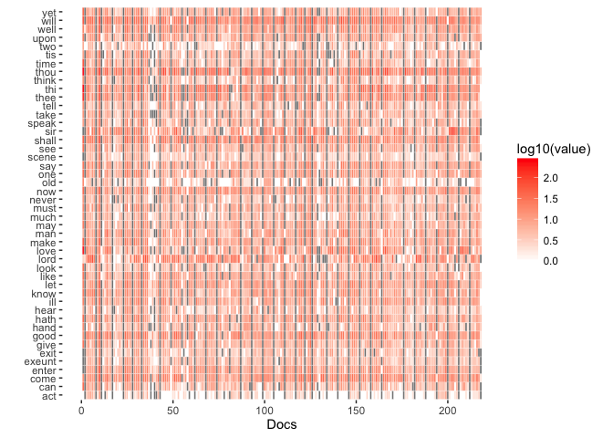

# Text Mining the complete work of William Shakespeare
ppar  
13 april 2016  


## Reference
From the blog ["Text Mining the Complete Works of William Shakespeare"](http://www.r-bloggers.com/text-mining-the-complete-works-of-william-shakespeare/)

## Getting Ready

### Loading the data


```r
fileData <- "./../data/williamShakespearWork.txt"
if (!file.exists(fileData)) {
    download.file("http://www.gutenberg.org/cache/epub/100/pg100.txt", destfile = fileData)
}
shakespeare <- readLines(fileData, encoding = "UTF-8")
```

### Exploring the data

```r
#No of lines
length(shakespeare)
## [1] 124787

#Line examples
head(shakespeare, 10)
##  [1] "The Project Gutenberg EBook of The Complete Works of William Shakespeare, by"
##  [2] "William Shakespeare"                                                         
##  [3] ""                                                                            
##  [4] "This eBook is for the use of anyone anywhere at no cost and with"            
##  [5] "almost no restrictions whatsoever.  You may copy it, give it away or"        
##  [6] "re-use it under the terms of the Project Gutenberg License included"         
##  [7] "with this eBook or online at www.gutenberg.org"                              
##  [8] ""                                                                            
##  [9] "** This is a COPYRIGHTED Project Gutenberg eBook, Details Below **"          
## [10] "**     Please follow the copyright guidelines in this file.     **"
shakespeare[175:176]
## [1] ""            "THE SONNETS"
shakespeare[124366:124380]
##  [1] ""                                                                   
##  [2] "THE END"                                                            
##  [3] ""                                                                   
##  [4] ""                                                                   
##  [5] ""                                                                   
##  [6] "<<THIS ELECTRONIC VERSION OF THE COMPLETE WORKS OF WILLIAM"         
##  [7] "SHAKESPEARE IS COPYRIGHT 1990-1993 BY WORLD LIBRARY, INC., AND IS"  
##  [8] "PROVIDED BY PROJECT GUTENBERG ETEXT OF ILLINOIS BENEDICTINE COLLEGE"
##  [9] "WITH PERMISSION.  ELECTRONIC AND MACHINE READABLE COPIES MAY BE"    
## [10] "DISTRIBUTED SO LONG AS SUCH COPIES (1) ARE FOR YOUR OR OTHERS"      
## [11] "PERSONAL USE ONLY, AND (2) ARE NOT DISTRIBUTED OR USED"             
## [12] "COMMERCIALLY.  PROHIBITED COMMERCIAL DISTRIBUTION INCLUDES BY ANY"  
## [13] "SERVICE THAT CHARGES FOR DOWNLOAD TIME OR FOR MEMBERSHIP.>>"        
## [14] ""                                                                   
## [15] ""
tail(shakespeare, 10)
##  [1] ""                                         
##  [2] "http://www.gutenberg.org/1/0/2/3/10234"   
##  [3] ""                                         
##  [4] "or filename 24689 would be found at:"     
##  [5] "http://www.gutenberg.org/2/4/6/8/24689"   
##  [6] ""                                         
##  [7] "An alternative method of locating eBooks:"
##  [8] "http://www.gutenberg.org/GUTINDEX.ALL"    
##  [9] ""                                         
## [10] "*** END: FULL LICENSE ***"
```

Looking at the lines at the beginning and end of the book, it is possible to see that a header and footer section are present in the dataset. __These sections need to be removed from the dataset__.

Different works are separated by the following section 

    '<<THIS ELECTRONIC VERSION OF THE COMPLETE WORKS OF WILLIAM SHAKESPEARE IS COPYRIGHT 1990-1993 BY WORLD LIBRARY, INC., AND IS PROVIDED BY PROJECT GUTENBERG ETEXT OF ILLINOIS BENEDICTINE COLLEGE... FOR DOWNLOAD TIME OR FOR MEMBERSHIP.>>'

Actions:

* __CLEAN__ - remove header and footer sections from the dataset
    * header: from line 1 to line 175
    * footer: from line 124368 to the end
* __CLEAN__ - remove the sections separting the different works
    

### Clean the data


```r

# remove header and footer
# create a one string document
endHeader <- 175
startFooter <- 124368

header <- shakespeare[1:endHeader]
header.txt <- paste(header, collapse = " ")

footer <- shakespeare[startFooter: length(shakespeare)]
footer.txt <- paste(footer, collapse = " ")

header.txt
## [1] "The Project Gutenberg EBook of The Complete Works of William Shakespeare, by William Shakespeare  This eBook is for the use of anyone anywhere at no cost and with almost no restrictions whatsoever.  You may copy it, give it away or re-use it under the terms of the Project Gutenberg License included with this eBook or online at www.gutenberg.org  ** This is a COPYRIGHTED Project Gutenberg eBook, Details Below ** **     Please follow the copyright guidelines in this file.     **  Title: The Complete Works of William Shakespeare  Author: William Shakespeare  Posting Date: September 1, 2011 [EBook #100] Release Date: January, 1994  Language: English   *** START OF THIS PROJECT GUTENBERG EBOOK COMPLETE WORKS--WILLIAM SHAKESPEARE ***     Produced by World Library, Inc., from their Library of the Future     This is the 100th Etext file presented by Project Gutenberg, and is presented in cooperation with World Library, Inc., from their Library of the Future and Shakespeare CDROMS.  Project Gutenberg often releases Etexts that are NOT placed in the Public Domain!!  Shakespeare  *This Etext has certain copyright implications you should read!*  <<THIS ELECTRONIC VERSION OF THE COMPLETE WORKS OF WILLIAM SHAKESPEARE IS COPYRIGHT 1990-1993 BY WORLD LIBRARY, INC., AND IS PROVIDED BY PROJECT GUTENBERG ETEXT OF ILLINOIS BENEDICTINE COLLEGE WITH PERMISSION.  ELECTRONIC AND MACHINE READABLE COPIES MAY BE DISTRIBUTED SO LONG AS SUCH COPIES (1) ARE FOR YOUR OR OTHERS PERSONAL USE ONLY, AND (2) ARE NOT DISTRIBUTED OR USED COMMERCIALLY.  PROHIBITED COMMERCIAL DISTRIBUTION INCLUDES BY ANY SERVICE THAT CHARGES FOR DOWNLOAD TIME OR FOR MEMBERSHIP.>>  *Project Gutenberg is proud to cooperate with The World Library* in the presentation of The Complete Works of William Shakespeare for your reading for education and entertainment.  HOWEVER, THIS IS NEITHER SHAREWARE NOR PUBLIC DOMAIN. . .AND UNDER THE LIBRARY OF THE FUTURE CONDITIONS OF THIS PRESENTATION. . .NO CHARGES MAY BE MADE FOR *ANY* ACCESS TO THIS MATERIAL.  YOU ARE ENCOURAGED!! TO GIVE IT AWAY TO ANYONE YOU LIKE, BUT NO CHARGES ARE ALLOWED!!     ***** SMALL PRINT! for COMPLETE SHAKESPEARE *****  THIS ELECTRONIC VERSION OF THE COMPLETE WORKS OF WILLIAM SHAKESPEARE IS COPYRIGHT 1990-1993 BY WORLD LIBRARY, INC., AND IS PROVIDED BY PROJECT GUTENBERG ETEXT OF ILLINOIS BENEDICTINE COLLEGE WITH PERMISSION.  Since unlike many other Project Gutenberg-tm etexts, this etext is copyright protected, and since the materials and methods you use will effect the Project's reputation, your right to copy and distribute it is limited by the copyright and other laws, and by the conditions of this \"Small Print!\" statement.  1.  LICENSE    A) YOU MAY (AND ARE ENCOURAGED) TO DISTRIBUTE ELECTRONIC AND MACHINE READABLE COPIES OF THIS ETEXT, SO LONG AS SUCH COPIES (1) ARE FOR YOUR OR OTHERS PERSONAL USE ONLY, AND (2) ARE NOT DISTRIBUTED OR USED COMMERCIALLY.  PROHIBITED COMMERCIAL DISTRIBUTION INCLUDES BY ANY SERVICE THAT CHARGES FOR DOWNLOAD TIME OR FOR MEMBERSHIP.    B) This license is subject to the conditions that you honor the refund and replacement provisions of this \"small print!\" statement; and that you distribute exact copies of this etext, including this Small Print statement.  Such copies can be compressed or any proprietary form (including any form resulting from word processing or hypertext software), so long as *EITHER*:      (1) The etext, when displayed, is clearly readable, and does   *not* contain characters other than those intended by the   author of the work, although tilde (~), asterisk (*) and   underline (_) characters may be used to convey punctuation   intended by the author, and additional characters may be used   to indicate hypertext links; OR      (2) The etext is readily convertible by the reader at no   expense into plain ASCII, EBCDIC or equivalent form by the   program that displays the etext (as is the case, for instance,   with most word processors); OR      (3) You provide or agree to provide on request at no   additional cost, fee or expense, a copy of the etext in plain   ASCII.  2.  LIMITED WARRANTY; DISCLAIMER OF DAMAGES  This etext may contain a \"Defect\" in the form of incomplete, inaccurate or corrupt data, transcription errors, a copyright or other infringement, a defective or damaged disk, computer virus, or codes that damage or cannot be read by your equipment.  But for the \"Right of Replacement or Refund\" described below, the Project (and any other party you may receive this etext from as a PROJECT GUTENBERG-tm etext) disclaims all liability to you for damages, costs and expenses, including legal fees, and YOU HAVE NO REMEDIES FOR NEGLIGENCE OR UNDER STRICT LIABILITY, OR FOR BREACH OF WARRANTY OR CONTRACT, INCLUDING BUT NOT LIMITED TO INDIRECT, CONSEQUENTIAL, PUNITIVE OR INCIDENTAL DAMAGES, EVEN IF YOU GIVE NOTICE OF THE POSSIBILITY OF SUCH DAMAGES.  If you discover a Defect in this etext within 90 days of receiv- ing it, you can receive a refund of the money (if any) you paid for it by sending an explanatory note within that time to the person you received it from.  If you received it on a physical medium, you must return it with your note, and such person may choose to alternatively give you a replacement copy.  If you received it electronically, such person may choose to alternatively give you a second opportunity to receive it electronically.  THIS ETEXT IS OTHERWISE PROVIDED TO YOU \"AS-IS\".  NO OTHER WARRANTIES OF ANY KIND, EXPRESS OR IMPLIED, ARE MADE TO YOU AS TO THE ETEXT OR ANY MEDIUM IT MAY BE ON, INCLUDING BUT NOT LIMITED TO WARRANTIES OF MERCHANTABILITY OR FITNESS FOR A PARTICULAR PURPOSE.  Some states do not allow disclaimers of implied warranties or the exclusion or limitation of consequen- tial damages, so the above disclaimers and exclusions may not apply to you, and you may have other legal rights.  3.  INDEMNITY: You will indemnify and hold the Project, its directors, officers, members and agents harmless from all lia- bility, cost and expense, including legal fees, that arise directly or indirectly from any of the following that you do or cause: [A] distribution of this etext, [B] alteration, modification, or addition to the etext, or [C] any Defect.  4.  WHAT IF YOU *WANT* TO SEND MONEY EVEN IF YOU DON'T HAVE TO? Project Gutenberg is dedicated to increasing the number of public domain and licensed works that can be freely distributed in machine readable form.  The Project gratefully accepts contributions in money, time, scanning machines, OCR software, public domain etexts, royalty free copyright licenses, and whatever else you can think of.  Money should be paid to \"Pro- ject Gutenberg Association / Illinois Benedictine College\".  This \"Small Print!\" by Charles B. Kramer, Attorney Internet (72600.2026@compuserve.com); TEL: (212-254-5093) ****   SMALL PRINT! FOR __ COMPLETE SHAKESPEARE **** [\"Small Print\" V.12.08.93]  <<THIS ELECTRONIC VERSION OF THE COMPLETE WORKS OF WILLIAM SHAKESPEARE IS COPYRIGHT 1990-1993 BY WORLD LIBRARY, INC., AND IS PROVIDED BY PROJECT GUTENBERG ETEXT OF ILLINOIS BENEDICTINE COLLEGE WITH PERMISSION.  ELECTRONIC AND MACHINE READABLE COPIES MAY BE DISTRIBUTED SO LONG AS SUCH COPIES (1) ARE FOR YOUR OR OTHERS PERSONAL USE ONLY, AND (2) ARE NOT DISTRIBUTED OR USED COMMERCIALLY.  PROHIBITED COMMERCIAL DISTRIBUTION INCLUDES BY ANY SERVICE THAT CHARGES FOR DOWNLOAD TIME OR FOR MEMBERSHIP.>>     1609 "

footer.txt
## [1] "   <<THIS ELECTRONIC VERSION OF THE COMPLETE WORKS OF WILLIAM SHAKESPEARE IS COPYRIGHT 1990-1993 BY WORLD LIBRARY, INC., AND IS PROVIDED BY PROJECT GUTENBERG ETEXT OF ILLINOIS BENEDICTINE COLLEGE WITH PERMISSION.  ELECTRONIC AND MACHINE READABLE COPIES MAY BE DISTRIBUTED SO LONG AS SUCH COPIES (1) ARE FOR YOUR OR OTHERS PERSONAL USE ONLY, AND (2) ARE NOT DISTRIBUTED OR USED COMMERCIALLY.  PROHIBITED COMMERCIAL DISTRIBUTION INCLUDES BY ANY SERVICE THAT CHARGES FOR DOWNLOAD TIME OR FOR MEMBERSHIP.>>          End of the Project Gutenberg EBook of The Complete Works of William Shakespeare, by William Shakespeare  *** END OF THIS PROJECT GUTENBERG EBOOK COMPLETE WORKS--WILLIAM SHAKESPEARE ***  ***** This file should be named 100.txt or 100.zip ***** This and all associated files of various formats will be found in:         http://www.gutenberg.org/1/0/100/  Produced by World Library, Inc., from their Library of the Future  Updated editions will replace the previous one--the old editions will be renamed.  Creating the works from public domain print editions means that no one owns a United States copyright in these works, so the Foundation (and you!) can copy and distribute it in the United States without permission and without paying copyright royalties. Special rules, set forth in the General Terms of Use part of this license, apply to copying and distributing Project Gutenberg-tm electronic works to protect the PROJECT GUTENBERG-tm concept and trademark. Project Gutenberg is a registered trademark, and may not be used if you charge for the eBooks, unless you receive specific permission. If you do not charge anything for copies of this eBook, complying with the rules is very easy. You may use this eBook for nearly any purpose such as creation of derivative works, reports, performances and research. They may be modified and printed and given away--you may do practically ANYTHING with public domain eBooks. Redistribution is subject to the trademark license, especially commercial redistribution.    *** START: FULL LICENSE ***  THE FULL PROJECT GUTENBERG LICENSE PLEASE READ THIS BEFORE YOU DISTRIBUTE OR USE THIS WORK  To protect the Project Gutenberg-tm mission of promoting the free distribution of electronic works, by using or distributing this work (or any other work associated in any way with the phrase \"Project Gutenberg\"), you agree to comply with all the terms of the Full Project Gutenberg-tm License (available with this file or online at http://www.gutenberg.org/license).   Section 1.  General Terms of Use and Redistributing Project Gutenberg-tm electronic works  1.A.  By reading or using any part of this Project Gutenberg-tm electronic work, you indicate that you have read, understand, agree to and accept all the terms of this license and intellectual property (trademark/copyright) agreement.  If you do not agree to abide by all the terms of this agreement, you must cease using and return or destroy all copies of Project Gutenberg-tm electronic works in your possession. If you paid a fee for obtaining a copy of or access to a Project Gutenberg-tm electronic work and you do not agree to be bound by the terms of this agreement, you may obtain a refund from the person or entity to whom you paid the fee as set forth in paragraph 1.E.8.  1.B.  \"Project Gutenberg\" is a registered trademark.  It may only be used on or associated in any way with an electronic work by people who agree to be bound by the terms of this agreement.  There are a few things that you can do with most Project Gutenberg-tm electronic works even without complying with the full terms of this agreement.  See paragraph 1.C below.  There are a lot of things you can do with Project Gutenberg-tm electronic works if you follow the terms of this agreement and help preserve free future access to Project Gutenberg-tm electronic works.  See paragraph 1.E below.  1.C.  The Project Gutenberg Literary Archive Foundation (\"the Foundation\" or PGLAF), owns a compilation copyright in the collection of Project Gutenberg-tm electronic works.  Nearly all the individual works in the collection are in the public domain in the United States.  If an individual work is in the public domain in the United States and you are located in the United States, we do not claim a right to prevent you from copying, distributing, performing, displaying or creating derivative works based on the work as long as all references to Project Gutenberg are removed.  Of course, we hope that you will support the Project Gutenberg-tm mission of promoting free access to electronic works by freely sharing Project Gutenberg-tm works in compliance with the terms of this agreement for keeping the Project Gutenberg-tm name associated with the work.  You can easily comply with the terms of this agreement by keeping this work in the same format with its attached full Project Gutenberg-tm License when you share it without charge with others. This particular work is one of the few copyrighted individual works included with the permission of the copyright holder.  Information on the copyright owner for this particular work and the terms of use imposed by the copyright holder on this work are set forth at the beginning of this work.  1.D.  The copyright laws of the place where you are located also govern what you can do with this work.  Copyright laws in most countries are in a constant state of change.  If you are outside the United States, check the laws of your country in addition to the terms of this agreement before downloading, copying, displaying, performing, distributing or creating derivative works based on this work or any other Project Gutenberg-tm work.  The Foundation makes no representations concerning the copyright status of any work in any country outside the United States.  1.E.  Unless you have removed all references to Project Gutenberg:  1.E.1.  The following sentence, with active links to, or other immediate access to, the full Project Gutenberg-tm License must appear prominently whenever any copy of a Project Gutenberg-tm work (any work on which the phrase \"Project Gutenberg\" appears, or with which the phrase \"Project Gutenberg\" is associated) is accessed, displayed, performed, viewed, copied or distributed:  This eBook is for the use of anyone anywhere at no cost and with almost no restrictions whatsoever.  You may copy it, give it away or re-use it under the terms of the Project Gutenberg License included with this eBook or online at www.gutenberg.org  1.E.2.  If an individual Project Gutenberg-tm electronic work is derived from the public domain (does not contain a notice indicating that it is posted with permission of the copyright holder), the work can be copied and distributed to anyone in the United States without paying any fees or charges.  If you are redistributing or providing access to a work with the phrase \"Project Gutenberg\" associated with or appearing on the work, you must comply either with the requirements of paragraphs 1.E.1 through 1.E.7 or obtain permission for the use of the work and the Project Gutenberg-tm trademark as set forth in paragraphs 1.E.8 or 1.E.9.  1.E.3.  If an individual Project Gutenberg-tm electronic work is posted with the permission of the copyright holder, your use and distribution must comply with both paragraphs 1.E.1 through 1.E.7 and any additional terms imposed by the copyright holder.  Additional terms will be linked to the Project Gutenberg-tm License for all works posted with the permission of the copyright holder found at the beginning of this work.  1.E.4.  Do not unlink or detach or remove the full Project Gutenberg-tm License terms from this work, or any files containing a part of this work or any other work associated with Project Gutenberg-tm.  1.E.5.  Do not copy, display, perform, distribute or redistribute this electronic work, or any part of this electronic work, without prominently displaying the sentence set forth in paragraph 1.E.1 with active links or immediate access to the full terms of the Project Gutenberg-tm License.  1.E.6.  You may convert to and distribute this work in any binary, compressed, marked up, nonproprietary or proprietary form, including any word processing or hypertext form.  However, if you provide access to or distribute copies of a Project Gutenberg-tm work in a format other than \"Plain Vanilla ASCII\" or other format used in the official version posted on the official Project Gutenberg-tm web site (www.gutenberg.org), you must, at no additional cost, fee or expense to the user, provide a copy, a means of exporting a copy, or a means of obtaining a copy upon request, of the work in its original \"Plain Vanilla ASCII\" or other form.  Any alternate format must include the full Project Gutenberg-tm License as specified in paragraph 1.E.1.  1.E.7.  Do not charge a fee for access to, viewing, displaying, performing, copying or distributing any Project Gutenberg-tm works unless you comply with paragraph 1.E.8 or 1.E.9.  1.E.8.  You may charge a reasonable fee for copies of or providing access to or distributing Project Gutenberg-tm electronic works provided that  - You pay a royalty fee of 20% of the gross profits you derive from      the use of Project Gutenberg-tm works calculated using the method      you already use to calculate your applicable taxes.  The fee is      owed to the owner of the Project Gutenberg-tm trademark, but he      has agreed to donate royalties under this paragraph to the      Project Gutenberg Literary Archive Foundation.  Royalty payments      must be paid within 60 days following each date on which you      prepare (or are legally required to prepare) your periodic tax      returns.  Royalty payments should be clearly marked as such and      sent to the Project Gutenberg Literary Archive Foundation at the      address specified in Section 4, \"Information about donations to      the Project Gutenberg Literary Archive Foundation.\"  - You provide a full refund of any money paid by a user who notifies      you in writing (or by e-mail) within 30 days of receipt that s/he      does not agree to the terms of the full Project Gutenberg-tm      License.  You must require such a user to return or      destroy all copies of the works possessed in a physical medium      and discontinue all use of and all access to other copies of      Project Gutenberg-tm works.  - You provide, in accordance with paragraph 1.F.3, a full refund of any      money paid for a work or a replacement copy, if a defect in the      electronic work is discovered and reported to you within 90 days      of receipt of the work.  - You comply with all other terms of this agreement for free      distribution of Project Gutenberg-tm works.  1.E.9.  If you wish to charge a fee or distribute a Project Gutenberg-tm electronic work or group of works on different terms than are set forth in this agreement, you must obtain permission in writing from both the Project Gutenberg Literary Archive Foundation and Michael Hart, the owner of the Project Gutenberg-tm trademark.  Contact the Foundation as set forth in Section 3 below.  1.F.  1.F.1.  Project Gutenberg volunteers and employees expend considerable effort to identify, do copyright research on, transcribe and proofread public domain works in creating the Project Gutenberg-tm collection.  Despite these efforts, Project Gutenberg-tm electronic works, and the medium on which they may be stored, may contain \"Defects,\" such as, but not limited to, incomplete, inaccurate or corrupt data, transcription errors, a copyright or other intellectual property infringement, a defective or damaged disk or other medium, a computer virus, or computer codes that damage or cannot be read by your equipment.  1.F.2.  LIMITED WARRANTY, DISCLAIMER OF DAMAGES - Except for the \"Right of Replacement or Refund\" described in paragraph 1.F.3, the Project Gutenberg Literary Archive Foundation, the owner of the Project Gutenberg-tm trademark, and any other party distributing a Project Gutenberg-tm electronic work under this agreement, disclaim all liability to you for damages, costs and expenses, including legal fees.  YOU AGREE THAT YOU HAVE NO REMEDIES FOR NEGLIGENCE, STRICT LIABILITY, BREACH OF WARRANTY OR BREACH OF CONTRACT EXCEPT THOSE PROVIDED IN PARAGRAPH 1.F.3.  YOU AGREE THAT THE FOUNDATION, THE TRADEMARK OWNER, AND ANY DISTRIBUTOR UNDER THIS AGREEMENT WILL NOT BE LIABLE TO YOU FOR ACTUAL, DIRECT, INDIRECT, CONSEQUENTIAL, PUNITIVE OR INCIDENTAL DAMAGES EVEN IF YOU GIVE NOTICE OF THE POSSIBILITY OF SUCH DAMAGE.  1.F.3.  LIMITED RIGHT OF REPLACEMENT OR REFUND - If you discover a defect in this electronic work within 90 days of receiving it, you can receive a refund of the money (if any) you paid for it by sending a written explanation to the person you received the work from.  If you received the work on a physical medium, you must return the medium with your written explanation.  The person or entity that provided you with the defective work may elect to provide a replacement copy in lieu of a refund.  If you received the work electronically, the person or entity providing it to you may choose to give you a second opportunity to receive the work electronically in lieu of a refund.  If the second copy is also defective, you may demand a refund in writing without further opportunities to fix the problem.  1.F.4.  Except for the limited right of replacement or refund set forth in paragraph 1.F.3, this work is provided to you 'AS-IS,' WITH NO OTHER WARRANTIES OF ANY KIND, EXPRESS OR IMPLIED, INCLUDING BUT NOT LIMITED TO WARRANTIES OF MERCHANTIBILITY OR FITNESS FOR ANY PURPOSE.  1.F.5.  Some states do not allow disclaimers of certain implied warranties or the exclusion or limitation of certain types of damages. If any disclaimer or limitation set forth in this agreement violates the law of the state applicable to this agreement, the agreement shall be interpreted to make the maximum disclaimer or limitation permitted by the applicable state law.  The invalidity or unenforceability of any provision of this agreement shall not void the remaining provisions.  1.F.6.  INDEMNITY - You agree to indemnify and hold the Foundation, the trademark owner, any agent or employee of the Foundation, anyone providing copies of Project Gutenberg-tm electronic works in accordance with this agreement, and any volunteers associated with the production, promotion and distribution of Project Gutenberg-tm electronic works, harmless from all liability, costs and expenses, including legal fees, that arise directly or indirectly from any of the following which you do or cause to occur: (a) distribution of this or any Project Gutenberg-tm work, (b) alteration, modification, or additions or deletions to any Project Gutenberg-tm work, and (c) any Defect you cause.   Section  2.  Information about the Mission of Project Gutenberg-tm  Project Gutenberg-tm is synonymous with the free distribution of electronic works in formats readable by the widest variety of computers including obsolete, old, middle-aged and new computers.  It exists because of the efforts of hundreds of volunteers and donations from people in all walks of life.  Volunteers and financial support to provide volunteers with the assistance they need are critical to reaching Project Gutenberg-tm's goals and ensuring that the Project Gutenberg-tm collection will remain freely available for generations to come.  In 2001, the Project Gutenberg Literary Archive Foundation was created to provide a secure and permanent future for Project Gutenberg-tm and future generations. To learn more about the Project Gutenberg Literary Archive Foundation and how your efforts and donations can help, see Sections 3 and 4 and the Foundation web page at http://www.pglaf.org.   Section 3.  Information about the Project Gutenberg Literary Archive Foundation  The Project Gutenberg Literary Archive Foundation is a non profit 501(c)(3) educational corporation organized under the laws of the state of Mississippi and granted tax exempt status by the Internal Revenue Service.  The Foundation's EIN or federal tax identification number is 64-6221541.  Its 501(c)(3) letter is posted at http://pglaf.org/fundraising.  Contributions to the Project Gutenberg Literary Archive Foundation are tax deductible to the full extent permitted by U.S. federal laws and your state's laws.  The Foundation's principal office is located at 4557 Melan Dr. S. Fairbanks, AK, 99712., but its volunteers and employees are scattered throughout numerous locations.  Its business office is located at 809 North 1500 West, Salt Lake City, UT 84116, (801) 596-1887, email business@pglaf.org.  Email contact links and up to date contact information can be found at the Foundation's web site and official page at http://pglaf.org  For additional contact information:      Dr. Gregory B. Newby      Chief Executive and Director      gbnewby@pglaf.org  Section 4.  Information about Donations to the Project Gutenberg Literary Archive Foundation  Project Gutenberg-tm depends upon and cannot survive without wide spread public support and donations to carry out its mission of increasing the number of public domain and licensed works that can be freely distributed in machine readable form accessible by the widest array of equipment including outdated equipment.  Many small donations ($1 to $5,000) are particularly important to maintaining tax exempt status with the IRS.  The Foundation is committed to complying with the laws regulating charities and charitable donations in all 50 states of the United States.  Compliance requirements are not uniform and it takes a considerable effort, much paperwork and many fees to meet and keep up with these requirements.  We do not solicit donations in locations where we have not received written confirmation of compliance.  To SEND DONATIONS or determine the status of compliance for any particular state visit http://pglaf.org  While we cannot and do not solicit contributions from states where we have not met the solicitation requirements, we know of no prohibition against accepting unsolicited donations from donors in such states who approach us with offers to donate.  International donations are gratefully accepted, but we cannot make any statements concerning tax treatment of donations received from outside the United States.  U.S. laws alone swamp our small staff.  Please check the Project Gutenberg Web pages for current donation methods and addresses.  Donations are accepted in a number of other ways including checks, online payments and credit card donations. To donate, please visit: http://pglaf.org/donate   Section 5.  General Information About Project Gutenberg-tm electronic works.  Professor Michael S. Hart is the originator of the Project Gutenberg-tm concept of a library of electronic works that could be freely shared with anyone.  For thirty years, he produced and distributed Project Gutenberg-tm eBooks with only a loose network of volunteer support.  Project Gutenberg-tm eBooks are often created from several printed editions, all of which are confirmed as Public Domain in the U.S. unless a copyright notice is included.  Thus, we do not necessarily keep eBooks in compliance with any particular paper edition.  Each eBook is in a subdirectory of the same number as the eBook's eBook number, often in several formats including plain vanilla ASCII, compressed (zipped), HTML and others.  Corrected EDITIONS of our eBooks replace the old file and take over the old filename and etext number.  The replaced older file is renamed. VERSIONS based on separate sources are treated as new eBooks receiving new filenames and etext numbers.  Most people start at our Web site which has the main PG search facility:  http://www.gutenberg.org  This Web site includes information about Project Gutenberg-tm, including how to make donations to the Project Gutenberg Literary Archive Foundation, how to help produce our new eBooks, and how to subscribe to our email newsletter to hear about new eBooks.  EBooks posted prior to November 2003, with eBook numbers BELOW #10000, are filed in directories based on their release date.  If you want to download any of these eBooks directly, rather than using the regular search system you may utilize the following addresses and just download by the etext year.  http://www.ibiblio.org/gutenberg/etext06      (Or /etext 05, 04, 03, 02, 01, 00, 99,      98, 97, 96, 95, 94, 93, 92, 92, 91 or 90)  EBooks posted since November 2003, with etext numbers OVER #10000, are filed in a different way.  The year of a release date is no longer part of the directory path.  The path is based on the etext number (which is identical to the filename).  The path to the file is made up of single digits corresponding to all but the last digit in the filename.  For example an eBook of filename 10234 would be found at:  http://www.gutenberg.org/1/0/2/3/10234  or filename 24689 would be found at: http://www.gutenberg.org/2/4/6/8/24689  An alternative method of locating eBooks: http://www.gutenberg.org/GUTINDEX.ALL  *** END: FULL LICENSE ***"

shakespeare <- shakespeare[-c(startFooter: length(shakespeare))]
shakespeare <- shakespeare[-c(1:endHeader)]
shakespeare.txt <- paste(shakespeare, collapse = " ")

nchar(shakespeare.txt)
## [1] 5436534
```


```r
# remove separating section
# create a one string document fopr each document
shakespeare.works <- strsplit(shakespeare.txt, "<<[^>]*>>")[[1]]
length(shakespeare.works) #No of works
## [1] 218
```

### Data Analysis - Text Mining

#### Create the Corpus

```r
require(tm)
```

```
## Loading required package: tm
```

```
## Warning: package 'tm' was built under R version 3.1.3
```

```
## Loading required package: NLP
```

```
## Warning: package 'NLP' was built under R version 3.1.3
```

```r
require(SnowballC)
```

```
## Loading required package: SnowballC
```

```r
docs.corpus <- Corpus(VectorSource(shakespeare.works))

docs.corpus
```

```
## <<VCorpus>>
## Metadata:  corpus specific: 0, document level (indexed): 0
## Content:  documents: 218
```

```r
inspect(docs.corpus[1:2])
```

```
## <<VCorpus>>
## Metadata:  corpus specific: 0, document level (indexed): 0
## Content:  documents: 2
## 
## [[1]]
## <<PlainTextDocument>>
## Metadata:  7
## Content:  chars: 102700
## 
## [[2]]
## <<PlainTextDocument>>
## Metadata:  7
## Content:  chars: 706
```

#### Clean the Corpus and apply Stemming


```r
#Transformations used to clean up the Corpus
docs.corpus <- tm_map(docs.corpus, content_transformer(tolower))
docs.corpus <- tm_map(docs.corpus, removePunctuation)
docs.corpus <- tm_map(docs.corpus, removeNumbers)
docs.corpus <- tm_map(docs.corpus, removeWords, stopwords(kind = "en"))
docs.corpus <- tm_map(docs.corpus, stemDocument)

docs.corpus <- tm_map(docs.corpus, stripWhitespace)
```


```r
inspect(docs.corpus[1])
```

```
## <<VCorpus>>
## Metadata:  corpus specific: 0, document level (indexed): 0
## Content:  documents: 1
## 
## [[1]]
## <<PlainTextDocument>>
## Metadata:  7
## Content:  chars: 56055
```

```r
as.character(docs.corpus[[1]])
```

```
## [1] " sonnet william shakespear fairest creatur desir increas therebi beauti rose might never die riper time deceas tender heir might bear memori thou contract thine bright eye feedst thi light flame selfsubstanti fuel make famin abund lie thi self thi foe thi sweet self cruel thou art now world fresh ornament herald gaudi spring within thine bud buriest thi content tender churl makst wast niggard piti world els glutton eat world due grave thee forti winter shall besieg thi brow dig deep trench thi beauti field thi youth proud liveri gaze now will tatter weed small worth held ask thi beauti lie treasur thi lusti day say within thine deep sunken eye alleat shame thriftless prais much prais deserv thi beauti use thou couldst answer fair child mine shall sum count make old excus prove beauti success thine new made thou art old see thi blood warm thou feelst cold look thi glass tell face thou viewest now time face form anoth whose fresh repair now thou renewest thou dost beguil world unbless mother fair whose unear womb disdain tillag thi husbandri fond will tomb selflov stop poster thou art thi mother glass thee call back love april prime thou window thine age shalt see despit wrinkl thi golden time thou live rememb die singl thine imag die thee unthrifti loveli dost thou spend upon thi self thi beauti legaci natur bequest give noth doth lend frank lend free beauteous niggard dost thou abus bounteous largess given thee give profitless usur dost thou use great sum sum yet canst live traffic thi self alon thou thi self thi sweet self dost deceiv natur call thee gone accept audit canst thou leav thi unus beauti must tomb thee use live th executor hour gentl work frame love gaze everi eye doth dwell will play tyrant unfair fair doth excel neverrest time lead summer hideous winter confound sap check frost lusti leav quit gone beauti oersnow bare everi summer distil left liquid prison pent wall glass beauti effect beauti bereft remembr flower distil though winter meet lees show substanc still live sweet let winter rag hand defac thee thi summer ere thou distil make sweet vial treasur thou place beauti treasur ere selfkil use forbidden usuri happi pay will loan that thi self breed anoth thee ten time happier ten one ten time thi self happier thou art ten thine ten time refigur thee death thou shouldst depart leav thee live poster selfwil thou art much fair death conquest make worm thine heir lo orient gracious light lift burn head eye doth homag newappear sight serv look sacr majesti climb steepup heaven hill resembl strong youth middl age yet mortal look ador beauti still attend golden pilgrimag highmost pitch weari car like feebl age reeleth day eye fore duteous now convert low tract look anoth way thou thi self outgo thi noon unlook diest unless thou get son music hear hearst thou music sad sweet sweet war joy delight joy lovst thou thou receivst glad els receivst pleasur thine annoy true concord welltun sound union marri offend thine ear sweet chide thee confound singl part thou shouldst bear mark one string sweet husband anoth strike mutual order resembl sire child happi mother one one pleas note sing whose speechless song mani seem one sing thee thou singl wilt prove none fear wet widow eye thou consumst thi self singl life ah thou issueless shalt hap die world will wail thee like makeless wife world will thi widow still weep thou form thee hast left behind everi privat widow well may keep children eye husband shape mind look unthrift world doth spend shift place still world enjoy beauti wast hath world end kept unus user destroy love toward other bosom sit murdrous shame commit shame deni thou bearst love thi self art unprovid grant thou wilt thou art belov mani thou none lovst evid thou art possess murdrous hate gainst thi self thou stickst conspir seek beauteous roof ruinat repair thi chief desir o chang thi thought may chang mind shall hate fairer lodg gentl love thi presenc gracious kind thi self least kindheart prove make thee anoth self love beauti still may live thine thee fast thou shalt wane fast thou growst one thine thou departest fresh blood young thou bestowst thou mayst call thine thou youth convertest herein live wisdom beauti increas without folli age cold decay mind time ceas threescor year make world away let natur hath made store harsh featureless rude barren perish look best endow gave thee bounteous gift thou shouldst bounti cherish carv thee seal meant therebi thou shouldst print let copi die count clock tell time see brave day sunk hideous night behold violet past prime sabl curl silver oer white lofti tree see barren leav erst heat canopi herd summer green gird sheav born bier white brist beard thi beauti question make thou among wast time must go sinc sweet beauti forsak die fast see other grow noth gainst time scyth can make defenc save breed brave take thee henc o self love longer self live come end prepar sweet semblanc give beauti hold leas find determin self self deceas sweet issu sweet form bear let fair hous fall decay husbandri honour might uphold stormi gust winter day barren rage death etern cold o none unthrift dear love know father let son say star judgement pluck yet methink astronomi tell good evil luck plagu dearth season qualiti can fortun brief minut tell point thunder rain wind say princ shall go well oft predict heaven find thine eye knowledg deriv constant star read art truth beauti shall togeth thrive thi self store thou wouldst convert els thee prognost thi end truth beauti doom date consid everi thing grow hold perfect littl moment huge stage presenteth nought show whereon star secret influenc comment perceiv men plant increas cheer check even selfsam sky vaunt youth sap height decreas wear brave state memori conceit inconst stay set rich youth sight wast time debateth decay chang day youth sulli night war time love take engraft new wherefor mightier way make war upon bloodi tyrant time fortifi self decay mean bless barren rhyme now stand top happi hour mani maiden garden yet unset virtuous wish bear live flower much liker paint counterfeit line life life repair time pencil pupil pen neither inward worth outward fair can make live self eye men give away self keep self still must live drawn sweet skill will believ vers time come fill high desert though yet heaven know tomb hide life show half part write beauti eye fresh number number grace age come say poet lie heaven touch neer touch earth face paper yellow age scorn like old men less truth tongu true right term poet rage stretch metr antiqu song child aliv time live twice rhyme shall compar thee summer day thou art love temper rough wind shake darl bud may summer leas hath short date sometim hot eye heaven shine often gold complexion dim everi fair fair sometim declin chanc natur chang cours untrim thi etern summer shall fade lose possess fair thou owst shall death brag thou wandrest shade etern line time thou growst long men can breath eye can see long live give life thee devour time blunt thou lion paw make earth devour sweet brood pluck keen teeth fierc tiger jaw burn longliv phoenix blood make glad sorri season thou fleetst whateer thou wilt swiftfoot time wide world fade sweet forbid thee one heinous crime o carv thi hour love fair brow draw line thine antiqu pen thi cours untaint allow beauti pattern succeed men yet thi worst old time despit thi wrong love shall vers ever live young woman face natur hand paint hast thou master mistress passion woman gentl heart acquaint shift chang fals women fashion eye bright less fals roll gild object whereupon gazeth man hue hue control steal men eye women soul amazeth woman wert thou first creat till natur wrought thee fell adot addit thee defeat ad one thing purpos noth sinc prick thee women pleasur mine thi love thi love use treasur muse stir paint beauti vers heaven self ornament doth use everi fair fair doth rehears make couplement proud compar sun moon earth sea rich gem april firstborn flower thing rare heaven air huge rondur hem o let true love truli write believ love fair mother child though bright gold candl fix heaven air let say like hearsay well will prais purpos sell glass shall persuad old long youth thou one date thee time furrow behold look death day expiat beauti doth cover thee seem raiment heart thi breast doth live thine can elder thou art o therefor love thyself wari self thee will bear thi heart will keep chari tender nurs babe fare ill presum thi heart mine slain thou gavst thine give back unperfect actor stage fear put besid part fierc thing replet much rage whose strength abund weaken heart fear trust forget say perfect ceremoni love rite mine love strength seem decay oercharg burthen mine love might o let look eloqu dumb presag speak breast plead love look recompens tongu hath express o learn read silent love hath writ hear eye belong love fine wit mine eye hath play painter hath stell thi beauti form tabl heart bodi frame wherein tis held perspect best painter art painter must see skill find true imag pictur lie bosom shop hang still hath window glaze thine eye now see good turn eye eye done mine eye drawn thi shape thine window breast wherethrough sun delight peep gaze therein thee yet eye cun want grace art draw see know heart let favour star public honour proud titl boast whilst fortun triumph bar unlook joy honour great princ favourit fair leav spread marigold sun eye pride lie buri frown glori die pain warrior famous fight thousand victori foil book honour raze quit rest forgot toil happi love belov may remov remov lord love vassalag thi merit hath duti strong knit thee send written embassag wit duti show wit duti great wit poor mine may make seem bare want word show hope good conceit thine thi soul thought nake will bestow till whatsoev star guid move point gracious fair aspect put apparel tatter love show worthi thi sweet respect may dare boast love thee till show head thou mayst prove weari toil hast bed dear respos limb travel tire begin journey head work mind bodi work expir thought far abid intend zealous pilgrimag thee keep droop eyelid open wide look dark blind see save soul imaginari sight present thi shadow sightless view like jewel hung ghast night make black night beauteous old face new lo thus day limb night mind thee self quiet find can return happi plight debar benefit rest day oppress eas night day night night day oppress though enemi either reign consent shake hand tortur one toil complain far toil still farther thee tell day pleas thou art bright dost grace cloud blot heaven flatter swartcomplexion night sparkl star twire thou gildst even day doth daili draw sorrow longer night doth night make grief length seem stronger disgrac fortun men eye alon beweep outcast state troubl deaf heaven bootless cri look upon self curs fate wish like one rich hope featur like like friend possess desir man art man scope enjoy content least yet thought self almost despis hapli think thee state like lark break day aris sullen earth sing hymn heaven gate thi sweet love rememb wealth bring scorn chang state king session sweet silent thought summon remembr thing past sigh lack mani thing sought old woe new wail dear time wast can drown eye unus flow precious friend hid death dateless night weep afresh love long sinc cancel woe moan th expens mani vanish sight can griev grievanc foregon heavili woe woe tell oer sad account forebemoan moan new pay paid think thee dear friend loss restor sorrow end thi bosom endear heart lack suppos dead reign love love love part friend thought buri mani holi obsequi tear hath dear religi love stoln mine eye interest dead now appear thing remov hidden thee lie thou art grave buri love doth live hung trophi lover gone part thee give due mani now thine alon imag love view thee thou hast thou surviv wellcont day churl death bone dust shall cover shalt fortun resurvey poor rude line thi deceas lover compar bettr time though outstrip everi pen reserv love rhyme exceed height happier men o vouchsaf love thought friend muse grown grow age dearer birth love brought march rank better equipag sinc die poet better prove style ill read love full mani glorious morn seen flatter mountain top sovereign eye kiss golden face meadow green gild pale stream heaven alchemi anon permit basest cloud ride ugli rack celesti face forlorn world visag hide steal unseen west disgrac even sun one earli morn shine triumphant splendour brow alack one hour mine region cloud hath mask now yet love whit disdaineth sun world may stain heaven sun staineth didst thou promis beauteous day make travel forth without cloak let base cloud oertak way hide thi bravri rotten smoke tis enough cloud thou break dri rain stormbeaten face man well salv can speak heal wound cure disgrac can thi shame give physic grief though thou repent yet still loss th offend sorrow lend weak relief bear strong offenc cross ah tear pearl thi love shed rich ransom ill deed griev thou hast done rose thorn silver fountain mud cloud eclips stain moon sun loathsom canker live sweetest bud men make fault even author thi trespass compar self corrupt salv thi amiss excus thi sin thi sin thi sensual fault bring sens thi advers parti thi advoc gainst self law plea commenc civil war love hate accessari need must sweet thief sour rob let confess two must twain although undivid love one shall blot remain without thi help born alon two love one respect though live separ spite though alter love sole effect yet doth steal sweet hour love delight may evermor acknowledg thee lest bewail guilt thee shame thou public kind honour unless thou take honour thi name love thee sort thou mine mine thi good report decrepit father take delight see activ child deed youth made lame fortun dearest spite take comfort thi worth truth whether beauti birth wealth wit entitl thi part crown sit make love engraft store lame poor despis whilst shadow doth substanc give thi abund suffic part thi glori live look best best wish thee wish ten time happi can muse want subject invent thou dost breath pourst vers thine sweet argument excel everi vulgar paper rehears o give thi self thank aught worthi perus stand thi sight whos dumb write thee thou thi self dost give invent light thou tenth muse ten time worth old nine rhymer invoc call thee let bring forth etern number outliv long date slight muse pleas curious day pain mine thine shall prais o thi worth manner may sing thou art better part can mine prais mine self bring ist mine prais thee even let us divid live dear love lose name singl one separ may give due thee thou deservst alon o absenc torment wouldst thou prove thi sour leisur gave sweet leav entertain time thought love time thought sweet doth deceiv thou teachest make one twain prais doth henc remain take love love yea take hast thou thou hadst love love thou mayst true love call mine thine thou hadst love thou love receivest blame thee love thou usest yet blame thou thi self deceivest wil tast thi self refusest forgiv thi robberi gentl thief although thou steal thee poverti yet love know greater grief bear greater wrong hate known injuri lascivi grace ill well show kill spite yet must foe pretti wrong liberti commit sometim absent thi heart thi beauti thi year full well befit still temptat follow thou art gentl thou art therefor won beauteous thou art therefor assail woman woo woman son will sour leav till prevail ay yet thou mightst seat forbear chide thi beauti thi stray youth lead thee riot even thou art forc break twofold truth thi beauti tempt thee thine thi beauti fals thou hast grief yet may said love dear hath thee wail chief loss love touch near love offend thus will excus ye thou dost love thou knowst love sake even doth abus suffr friend sake approv lose thee loss love gain lose friend hath found loss find lose twain sake lay cross here joy friend one sweet flatteri love alon wink mine eye best see day view thing unrespect sleep dream look thee dark bright bright dark direct thou whose shadow shadow doth make bright thi shadow form form happi show clear day thi much clearer light unse eye thi shade shine say mine eye bless made look thee live day dead night thi fair imperfect shade heavi sleep sightless eye doth stay day night see till see thee night bright day dream show thee dull substanc flesh thought injuri distanc stop way despit space brought limit far remot thou dost stay matter although foot stand upon farthest earth remov thee nimbl thought can jump sea land soon think place ah thought kill thought leap larg length mile thou art gone much earth water wrought must attend time leisur moan receiv nought element slow heavi tear badg either woe two slight air purg fire thee wherev abid first thought desir presentabs swift motion slide quicker element gone tender embassi love thee life made four two alon sink death oppress melancholi life composit recur swift messeng return thee even now come back assur thi fair health recount told joy longer glad send back straight grow sad mine eye heart mortal war divid conquest thi sight mine eye heart thi pictur sight bar heart mine eye freedom right heart doth plead thou dost lie closet never pierc crystal eye defend doth plea deni say thi fair appear lie side titl impanel quest thought tenant heart verdict determin clear eye moieti dear heart part thus mine eye due thi outward part heart right thi inward love heart betwixt mine eye heart leagu took doth good turn now unto mine eye famish look heart love sigh doth smother love pictur eye doth feast paint banquet bid heart anoth time mine eye heart guest thought love doth share part either thi pictur love thi self away art present still thou farther thought canst move still thee sleep thi pictur sight awak heart heart eye delight care took way trifl truest bar thrust use might unus stay hand falsehood sure ward trust thou jewel trifl worthi comfort now greatest grief thou best dearest mine care art left prey everi vulgar thief thee lock chest save thou art though feel thou art within gentl closur breast whenc pleasur thou mayst come part even thenc thou wilt stoln fear truth prove thievish prize dear time ever time come shall see thee frown defect thi love hath cast utmost sum call audit advis respect time thou shalt strang pass scarc greet sun thine eye love convert thing shall reason find settl graviti time ensconc within knowledg mine desert hand self uprear guard law reason thi part leav poor thou hast strength law sinc love can alleg caus heavi journey way seek weari travel end doth teach case repos say thus far mile measur thi friend beast bear tire woe plod dulli bear weight instinct wretch know rider love speed made thee bloodi spur provok sometim anger thrust hide heavili answer groan sharp spur side groan doth put mind grief lie onward joy behind thus can love excus slow offenc dull bearer thee speed thou art hast thenc till return post need o excus will poor beast find swift extrem can seem slow spur though mount wind wing speed motion shall know can hors desir keep pace therefor desir perfectst love made shall neigh dull flesh fieri race love love thus shall excus jade sinc thee go went wilfulslow toward thee ill run give leav go rich whose bless key can bring sweet uplock treasur will everi hour survey blunt fine point seldom pleasur therefor feast solemn rare sinc seldom come long year set like stone worth thin place captain jewel carcanet time keep chest wardrob robe doth hide make special instant specialblest new unfold imprison pride bless whose worthi give scope triumph lack hope substanc whereof made million strang shadow tend sinc everi one hath everi one one shade one can everi shadow lend describ adoni counterfeit poor imit helen cheek art beauti set grecian tire paint new speak spring foison year one doth shadow beauti show bounti doth appear everi bless shape know extern grace part like none none constant heart o much doth beauti beauteous seem sweet ornament truth doth give rose look fair fairer deem sweet odour doth live canker bloom full deep dye perfum tinctur rose hang thorn play wanton summer breath mask bud disclos virtu show live unwoo unrespect fade die sweet rose sweet death sweetest odour made beauteous love youth shall fade vers distil truth marbl gild monument princ shall outliv power rhyme shall shine bright content unswept stone besmear sluttish time wast war shall statu overturn broil root work masonri mar sword war quick fire shall burn live record memori gainst death alloblivi enmiti shall pace forth prais shall still find room even eye poster wear world end doom till judgment self aris live dwell lover eye sweet love renew thi forc said thi edg blunter appetit today feed allay tomorrow sharpen former might love thou although today thou fill thi hungri eye even till wink ful tomorrow see kill spirit love perpetu dul let sad interim like ocean part shore two contract new come daili bank see return love blest may view call winter full care make summer welcom thrice wish rare slave tend upon hour time desir precious time spend servic till requir dare chide worldwithoutend hour whilst sovereign watch clock think bitter absenc sour bid servant adieu dare question jealous thought may affair suppos like sad slave stay think nought save happi make true fool love will though thing think ill god forbid made first slave thought control time pleasur hand th account hour crave vassal bound stay leisur o let suffer beck th imprison absenc liberti patienc tame suffer bide check without accus injuri list charter strong self may privilag time will doth belong self pardon selfdo crime wait though wait hell blame pleasur ill well noth new hath brain beguil labour invent bear ami second burthen former child o record backward look even five hundr cours sun show imag antiqu book sinc mind first charact done might see old world say compos wonder frame whether mend whether better whether revolut o sure wit former day subject wors given admir prais like wave make toward pebbl shore minut hasten end chang place goe sequent toil forward contend nativ main light crawl matur wherewith crown crook eclips gainst glori fight time gave doth now gift confound time doth transfix flourish set youth delv parallel beauti brow feed rariti natur truth noth stand scyth mow yet time hope vers shall stand prais thi worth despit cruel hand thi will thi imag keep open heavi eyelid weari night dost thou desir slumber broken shadow like thee mock sight thi spirit thou sendst thee far home deed pri find shame idl hour scope tenur thi jealousi o thi love though much great love keep mine eye awak mine true love doth rest defeat play watchman ever thi sake thee watch whilst thou dost wake elsewher far other near sin selflov possesseth mine eye soul everi part sin remedi ground inward heart methink face gracious mine shape true truth account self mine worth defin worth surmount glass show self inde beat chopt tan antiqu mine selflov quit contrari read self selflov iniqu tis thee self self prais paint age beauti thi day love shall now time injuri hand crush oerworn hour drain blood fill brow line wrinkl youth morn hath travel age steepi night beauti whereof now hes king vanish vanish sight steal away treasur spring time now fortifi confound age cruel knife shall never cut memori sweet love beauti though lover life beauti shall black line seen shall live still green seen time fell hand defac richproud cost outworn buri age sometim lofti tower see downras brass etern slave mortal rage seen hungri ocean gain advantag kingdom shore firm soil win wateri main increas store loss loss store seen interchang state state self confound decay ruin hath taught thus rumin time will come take love away thought death choos weep fear lose sinc brass stone earth boundless sea sad mortal oersway power rage shall beauti hold plea whose action stronger flower o shall summer honey breath hold wrack sieg battr day rock impregn stout gate steel strong time decay o fear medit alack shall time best jewel time chest lie hid strong hand can hold swift foot back spoil beauti can forbid o none unless miracl might black ink love may still shine bright tire rest death cri behold desert beggar born needi noth trim jolliti purest faith unhappili forsworn gild honour shame misplac maiden virtu rude strumpet right perfect wrong disgrac strength limp sway disabl art made tongueti author folli doctorlik control skill simpl truth miscal simplic captiv good attend captain ill tire gone save die leav love alon ah wherefor infect live presenc grace impieti sin advantag achiev lace self societi fals paint imit cheek steal dead seem live hue poor beauti indirect seek rose shadow sinc rose true live now natur bankrupt beggar blood blush live vein hath exchequ now proud mani live upon gain o store show wealth day long sinc last bad thus cheek map day outworn beauti live die flower now bastard sign fair born durst inhabit live brow golden tress dead right sepulchr shorn away live second life second head ere beauti dead fleec made anoth gay holi antiqu hour seen without ornament self true make summer anoth green rob old dress beauti new map doth natur store show fals art beauti yore part thee world eye doth view want noth thought heart can mend tongu voic soul give thee due utter bare truth even foe commend thi outward thus outward prais crown tongu give thee thine accent prais confound see farther eye hath shown look beauti thi mind guess measur thi deed churl thought although eye kind thi fair flower add rank smell weed thi odour matcheth thi show soil thou dost common grow thou art blame shall thi defect slander mark ever yet fair ornament beauti suspect crow fli heaven sweetest air thou good slander doth approv thi worth greater woo time canker vice sweetest bud doth love thou presentst pure unstain prime thou hast pass ambush young day either assail victor charg yet thi prais thi prais tie envi evermor enlarg suspect ill mask thi show thou alon kingdom heart shouldst owe longer mourn dead shall hear sur sullen bell give warn world fled vile world vilest worm dwell nay read line rememb hand writ love sweet thought forgot think make woe o say look upon vers perhap compound clay much poor name rehears let love even life decay lest wise world look moan mock gone o lest world task recit merit live love death dear love forget quit can noth worthi prove unless devis virtuous lie mine desert hang prais upon deceas niggard truth will impart o lest true love may seem fals love speak well untru name buri bodi live shame shame bring forth love thing noth worth time year thou mayst behold yellow leav none hang upon bough shake cold bare ruin choir late sweet bird sang thou seest twilight day sunset fadeth west black night doth take away death second self seal rest thou seest glow fire ash youth doth lie deathb whereon must expir consum nourish thou perceivst make thi love strong love well thou must leav ere long content fell arrest without bail shall carri away life hath line interest memori still thee shall stay thou reviewest thou dost review part consecr thee earth can earth due spirit thine better part thou hast lost dreg life prey worm bodi dead coward conquest wretch knife base thee rememb worth contain thee remain thought food life sweetseason shower ground peac hold strife twixt miser wealth found now proud enjoy anon doubt filch age will steal treasur now count best alon better world may see pleasur sometim full feast sight clean starv look possess pursu delight save must took thus pine surfeit day day glutton away vers barren new pride far variat quick chang time glanc asid newfound method compound strang write still one ever keep invent note weed everi word doth almost tell name show birth proceed o know sweet love alway write love still argument best dress old word new spend alreadi spent sun daili new old love still tell told thi glass will show thee thi beauti wear thi dial thi precious minut wast vacant leav thi mind imprint will bear book learn mayst thou tast wrinkl thi glass will truli show mouth grave will give thee memori thou thi dial shadi stealth mayst know time thievish progress etern look thi memori contain commit wast blank thou shalt find children nurs deliv thi brain take new acquaint thi mind offic oft thou wilt look shall profit thee much enrich thi book oft invok thee muse found fair assist vers everi alien pen hath got use thee poesi dispers thine eye taught dumb high sing heavi ignor aloft fli ad feather learn wing given grace doubl majesti yet proud compil whose influenc thine born thee other work thou dost mend style art thi sweet grace grace thou art art dost advanc high learn rude ignor whilst alon call upon thi aid vers alon thi gentl grace now gracious number decay sick muse doth give place grant sweet love thi love argument deserv travail worthier pen yet thee thi poet doth invent rob thee pay thee lend thee virtu stole word thi behaviour beauti doth give found thi cheek can afford prais thee thee doth live thank doth say sinc owe thee thou thi self dost pay o faint write know better spirit doth use name prais thereof spend might make tongueti speak fame sinc worth wide ocean humbl proudest sail doth bear sauci bark inferior far broad main doth wil appear shallowest help will hold afloat whilst upon soundless deep doth ride wreck worthless boat tall build good pride thrive cast away worst love decay shall live epitaph make surviv earth rotten henc memori death take although part will forgotten name henc immort life shall though gone world must die earth can yield common grave entomb men eye shall lie monument shall gentl vers eye yet creat shall oerread tongu shall rehears breather world dead still shall live virtu hath pen breath breath even mouth men grant thou wert marri muse therefor mayst without attaint oerlook dedic word writer use fair subject bless everi book thou art fair knowledg hue find thi worth limit past prais therefor art enforc seek anew fresher stamp timebett day love yet devis strain touch rhetor can lend thou truli fair wert truli sympath true plain word thi truetel friend gross paint might better use cheek need blood thee abus never saw paint need therefor fair paint set found thought found exceed barren tender poet debt therefor slept report self extant well might show far modern quill doth come short speak worth worth doth grow silenc sin imput shall glori dumb impair beauti mute other give life bring tomb live life one fair eye poet can prais devis say can say rich prais alon whose confin immur store exampl equal grew lean penuri within pen doth dwell subject lend small glori write can tell dignifi stori let copi writ make wors natur made clear counterpart shall fame wit make style admir everi beauteous bless add curs fond prais make prais wors tongueti muse manner hold still comment prais rich compil reserv charact golden quill precious phrase muse file think good thought whilst write good word like unlett clerk still cri amen everi hymn abl spirit afford polish form well refin pen hear prais say tis tis true prais add someth thought whose love though word come hindmost hold rank other breath word respect dumb thought speak effect proud full sail great vers bound prize precious ripe thought brain inhears make tomb womb wherein grew spirit spirit taught write mortal pitch struck dead neither compeer night give aid vers astonish affabl familiar ghost night gull intellig victor silenc boast sick fear thenc counten fill line lack matter enfeebl mine farewel thou art dear possess like enough thou knowst thi estim charter thi worth give thee releas bond thee determin hold thee thi grant rich deserv caus fair gift want patent back swerv thi self thou gavst thi worth know thou gavst els mistak thi great gift upon mispris grow come home better judgement make thus thee dream doth flatter sleep king wake matter thou shalt dispos set light place merit eye scorn upon thi side self ill fight prove thee virtuous though thou art forsworn mine weak best acquaint upon thi part can set stori fault conceal wherein attaint thou lose shalt win much glori will gainer bend love thought thee injuri self thee vantag doublevantag love thee belong thi right self will bear wrong say thou didst forsak fault will comment upon offenc speak lame straight will halt thi reason make defenc thou canst love disgrac half ill set form upon desir chang ill self disgrac know thi will will acquaint strangl look strang absent thi walk tongu thi sweet belov name shall dwell lest much profan wronk hapli old acquaint tell thee self ill vow debat must neer love thou dost hate hate thou wilt ever now now world bent deed cross join spite fortun make bow drop afterloss ah heart hath scape sorrow come rearward conquer woe give windi night raini morrow linger purpos overthrow thou wilt leav leav last petti grief done spite onset come shall tast first worst fortun might strain woe now seem woe compar loss thee will seem glori birth skill wealth bodi forc garment though newfangl ill hawk hound hors everi humour hath adjunct pleasur wherein find joy rest particular measur better one general best thi love better high birth richer wealth prouder garment cost delight hawk hors thee men pride boast wretch alon thou mayst take away wretchcd make thi worst steal thi self away term life thou art assur mine life longer thi love will stay depend upon love thine need fear worst wrong least life hath end see better state belong thi humour doth depend thou canst vex inconst mind sinc life thi revolt doth lie o happi titl find happi thi love happi die what blessedfair fear blot thou mayst fals yet know shall live suppos thou art true like deceiv husband love face may still seem love though alter new thi look thi heart place can live hatr thine eye therefor know thi chang mani look fals heart histori writ mood frown wrinkl strang heaven thi creation decre thi face sweet love ever dwell whateer thi thought thi heart work thi look noth thenc sweet tell like eve appl doth thi beauti grow thi sweet virtu answer thi show power hurt will none thing show move other stone unmov cold temptat slow right inherit heaven grace husband natur rich expens tibey lord owner face other steward excel summer flower summer sweet though self live die flower base infect meet basest weed outbrav digniti sweetest thing turn sourest deed lili fester smell far wors weed sweet love dost thou make shame like canker fragrant rose doth spot beauti thi bud name o sweet dost thou thi sin enclos tongu tell stori thi day make lascivi comment thi sport disprais kind prais name thi name bless ill report o mansion vice got habit chose thee beauti veil doth cover everi blot thing turn fair eye can see take heed dear heart larg privileg hardest knife illus doth lose edg say thi fault youth wanton say thi grace youth gentl sport grace fault love less thou makst fault grace thee resort finger throne queen basest jewel will well esteem error thee seen truth translat true thing deem mani lamb might stern wolf betray like lamb look translat mani gazer mightst thou lead away thou wouldst use strength thi state love thee sort thou mine mine thi good report like winter hath absenc thee pleasur fleet year freez felt dark day seen old decemb bare everywher yet time remov summer time teem autumn big rich increas bear wanton burden prime like widow womb lord deceas yet abund issu seem hope orphan unfath fruit summer pleasur wait thee thou away bird mute sing tis dull cheer leav look pale dread winter near absent spring proudpi april dress trim hath put spirit youth everi thing heavi saturn laugh leap yet lay bird sweet smell differ flower odour hue make summer stori tell proud lap pluck grew wonder lili white prais deep vermilion rose sweet figur delight drawn pattern yet seem winter still away shadow play forward violet thus chide sweet thief whenc didst thou steal thi sweet smell love breath purpl pride thi soft check complexion dwell love vein thou hast grossli dy lili condemn thi hand bud marjoram stoln thi hair rose fear thorn stand one blush shame anoth white despair third red white stoln robberi annex thi breath theft pride growth veng canker eat death flower note yet none see sweet colour stoln thee art thou muse thou forgetst long speak give thee thi might spendst thou thi furi worthless song darken thi power lend base subject light return forget muse straight redeem gentl number time idl spent sing ear doth thi lay esteem give thi pen skill argument rise resti muse love sweet face survey time wrinkl graven satir decay make time spoil despis everywher give love fame faster time wast life thou preventst scyth crook knife o truant muse shall thi amend thi neglect truth beauti dy truth beauti love depend dost thou therein dignifi make answer muse wilt thou hapli say truth need colour colour fix beauti pencil beauti truth lay best best never intermix need prais wilt thou dumb excus silenc fort lie thee make much outliv gild tomb prais age yet thi offic muse teach thee make seem long henc show now love strengthen though weak seem love less though less show appear love merchand whose rich esteem owner tongu doth publish everi love new spring wont greet lay philomel summer front doth sing stop pipe growth riper day summer less pleasant now mourn hymn hush night wild music burthen everi bough sweet grown common lose dear delight therefor like sometim hold tongu dull song alack poverti muse bring forth scope show pride argument bare worth hath ad prais besid o blame can write look glass appear face overgo blunt invent quit dull line disgrac sin strive mend mar subject well pass vers tend grace gift tell much vers can sit glass show look fair friend never can old first eye eye seem beauti still three winter cold forest shook three summer pride three beauteous spring yellow autumn turn process season seen three april perfum three hot june burn sinc first saw fresh yet green ah yet doth beauti like dial hand steal figur pace perceiv sweet hue methink still doth stand hath motion mine eye may deceiv fear hear thou age unbr ere born beauti summer dead let love call idolatri belov idol show sinc alik song prais one one still ever kind love today tomorrow kind still constant wondrous excel therefor vers constanc confin one thing express leav differ fair kind true argument fair kind true vari word chang invent spent three theme one wondrous scope afford fair kind true often live alon three till now never kept seat one chronicl wast time see descript fairest wight beauti make beauti old rhyme prais ladi dead love knight blazon sweet beauti best hand foot lip eye brow see antiqu pen express even beauti master now prais propheci time prefigur look divin eye skill enough worth sing now behold present day eye wonder lack tongu prais mine fear prophet soul wide world dream thing come can yet leas true love control suppos forfeit confin doom mortal moon hath eclips endur sad augur mock presag incertainti now crown assur peac proclaim oliv endless age now drop balmi time love look fresh death subscrib sinc spite ill live poor rhyme insult oer dull speechless tribe thou shalt find thi monument tyrant crest tomb brass spent what brain ink may charact hath figur thee true spirit what new speak now regist may express love thi dear merit noth sweet boy yet like prayer divin must day say oer count old thing old thou mine thine even first hallow thi fair name etern love love fresh case weigh dust injuri age give necessari wrinkl place make antiqu aye page find first conceit love bred time outward form show dead o never say fals heart though absenc seem flame qualifi easi might self depart soul thi breast doth lie home love rang like travel return just time time exchang self bring water stain never believ though natur reign frailti besieg kind blood preposter stain leav noth thi sum good noth wide univers call save thou rose thou art ala tis true gone made self motley view gore mine thought sold cheap dear made old offenc affect new true look truth askanc strang blench gave heart anoth youth wors essay prove thee best love now done shall end mine appetit never will grind newer proof tri older friend god love confin give welcom next heaven best even thi pure love breast o sake fortun chide guilti goddess harm deed better life provid public mean public manner breed thenc come name receiv brand almost thenc natur subdu work like dyer hand piti wish renew whilst like will patient will drink potion eisel gainst strong infect bitter will bitter think doubl penanc correct correct piti dear friend assur ye even piti enough cure love piti doth th impress fill vulgar scandal stamp upon brow care call well ill oergreen bad good allow world must strive know shame prais tongu none els none aliv steel sens chang right wrong profound abysm throw care other voic adder sens critic flatter stop mark neglect dispens strong purpos bred world besid methink dead sinc left mine eye mind govern go doth part function part blind seem see effectu form deliv heart bird flower shape doth latch quick object hath mind part vision hold doth catch see rudst gentlest sight sweet favour deformedst creatur mountain sea day night crow dove shape featur incap replet true mind thus maketh mine untru whether doth mind crown drink monarch plagu flatteri whether shall say mine eye saith true love taught alchemi make monster thing indigest cherubin sweet self resembl creat everi bad perfect best fast object beam assembl o tis first tis flatteri see great mind king drink mine eye well know gust gree palat doth prepar cup poison tis lesser sin mine eye love doth first begin line writ lie even said love dearer yet judgment knew reason full flame afterward burn clearer reckon time whose million accid creep twixt vow chang decre king tan sacr beauti blunt sharpst intent divert strong mind cours altr thing ala fear time tyranni might say now love best certain oer incertainti crown present doubt rest love babe might say give full growth still doth grow let marriag true mind admit impedi love love alter alter find bend remov remov o everfix mark look tempest never shaken star everi wandr bark whose worth unknown although height taken love time fool though rosi lip cheek within bend sickl compass come love alter brief hour week bear even edg doom error upon prove never writ man ever love accus thus scant wherein great desert repay forgot upon dearest love call whereto bond tie day day frequent unknown mind given time dearpurchas right hoist sail wind transport farthest sight book wil error just proof surmis accumul bring within level frown shoot waken hate sinc appeal say strive prove constanc virtu love like make appetit keen eager compound palat urg prevent maladi unseen sicken shun sick purg even full neercloy sweet bitter sauc frame feed sick welfar found kind meet diseas ere true need thus polici love t anticip ill grew fault assur brought medicin health state rank good ill cure thenc learn find lesson true drug poison feil sick potion drunk siren tear distil limbeck foul hell within appli fear hope hope fear still lose saw self win wretch error hath heart commit whilst hath thought self bless never mine eye sphere fit distract mad fever o benefit ill now find true better evil still made better ruin love built anew grow fairer first strong far greater return rebuk content gain ill thrice spent unkind befriend now sorrow feel need must transgress bow unless nerv brass hammer steel unkind shaken yhave pass hell time tyrant leisur taken weigh suffer crime o night woe might rememb deepest sens hard true sorrow hit soon tender humbl salv wound bosom fit trespass now becom fee mine ransom must ransom tis better vile vile esteem receiv reproach just pleasur lost deem feel other see other fals adulter eye give salut sportiv blood frailti frailer spi will count bad think good level abus reckon may straight though bevel rank thought deed must shown unless general evil maintain men bad bad reign thi gift thi tabl within brain full charact last memori shall idl rank remain beyond date even etern least long brain heart faculti natur subsist till raze oblivion yield part thee thi record never can miss poor retent much hold need talli thi dear love score therefor give bold trust tabl receiv thee keep adjunct rememb thee import forget time thou shalt boast chang thi pyramid built newer might noth novel noth strang dress former sight date brief therefor admir thou dost foist upon us old rather make born desir think heard told thi regist thee defi wondr present past thi record see doth lie made less thi continu hast vow shall ever will true despit thi scyth thee dear love child state might fortun bastard unfath subject time love time hate weed among weed flower flower gather build far accid suffer smile pomp fall blow thrall discont whereto th invit time fashion call fear polici heret work leas shortnumb hour alon stand huge polit grow heat drown shower wit call fool time die good live crime weret aught bore canopi extern outward honour laid great base etern prove short wast ruin seen dweller form favour lose pay much rent compound sweet forgo simpl savour piti thriver gaze spent let obsequi thi heart take thou oblat poor free mix second know art mutual render thee henc thou suborn inform true soul impeach stand least thi control o thou love boy thi power dost hold time fickl glass fickl hour hast wane grown therein showst thi lover wither thi sweet self growst natur sovereign mistress wrack thou goest onward still will pluck thee back keep thee purpos skill may time disgrac wretch minut kill yet fear o thou minion pleasur may detain still keep treasur audit though delay answer must quietus render thee old age black count fair bore beauti name now black beauti success heir beauti slander bastard shame sinc hand hath put natur power fair foul art fals borrow face sweet beauti hath name holi bower profan live disgrac therefor mistress eye raven black eye suit mourner seem born fair beauti lack slander creation fals esteem yet mourn becom woe everi tongu say beauti look oft thou music music playst upon bless wood whose motion sound thi sweet finger thou gentl swayst wiri concord mine ear confound envi jack nimbl leap kiss tender inward thi hand whilst poor lip harvest reap wood bold thee blush stand tickl chang state situat danc chip oer thi finger walk gentl gait make dead wood blest live lip sinc sauci jack happi give thi finger thi lip kiss th expens spirit wast shame lust action till action lust perjur murdrous bloodi full blame savag extrem rude cruel trust enjoy sooner despis straight past reason hunt sooner past reason hate swallow bait purpos laid make taker mad mad pursuit possess quest extrem bliss proof prove woe joy propos behind dream world well know yet none know well shun heaven lead men hell mistress eye noth like sun coral far red lip red snow white breast dun hair wire black wire grow head seen rose damask red white rose see cheek perfum delight breath mistress reek love hear speak yet well know music hath far pleas sound grant never saw goddess go mistress walk tread ground yet heaven think love rare beli fals compar thou art tyrann thou art whose beauti proud make cruel well thou knowst dear dote heart thou art fairest precious jewel yet good faith say thee behold thi face hath power make love groan say err dare bold although swear self alon sure fals swear thousand groan think thi face one anoth neck wit bear thi black fairest judgment place noth art thou black save thi deed thenc slander think proceed thine eye love piti know thi heart torment disdain put black love mourner look pretti ruth upon pain truli morn sun heaven better becom grey cheek east full star usher even doth half glori sober west two mourn eye becom thi face o let well beseem thi heart mourn sinc mourn doth thee grace suit thi piti like everi part will swear beauti black foul thi complexion lack beshrew heart make heart groan deep wound give friend ist enough tortur alon slave slaveri sweetst friend must self thi cruel eye hath taken next self thou harder hast engross self thee forsaken torment thrice threefold thus cross prison heart thi steel bosom ward friend heart let poor heart bail whoeer keep let heart guard thou canst use rigour gaol yet thou wilt pent thee perforc thine now confess thine self mortgag thi will self ill forfeit mine thou wilt restor comfort still thou wilt will free thou art covet kind learn suretylik write bond fist doth bind statut thi beauti thou wilt take thou usur putst forth use sue friend came debtor sake lose unkind abus lost thou hast pay whole yet free whoever hath wish thou hast thi will will boot will overplus enough vex thee still thi sweet will make addit thus wilt thou whose will larg spacious vouchsaf hide will thine shall will other seem right gracious will fair accept shine sea water yet receiv rain still abund addeth store thou rich will add thi will one will mine make thi larg will let unkind fair beseech kill think one one will thi soul check thee come near swear thi blind soul thi will will thi soul know admit thus far love lovesuit sweet fulfil will will fulfil treasur thi love ay fill full will will one thing great receipt case prove among number one reckon none number let pass untold though thi store account one must noth hold pleas thee hold noth someth sweet thee make name thi love love still thou lovst name will thou blind fool love dost thou mine eye behold see see know beauti see lie yet best take worst eye corrupt overparti look anchor bay men ride eye falsehood hast thou forg hook whereto judgment heart tie heart think sever plot heart know wide world common place mine eye see say put fair truth upon foul face thing right true heart eye er fals plagu now transfer love swear made truth believ though know lie might think untutor youth unlearn world fals subtleti thus vain think think young although know day past best simpli credit falsespeak tongu side thus simpl truth suppress wherefor say unjust wherefor say old o love best habit seem trust age love love year told therefor lie fault lie flatter o call justifi wrong thi unkind lay upon heart wound thine eye thi tongu use power power slay art tell thou lovst elsewher sight dear heart forbear glanc thine eye asid needst thou wound cun thi might oerpress defenc can bide let excus thee ah love well know pretti look mine enemi therefor face turn foe elsewher might dart injuri yet sinc near slain kill outright look rid pain wise thou art cruel press tongueti patienc much disdain lest sorrow lend word word express manner pityw pain might teach thee wit better though love yet love tell testi sick men death near news health physician know despair grow mad mad might speak ill thee now illwrest world grown bad mad slander mad ear believ may thou beli bear thine eye straight though thi proud heart go wide faith love thee mine eye thee thousand error note tis heart love despis despit view pleas dote mine car thi tongu tune delight tender feel base touch prone tast smell desir invit sensual feast thee alon five wit five sens can dissuad one foolish heart serv thee leav unsway like man thi proud heart slave vassal wretch plagu thus far count gain make sin award pain love sin thi dear virtu hate hate sin ground sin love o mine compar thou thine state thou shalt find merit reprov lip thine profan scarlet ornament seal fals bond love oft mine rob other bed revenu rent law love thee thou lovst thine eye woo mine importun thee root piti thi heart grow thi piti may deserv piti thou dost seek thou dost hide selfexampl mayst thou deni lo care huswif run catch one feather creatur broke away set babe make swift dispatch pursuit thing stay whilst neglect child hold chase cri catch whose busi care bent follow fli face prize poor infant discont runst thou fli thee whilst thi babe chase thee afar behind thou catch thi hope turn back play mother part kiss kind will pray thou mayst thi will thou turn back loud cri still two love comfort despair like two spirit suggest still better angel man right fair worser spirit woman colour ill win soon hell femal evil tempteth better angel side corrupt saint devil woo puriti foul pride whether angel turn fiend suspect may yet direct tell friend guess one angel anoth hell yet shall neer know live doubt till bad angel fire good one lip love hand make breath forth sound said hate languish sake saw woeful state straight heart merci come chide tongu ever sweet use give gentl doom taught thus anew greet hate alter end follow gentl day doth follow night like fiend heaven hell flown away hate hate away threw save life say poor soul centr sin earth sin earth rebel power array dost thou pine within suffer dearth paint thi outward wall cost gay larg cost short leas dost thou upon thi fade mansion spend shall worm inheritor excess eat thi charg thi bodi end soul live thou upon thi servant loss let pine aggrav thi store buy term divin sell hour dross within fed without rich shall thou feed death feed men death dead there die love fever long still longer nurseth diseas feed doth preserv ill th uncertain sick appetit pleas reason physician love angri prescript kept hath left desper now approv desir death physic except past cure now reason past care franticmad evermor unrest thought discours mad men random truth vain express sworn thee fair thought thee bright art black hell dark night o eye hath love put head correspond true sight judgment fled censur fals see aright fair whereon fals eye dote mean world say love doth well denot love eye true men can o can love eye true vex watch tear marvel though mistak view sun self see till heaven clear o cun love tear thou keepst blind lest eye wellse thi foul fault find canst thou o cruel say love thee self thee partak think thee forgot self alltyr thi sake hateth thee call friend frownst thou fawn upon nay thou lourst spend reveng upon self present moan merit self respect proud thi servic despis best doth worship thi defect command motion thine eye love hate now know thi mind can see thou lovst blind o power hast thou power might insuffici heart sway make give lie true sight swear bright doth grace day whenc hast thou becom thing ill refus thi deed strength warrantis skill mind thi worst best exceed taught thee make love thee hear see just caus hate o though love other abhor other thou shouldst abhor state thi unworthi rais love worthi belov thee love young know conscienc yet know conscienc born love gentl cheater urg amiss lest guilti fault thi sweet self prove thou betray betray nobler part gross bodi treason soul doth tell bodi may triumph love flesh stay farther reason rise thi name doth point thee triumphant prize proud pride content thi poor drudg stand thi affair fall thi side want conscienc hold call love whose dear love rise fall love thee thou knowst forsworn thou art twice forsworn love swear act thi bedvow broke new faith torn vow new hate new love bear two oath breach accus thee break twenti perjur vow oath misus thee honest faith thee lost sworn deep oath thi deep kind oath thi love thi truth thi constanc enlighten thee gave eye blind made swear thing see sworn thee fair perjur swear truth foul cupid laid brand fell asleep maid dian advantag found lovekindl fire quick steep cold valleyfountain ground borrow holi fire love dateless live heat still endur grew seet bath yet men prove strang maladi sovereign cure mistress eye love brand newfir boy trial need touch breast sick withal help bath desir thither hie sad distemp guest found cure bath help lie cupid got new fire mistress eye littl lovegod lie asleep laid side heartinflam brand whilst mani nymph vow chast life keep came trip maiden hand fairest votari took fire mani legion true heart warm general hot desir sleep virgin hand disarm brand quench cool well love fire took heat perpetu grow bath health remedi men discas mistress thrall came cure prove love fire heat water water cool love end "
```

#### Create the TermDocumentMatrix & DocumentTermMatrix

The most convenient matrix will depend on the relative number of documents and terms in your data.


```r
tdm <- TermDocumentMatrix(docs.corpus)
tdm
## <<TermDocumentMatrix (terms: 18739, documents: 218)>>
## Non-/sparse entries: 186258/3898844
## Sparsity           : 95%
## Maximal term length: 31
## Weighting          : term frequency (tf)
#To visualize the content of the matrix
inspect(tdm[1:10, 1:10])
## <<TermDocumentMatrix (terms: 10, documents: 10)>>
## Non-/sparse entries: 1/99
## Sparsity           : 99%
## Maximal term length: 9
## Weighting          : term frequency (tf)
## 
##            Docs
## Terms       1 2 3 4 5 6 7 8 9 10
##   abaissiez 0 0 0 0 0 0 0 0 0  0
##   abandon   0 0 0 0 0 0 0 0 0  0
##   abandond  0 0 1 0 0 0 0 0 0  0
##   abas      0 0 0 0 0 0 0 0 0  0
##   abashd    0 0 0 0 0 0 0 0 0  0
##   abat      0 0 0 0 0 0 0 0 0  0
##   abatfowl  0 0 0 0 0 0 0 0 0  0
##   abbess    0 0 0 0 0 0 0 0 0  0
##   abbey     0 0 0 0 0 0 0 0 0  0
##   abbomin   0 0 0 0 0 0 0 0 0  0

dtm <- DocumentTermMatrix(docs.corpus)
dtm
## <<DocumentTermMatrix (documents: 218, terms: 18739)>>
## Non-/sparse entries: 186258/3898844
## Sparsity           : 95%
## Maximal term length: 31
## Weighting          : term frequency (tf)
#To visualize the content of the matrix
inspect(dtm[1:10, 1:10])
## <<DocumentTermMatrix (documents: 10, terms: 10)>>
## Non-/sparse entries: 1/99
## Sparsity           : 99%
## Maximal term length: 9
## Weighting          : term frequency (tf)
## 
##     Terms
## Docs abaissiez abandon abandond abas abashd abat abatfowl abbess abbey
##   1          0       0        0    0      0    0        0      0     0
##   2          0       0        0    0      0    0        0      0     0
##   3          0       0        1    0      0    0        0      0     0
##   4          0       0        0    0      0    0        0      0     0
##   5          0       0        0    0      0    0        0      0     0
##   6          0       0        0    0      0    0        0      0     0
##   7          0       0        0    0      0    0        0      0     0
##   8          0       0        0    0      0    0        0      0     0
##   9          0       0        0    0      0    0        0      0     0
##   10         0       0        0    0      0    0        0      0     0
##     Terms
## Docs abbomin
##   1        0
##   2        0
##   3        0
##   4        0
##   5        0
##   6        0
##   7        0
##   8        0
##   9        0
##   10       0
```

__What are the most frequently occuring terms? Most frequently -> at least 2000 times__


```r
# Same result working with the TermDocumentMatrix or 
# DocumentTermMatrix
findFreqTerms(tdm, 2000)
##  [1] "come"  "enter" "good"  "king"  "let"   "lord"  "love"  "make" 
##  [9] "man"   "now"   "shall" "sir"   "thee"  "thi"   "thou"  "well" 
## [17] "will"

findFreqTerms(dtm, 2000)
##  [1] "come"  "enter" "good"  "king"  "let"   "lord"  "love"  "make" 
##  [9] "man"   "now"   "shall" "sir"   "thee"  "thi"   "thou"  "well" 
## [17] "will"
```

__What are the possible associations between words?__


```r
findAssocs(x = tdm, terms = "love",  corlimit = 0.8)
```

```
## $love
## beauti    eye 
##   0.82   0.82
```

```r
findAssocs(x = tdm, terms = "love",  corlimit = 0.77)
```

```
## $love
## beauti    eye  sweet   doth   self 
##   0.82   0.82   0.79   0.78   0.77
```

Looking at the `tdm` we can see that there are around 18379 terms - some of those terms do not occur very often. Same processing could be done using the Document Term Matric.


```r
tdm
## <<TermDocumentMatrix (terms: 18739, documents: 218)>>
## Non-/sparse entries: 186258/3898844
## Sparsity           : 95%
## Maximal term length: 31
## Weighting          : term frequency (tf)
dim(tdm)
## [1] 18739   218
tdm.common <- removeSparseTerms(tdm, 0.2)
tdm.common
## <<TermDocumentMatrix (terms: 46, documents: 218)>>
## Non-/sparse entries: 8356/1672
## Sparsity           : 17%
## Maximal term length: 6
## Weighting          : term frequency (tf)
dim(tdm.common)
## [1]  46 218

inspect(tdm.common[1:10, 1:10])
## <<TermDocumentMatrix (terms: 10, documents: 10)>>
## Non-/sparse entries: 77/23
## Sparsity           : 23%
## Maximal term length: 6
## Weighting          : term frequency (tf)
## 
##         Docs
## Terms     1 2  3  4  5  6  7 8  9 10
##   act     1 0  4  7  9  6  3 0  2 14
##   can    44 0  8 12  5 10  6 0 10 24
##   come   19 0  9 16 17 12 15 0 14 89
##   enter   0 0  7 12 11 10 10 0 14 87
##   exeunt  0 0  3  8  8  5  4 0  7 49
##   exit    0 0  6  8  5  6  5 0  3 31
##   give   37 0  6 17  2  8 12 0 14 42
##   good   18 0 24 31 13 16 14 0 15 84
##   hand   20 0  1 14  5  1  4 0  3 36
##   hath   43 0  8  8  8 18 10 0  9 35
```
the TermDocumentMatrix has been reduuced from 18379 to 46 terms using a sparse value `0.2`.

#### Visual Inspection


```r
# require(slam)
tdm.common.asMatrix <- as.matrix(tdm.common)

#Please note the space used by the two different objects
object.size(tdm.common)
## 150264 bytes
object.size(tdm.common.asMatrix)
## 95720 bytes

require(reshape)
## Loading required package: reshape
require(ggplot2)
## Loading required package: ggplot2
## Warning: package 'ggplot2' was built under R version 3.1.3
## 
## Attaching package: 'ggplot2'
## The following object is masked from 'package:NLP':
## 
##     annotate
tdm.common.asMatrix <- melt(tdm.common.asMatrix)
head(tdm.common.asMatrix)
##    Terms Docs value
## 1    act    1     1
## 2    can    1    44
## 3   come    1    19
## 4  enter    1     0
## 5 exeunt    1     0
## 6   exit    1     0

ggplot(tdm.common.asMatrix, aes(x = Docs, y= Terms, fill = log10(value))) +
    geom_tile(colour = "white") +
    scale_fill_gradient(high="#FF0000", low = "#FFFFFF")+
    ylab("")+
    theme(panel.background = element_blank())
```



The colour scale indicates the number of times that each of the terms cropped up in each of the documents. I applied a logarithmic transform to the counts since there was a very large disparity in the numbers across terms and documents. The grey tiles correspond to terms which are not found in the corresponding document.

One can see that some terms, like “will” turn up frequently in most documents, while “love” is common in some and rare or absent in others.

